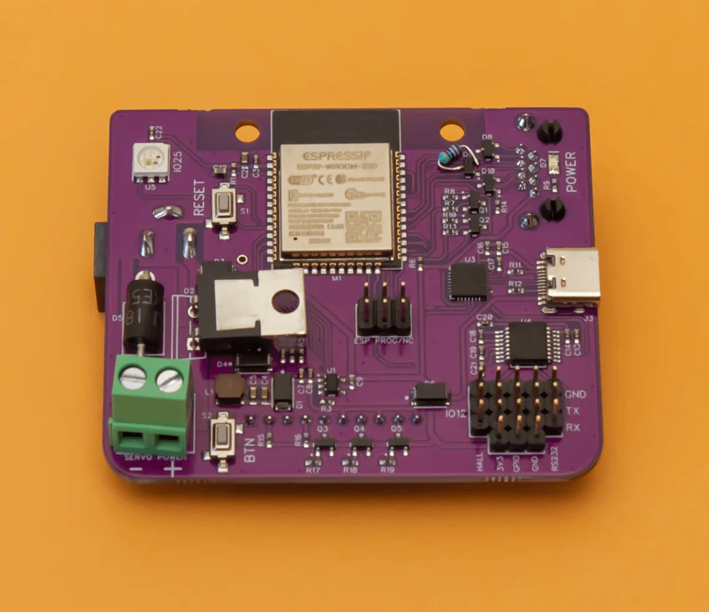
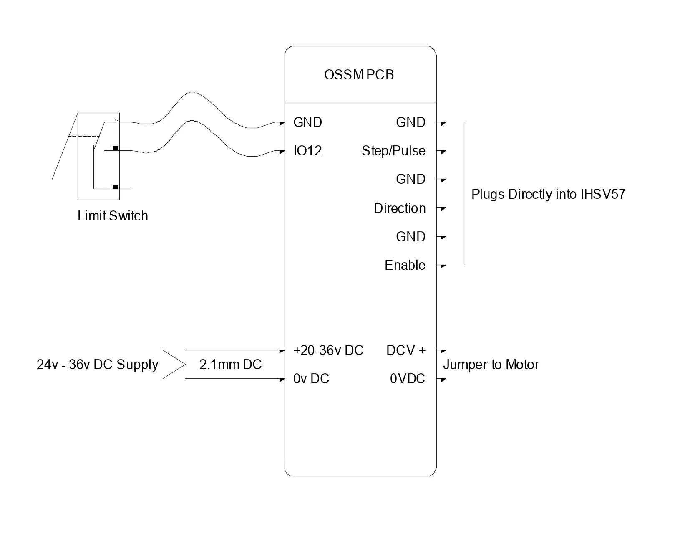
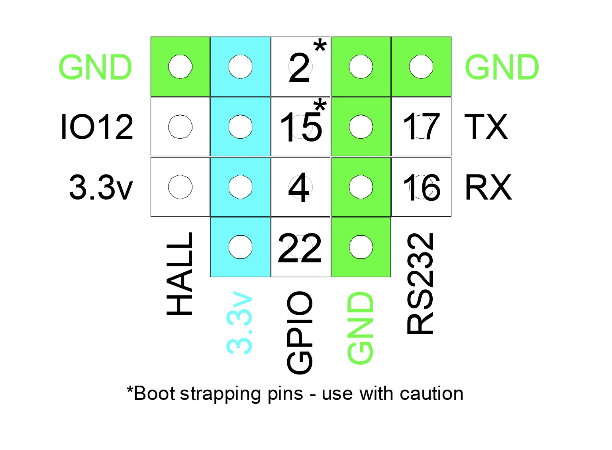
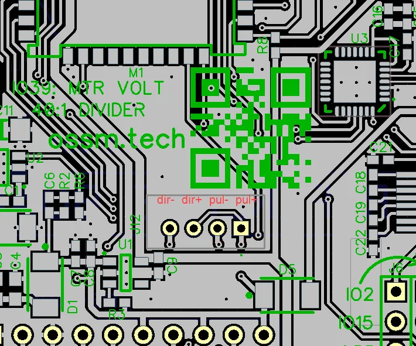
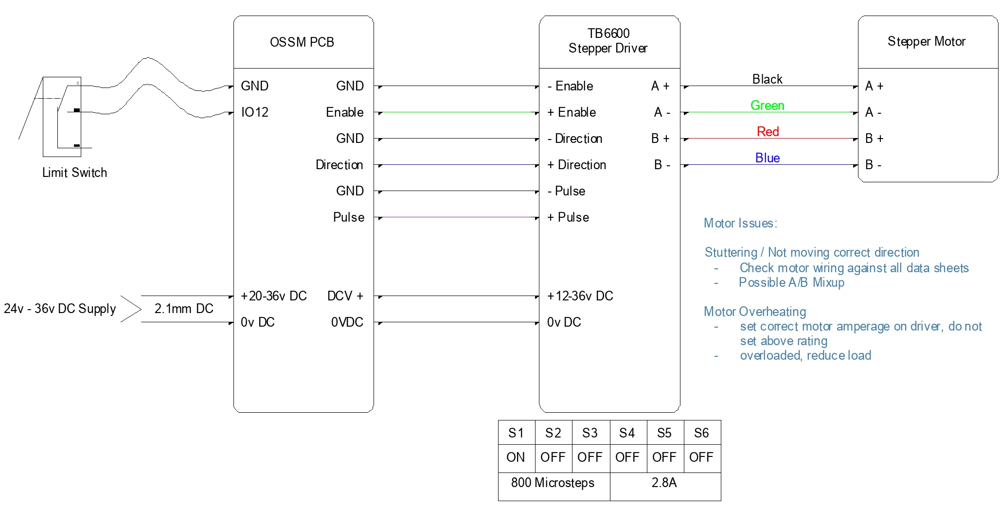
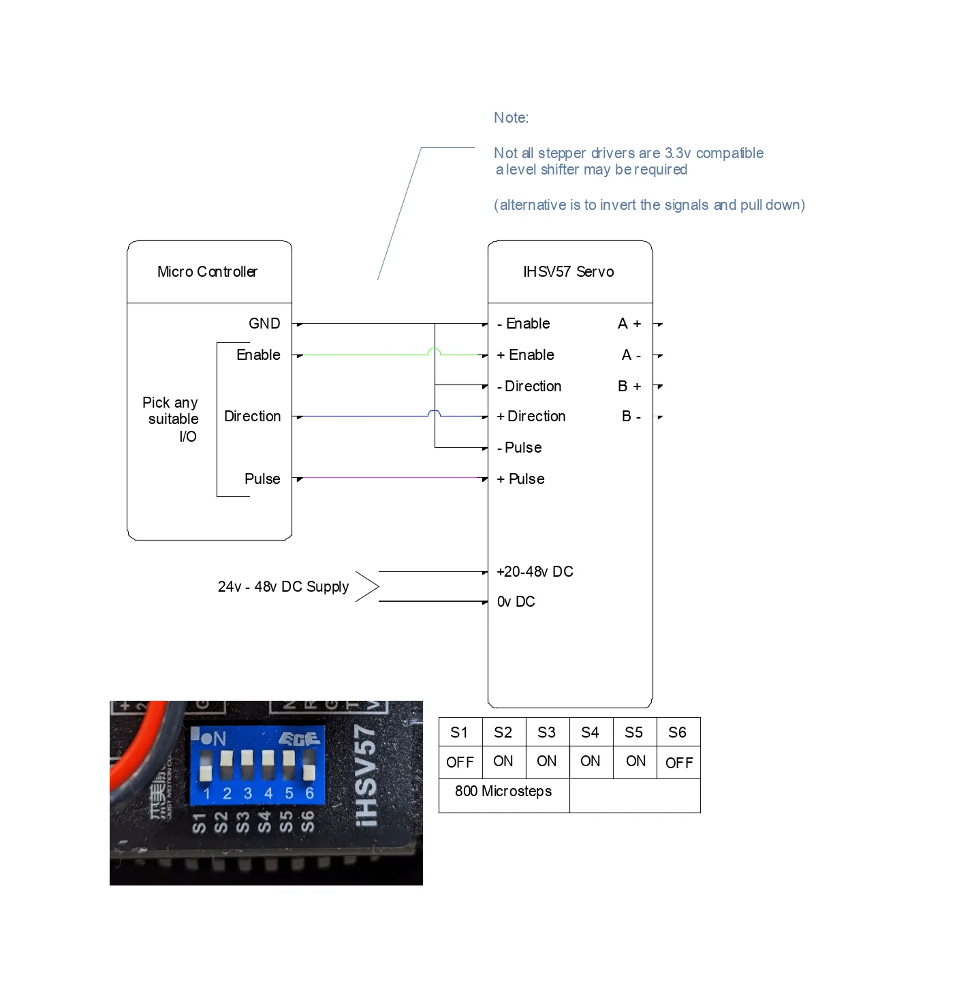

In dieser Anleitung erfahren Sie, wie Sie die offizielle OSSM-Platine anschließen und alternative Konfigurationen mit einem ESP32, Pegelumschaltung und gängigen Motortreibern verkabeln.

## Voraussetzungen

Bevor Sie beginnen, stellen Sie sicher, dass Sie Folgendes haben:

- Ein ESP32-Entwicklungsboard (ESP32-DevKitC oder kompatibel)
- Ein Motortreiber, der Schritt-/Richtungseingaben akzeptiert
- Ein Netzteil, das auf Ihren Motor und Treiber abgestimmt ist
- Grundlegende Werkzeuge: Abisolierzangen, kleiner Schraubendrehersatz, Multimeter

<Note>
Die meisten ESP32-Boards verwenden eine 3,3-V-Logik. Bei höheren Geschwindigkeiten kann es bei 5V-Logiktreibern zu fehlenden Schritten kommen. Verwenden Sie einen Pegelumsetzer, um Schritt/Richtung/Aktivierung für einen zuverlässigen Betrieb auf 5 V umzuwandeln.
</Note>

### Prototyping-Komponenten (für kundenspezifische Verkabelung)

Wenn Sie ohne die offizielle Platine verkabeln, benötigen Sie normalerweise:

- Logischer Pegelumsetzer (3,3 V → 5 V, 4+ Kanäle)
- Lötfreies Steckbrett oder Protoboard
- Dupont-Pullover (männlich↔männlich und männlich↔weiblich)
- 5-V-Schiene für die High-Side des Level-Shifters (oft bei Ihrem Treiber oder einem separaten Regler erhältlich)

<Tip>
Halten Sie die Signalverkabelung kurz und sauber. Verlegen Sie Schritt/Richtung/Freigabe vom Motor und den Stromkabeln weg, um Geräusche zu minimieren.
</Tip>

## Offizielle OSSM-Verkabelung

Die Referenz-OSSM-Leiterplatte umfasst Pegelumschaltung und standardisierte Stiftleisten. Dies ist der empfohlene Ansatz für die meisten Builds.

### Referenzplatinenlayout

<Frame caption="OSSM-Referenzplatine (Version 1) – Vorderansicht mit Darstellung der Komponentenplatzierung">
  
</Frame>

### Leiterplatten-Anschlussplan

<Frame caption="Anschlussplan mit Motortreiber- und Peripherieanschlüssen">
  
</Frame>

### ESP32 GPIO-Pinbelegung (Standard)

Dies sind die Standard-Firmware-Zuordnungen für die OSSM-Leiterplatte:

| Signal      | GPIO-Pin | Funktion                                      |
|-------------|----------|-----------------------------------------------|
| Schritt        | GPIO 14  | Schrittimpulsausgabe an Motortreiber             |
| Richtung   | GPIO 27  | Richtungssignal an den Lokführer              |
| Aktivieren      | GPIO 26  | Motortreiber aktivieren/deaktivieren                   |
| Encoder A   | GPIO 36  | Quadratur-Encoder-Kanal A (nur Eingang)     |
| Encoder B   | GPIO 39  | Quadratur-Encoder-Kanal B (nur Eingang)     |

<Frame caption="ESP32 GPIO-Pinbelegung, die die Steuersignalführung zeigt">
  
</Frame>

<Frame caption="JST-Header-Positionen mit Pin-Beschriftung zur einfachen Identifizierung">
  
</Frame>

<Info>
Bei Bedarf kann die Firmware die Pins neu zuordnen. Wenn Sie die Verkabelung ändern, aktualisieren Sie Ihre Firmware-Konfiguration entsprechend.
</Info>

## Alternative Verkabelungskonfigurationen

<Info>
Die folgenden Setups sind validierte Integrationsmuster. Hardwarerevisionen können andere Pinbelegungen erfordern. Überprüfen Sie daher die entsprechenden Platinen-, Treiber- und Motorspezifikationen.
</Info>

### TB6600 Schrittmotortreiber

Verwenden Sie dies, wenn Sie einen Schrittmotor mit einem externen Treiber im TB6600-Stil antreiben.

<Steps>
  <Step title="Motorleistung und Phasen anschließen">
    Verdrahten Sie die Motorversorgung (üblicherweise 24 V) mit dem TB6600 DC+ und DC‑. Schließen Sie die Motorphasen gemäß dem Schaltplan des Motors an A+, A-, B+, B- an.

    <Warning>
    Schrittmotoren niemals im laufenden Betrieb anschließen. Trennen Sie die Stromversorgung, bevor Sie die Motorverkabelung ändern.
    </Warning>
  </Step>
  <Step title="Kabelsteuersignale (über Levelshifter)">
    Verbinden Sie ESP32-Signale über den 3,3V→5V-Pegelumsetzer mit den Treibereingängen:

    - Schritt (GPIO 14) → PUL+
    - Richtung (GPIO 27) → DIR+
    - Aktivieren (GPIO 26, falls verwendet) → ENA+
    - GND (ESP32/Levelshifter) → PUL‑, DIR‑, ENA‑

    <Check>
    Alle Gründe sind zwischen ESP32, Levelshifter und Fahrer gleich.
    </Check>
  </Step>
  <Step title="DIP-Schalter einstellen">
    Konfigurieren Sie die Strombegrenzung passend zu Ihrem Motor und wählen Sie eine für Ihre Mechanik geeignete Mikroschritteinstellung. Beginnen Sie konservativ und nehmen Sie dann während des Tests eine Feinabstimmung vor.
  </Step>
</Steps>

<Frame caption="Verdrahtungsplan für TB6600-Schrittmotortreiber mit OSSM-Controller">
  
</Frame>

### Servomotor mit integriertem Treiber (iHSV57, 42AIM30 usw.)

Viele integrierte Servos akzeptieren Schritt/Richtung/Aktivierung genau wie ein Schrittmotortreiber.

<Frame caption="Verkabelungskonfiguration des Servomotors mit Schritt-/Richtungsschnittstelle">
  
</Frame>

<Tip>
Einige integrierte Servos akzeptieren 3,3-V-Logik direkt; andere benötigen 5V. Schauen Sie in der Dokumentation Ihres Servos nach – möglicherweise können Sie den Levelshifter weglassen.
</Tip>

### Zusätzliche Optionen für Schrittmotortreiber

Weitere Designs und archivierte Schaltpläne finden Sie im Hardware-Archiv des Repositorys:

```
/ossm/hardware/PCB Files/Archive/
```

## Best Practices für Stromversorgung und Erdung

- Verwenden Sie eine Einpunkt-(Stern-)Erdung zwischen ESP32, Levelshifter und Fahrer
- Halten Sie die Schritt-/Richtungs-/Aktivierungsleitungen kurz; Vermeiden Sie es, sie parallel zur Motorleistung zu betreiben
- Verdrehen Sie jedes Motorphasenpaar (A+/A- und B+/B-), um EMI zu reduzieren
- Sorgen Sie für eine Zugentlastung aller Anschlüsse, um intermittierende Fehler zu vermeiden
- Bei langen Leitungen sollten Sie ein abgeschirmtes Kabel für Steuersignale in Betracht ziehen und die Abschirmung nur an einem Ende mit Gehäuse/Erde verbinden

## Überprüfen Sie Ihre Verkabelung

Führen Sie diese Prüfungen durch, bevor Sie den Motortreiber mit Strom versorgen.

<Steps>
  <Step title="Kontinuität und Pin-Zuordnung">
    Verwenden Sie ein Multimeter, um zu überprüfen, ob jedes Signal vom richtigen ESP32-Pin zum Treibereingang gelangt.

    <Check>
    Schritt, Richtung und Aktivierung zeigen jeweils Kontinuität von ESP32 → Levelshifter → Fahrer an.
    </Check>
  </Step>
  <Step title="Isolierung zwischen Signalen und Strom">
    Stellen Sie sicher, dass keine Kurzschlüsse zwischen benachbarten Signalleitungen oder zwischen Signal- und Stromschienen bestehen.

    <Check>
    Kein Durchgang zwischen benachbarten Pins oder zwischen Signalen und DC+/DC‑.
    </Check>
  </Step>
  <Step title="Strompolarität und Spannung">
    Überprüfen Sie die Polarität und Spannung der Stromversorgung an den Treiberklemmen, bevor Sie den Motor anschließen.

    <Warning>
    Eine Verpolung kann den Treiber sofort beschädigen. Überprüfen Sie die DC+- und DC-Ausrichtung noch einmal.
    </Warning>
  </Step>
</Steps>

## Checkliste für das erste Einschalten

- Schalten Sie den Treiber bei abgeklemmtem Motor ein und vergewissern Sie sich, dass die Status-LEDs normal aussehen
- Schließen Sie den Motor an und steuern Sie dann eine Bewegung mit sehr niedriger Geschwindigkeit an
- Überprüfen Sie die Richtungsänderungen auf Befehl
- Wenn Sie einen Encoder verwenden, stellen Sie sicher, dass sich die Zählwerte gleichmäßig in eine Richtung ändern und bei Richtungswechsel umkehren

<Check>
Sie können Bewegungen mit niedriger Geschwindigkeit steuern, ohne Schritte zu verpassen, ohne Schwingungen oder Fahrerfehler.
</Check>

## Fehlerbehebung

<AccordionGroup>
  <Accordion title="Der Motor verpasst bei hoher Geschwindigkeit Schritte">
    Dies weist normalerweise auf eine Nichtübereinstimmung des Logikpegels oder eine schlechte Signalintegrität hin.

    - Der Levelshifter wird beidseitig mit Strom versorgt (3,3V und 5V)
    - Die Erdung ist zwischen ESP32, Levelshifter und Fahrer gleich
    - Die Signalkabel sind kurz und werden von der Motorstromversorgung entfernt verlegt

    <Tip>
    Wenn Sie keinen Levelshifter verwenden, fügen Sie einen hinzu. Wenn ja, überprüfen Sie die 5-V-Versorgung an den High-Side-Pins.
    </Tip>
  </Accordion>

  <Accordion title="Motor reagiert nicht auf Befehle">
    Der Fahrer empfängt möglicherweise keine gültigen Steuersignale.

    - Überprüfen Sie die Polarität des Aktivierungseingangs. Viele Treiber verwenden Active-Low-Enable
    - Bestätigen Sie, dass die Schritt-/Richtungspins mit Ihrer Firmware-Konfiguration übereinstimmen
    - Stellen Sie sicher, dass der Treiber über ausreichend Strom verfügt (überprüfen Sie die Status-LEDs).

    <Info>
    Verwenden Sie einen Logikanalysator oder ein Oszilloskop, um Schrittimpulse am Treibereingang zu bestätigen.
    </Info>
  </Accordion>

  <Accordion title="Unregelmäßige oder zittrige Bewegung">
    Elektrische Störungen oder Versorgungsinstabilität können den Steuerpfad beeinträchtigen.

    - Halten Sie die Signalkabel getrennt von den Motorleistungskabeln
    - Stellen Sie sicher, dass die Treiberversorgung unter Last innerhalb der Spezifikation bleibt
    - Fügen Sie eine lokale Entkopplung in der Nähe der Treibereingänge hinzu

    <Tip>
    Fügen Sie 0,1-µF-Keramikkondensatoren in der Nähe der Steuereingänge des Treibers (zur Erde) hinzu. Verwenden Sie für lange Signalstrecken ein abgeschirmtes Kabel.
    </Tip>
  </Accordion>

  <Accordion title="Motor läuft in die falsche Richtung">
    Das Richtungssignal ist relativ zu Ihrer Verkabelung invertiert.

    <Info>
    Tauschen Sie die Richtungspolarität am Stecker aus oder kehren Sie die Richtung in der Firmware um, indem Sie die Einstellung `INVERT_DIRECTION` ändern.
    </Info>
  </Accordion>
</AccordionGroup>

<Warning>
Schalten Sie das Gerät immer aus und warten Sie, bis sich die Kondensatoren entladen haben, bevor Sie die Verkabelung neu vornehmen. Eine Verpolung oder ein Kurzschluss der Ausgänge kann Ihre Hardware dauerhaft beschädigen.
</Warning>
