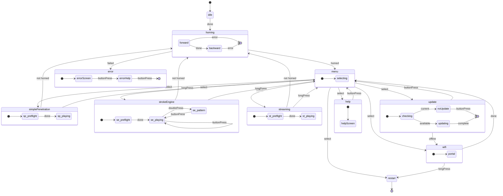

# Zustandsmaschinenarchitektur

Die OSSM-Firmware verwendet eine deklarative Zustandsmaschine, um das Geräteverhalten zu verwalten. Dies gewährleistet vorhersehbare Übergänge zwischen den Betriebsmodi und verhindert ungültige Zustände, die zu unerwartetem Verhalten führen könnten.

## Zustandsdiagramm

Das folgende Diagramm zeigt alle Zustände und Übergänge in der OSSM-Zustandsmaschine:

<MermaidControls />



## Designübersicht

Die Zustandsmaschine wird mithilfe von [Boost.SML](https://boost-ext.github.io/sml/) (State Machine Language) implementiert, einer reinen Header-C++14-Bibliothek, die eine domänenspezifische Sprache zum Definieren von Zustandsmaschinen bereitstellt.

### Warum Boost.SML?

Boost.SML wurde für OSSM ausgewählt, weil es Folgendes bietet:

- **Überprüfung zur Kompilierungszeit** – Ungültige Übergänge werden zur Kompilierungszeit und nicht zur Laufzeit abgefangen
- **Kein Laufzeit-Overhead** – Leistung entspricht handgeschriebenem Schalter/Gehäuse
- **Deklarative Syntax** – Die Übergangstabelle liest sich wie eine Dokumentation
- **Thread-Sicherheit** – Integrierte Unterstützung für gleichzeitigen Zugriff über Richtlinien
- **Geringer Platzbedarf** – Einzelner Header, ca. 2000 Codezeilen, keine Abhängigkeiten

### Syntax der Übergangstabelle

Jede Zeile in der Übergangstabelle folgt diesem Muster:

```cpp
source_state + event [guard] / action = target_state
```

Zum Beispiel:

```cpp
"menu.idle"_s + buttonPress[(isOption(Menu::SimplePenetration))] = "simplePenetration"_s
```

Dies lautet wie folgt: „Wenn im `menu.idle`-Status ein `buttonPress`-Ereignis auftritt und der Guard `isOption(Menu::SimplePenetration)` „true“ zurückgibt, wird in den `simplePenetration`-Status übergegangen.“

<Info>
Eine vollständige Anleitung zur Übergangstabellensyntax finden Sie im [Boost.SML-Tutorial](https://boost-ext.github.io/sml/tutorial.html).
</Info>

## Veranstaltungen

Ereignisse lösen Zustandsübergänge aus. Es handelt sich um einfache Strukturen, die in `Events.h` definiert sind und von überall in der Codebasis versendet werden können.

| Ereignis | Beschreibung | Typische Quelle |
|-------|-------------|----------------|
| `ButtonPress` | Ein Klick auf eine einzelne Taste | Drehgeber-Taste |
| `LongPress` | Taste für längere Zeit gedrückt gehalten | Drehgebertaste (gehalten) |
| `DoublePress` | Zwei schnelle Tastenklicks | Drehgeber-Taste |
| `Done` | Asynchroner Vorgang abgeschlossen | Homing-Aufgabe, Preflight-Check |
| `Error` | Der Vorgang ist fehlgeschlagen | Referenzierungsfehler, Hub zu kurz |
| `EmergencyStop` | Sofortiger Stopp erforderlich | Sicherheitssysteme |
| `Home` | Referenzfahrtsequenz anfordern | Externer Befehl |

### Versenden von Ereignissen

Ereignisse werden mithilfe der globalen `stateMachine`-Instanz versendet:

```cpp
#include "ossm/state/state.h"

// From anywhere in the codebase
stateMachine->process_event(ButtonPress{});
stateMachine->process_event(Done{});
```

Die Zustandsmaschine wird beim Start in [`state.cpp`](https://github.com/KinkyMakers/OSSM-hardware/blob/main/Software/src/ossm/state/state.cpp) initialisiert und als globaler Zeiger bereitgestellt.

<Tip>
Ereignisse werden als leere Strukturen definiert. Der Typ selbst trägt die Bedeutung – es sind keine Datennutzdaten erforderlich.
</Tip>

## Wachen

Guards sind bedingte Prüfungen, die bestimmen, ob ein Übergang stattfinden soll. Sie geben `true` zurück, um den Übergang zuzulassen, oder `false`, um ihn zu blockieren.

| Bewachen | Beschreibung | Gibt `true` zurück, wenn... |
|-------|-------------|------------------------|
| `isOnline` | Überprüfen Sie die WLAN-Verbindung | Das Gerät ist mit WLAN verbunden |
| `isUpdateAvailable` | Suchen Sie nach Firmware-Updates | Der Server meldet, dass eine neuere Version verfügbar ist |
| `isStrokeTooShort` | Referenzierungsergebnis validieren | Der gemessene Hub liegt unter dem Mindestschwellenwert |
| `isOption(Menu)` | Ausgewählten Menüpunkt prüfen | Die aktuelle Menüauswahl entspricht der angegebenen Option |
| `isPreflightSafe` | Überprüfen Sie die Position des Geschwindigkeitsreglers | Geschwindigkeitspotentiometer befindet sich im toten Bereich (sicherer Start) |
| `isFirstHomed` | Einmalige Erstprüfung der Referenzierung | Dies ist die erste erfolgreiche Referenzfahrt seit dem Booten |
| `isNotHomed` | Überprüfen Sie den Homing-Status | Das Gerät wurde nicht referenziert oder die Referenzierung wurde ungültig |

### Guard-Implementierung

Guards werden als `constexpr`-Lambdas im [`guards`](https://github.com/KinkyMakers/OSSM-hardware/blob/main/Software/src/ossm/state/guards.h)-Namespace definiert. Sie rufen vorwärts deklarierte Implementierungsfunktionen auf, um den Header schlank zu halten:

```cpp
// In guards.h - forward declaration
bool ossmIsPreflightSafe();

namespace guards {
    // Constexpr lambda wraps the implementation
    constexpr auto isPreflightSafe = []() {
        return ossmIsPreflightSafe();
    };

    // Parameterized guard using nested lambda
    constexpr auto isOption = [](Menu option) {
        return [option]() { return ossmGetMenuOption() == option; };
    };
}
```

Die eigentliche Logik befindet sich in `guards.cpp`, wodurch die Kompilierungszeiten kurz bleiben und Implementierungsänderungen möglich sind, ohne dass die Übergangstabelle neu kompiliert werden muss.

<Info>
Weitere Informationen zu Schutzmustern finden Sie im [Boost.SML Guards-Dokumentation](https://boost-ext.github.io/sml/user-guide.html#guards).
</Info>

## Aktionen

Aktionen sind Funktionen, die bei Zustandsübergängen ausgeführt werden. Sie führen zu Nebeneffekten wie der Aktualisierung der Anzeige, dem Starten von Motoren oder dem Zurücksetzen von Einstellungen.

### Aktionen anzeigen

| Aktion | Beschreibung |
|--------|-------------|
| `drawHello` | Begrüßungs-/Startbildschirm anzeigen |
| `(drawMenu)` | Rendern Sie das Hauptmenü |
| `drawPlayControls` | Geschwindigkeits-/Hub-/Tiefensteuerung anzeigen |
| `drawPatternControls` | Musterauswahl-Benutzeroberfläche anzeigen |
| `drawPreflight` | Warnung „Geschwindigkeit zum Starten reduzieren“ anzeigen |
| `drawHelp` | Hilfe-/Supportinformationen anzeigen |
| `drawWiFi` | WLAN-Konfigurationsbildschirm anzeigen |
| `drawUpdate` | Bildschirm „Nach Updates suchen“ anzeigen |
| `drawNoUpdate` | Meldung „Firmware ist aktuell“ anzeigen |
| `drawUpdating` | Update-Fortschritt anzeigen |
| `drawError` | Fehlerstatus mit Meldung anzeigen |

### Bewegungsaktionen

| Aktion | Beschreibung |
|--------|-------------|
| `startHoming` | Beginnen Sie mit der Homing-Sequenz |
| `clearHoming` | Referenzierungsstatusvariablen zurücksetzen |
| `startSimplePenetration` | Starten Sie die Aufgabe „Einfache Penetration“. |
| `startStrokeEngine` | Starten Sie die Aufgabe im Stroke Engine-Modus |
| `startStreaming` | Starten Sie die Aufgabe „Streaming-Modus“. |
| `emergencyStop` | Stoppen Sie den Motor und deaktivieren Sie die Ausgänge |

### Einstellungen-Aktionen

| Aktion | Beschreibung |
|--------|-------------|
| `resetSettingsStrokeEngine` | Standardwerte für Stroke Engine initialisieren (Geschwindigkeit=0, Hub=50, Tiefe=10, Empfindung=50) |
| `resetSettingsSimplePen` | Initialisieren Sie die Standardeinstellungen für die einfache Penetration (Geschwindigkeit=0, Schlaganfall=0, Tiefe=50). |
| `incrementControl` | Durchlaufen Sie die Steuerparameter (Hub → Tiefe → Empfindung) |
| `setHomed` | Markieren Sie das Gerät als erfolgreich referenziert |
| `setNotHomed` | Referenzfahrt ungültig machen (erfordert erneute Referenzfahrt vor dem Spiel) |

### Systemaktionen

| Aktion | Beschreibung |
|--------|-------------|
| `restart` | Starten Sie den ESP32 neu |
| `resetWiFi` | Gespeicherte WLAN-Anmeldeinformationen löschen |
| `updateOSSM` | Laden Sie das Firmware-Update herunter und installieren Sie es |

### Aktionsumsetzung

Aktionen werden als `constexpr`-Lambdas im [`actions`](https://github.com/KinkyMakers/OSSM-hardware/blob/main/Software/src/ossm/state/actions.h)-Namespace definiert. Wie Guards delegieren sie an vorwärts deklarierte Implementierungsfunktionen:

```cpp
// In actions.h - forward declarations
void ossmDrawHello();
void ossmEmergencyStop();

namespace actions {
    constexpr auto drawHello = []() { ossmDrawHello(); };
    constexpr auto emergencyStop = []() { ossmEmergencyStop(); };
}
```

Die Implementierungsfunktionen in `actions.cpp` rufen die entsprechenden Funktionsmodule auf:

```cpp
// In actions.cpp
void ossmEmergencyStop() {
    stepper->forceStop();
    stepper->disableOutputs();
}

void ossmDrawHello() {
    pages::drawHello();  // Delegates to pages namespace
}
```

Dieses Muster hält die Zustandsmaschine von bestimmten Implementierungen entkoppelt und ermöglicht die unabhängige Entwicklung von Funktionsmodulen.

<Warning>
Aktionen dürfen den Hauptthread nicht blockieren. Lang laufende Vorgänge sollten stattdessen FreeRTOS-Aufgaben erzeugen.
</Warning>

<Info>
Weitere Informationen zu Aktionsmustern finden Sie im [Dokumentation zu Boost.SML-Aktionen](https://boost-ext.github.io/sml/user-guide.html#actions).
</Info>

## Thread-Sicherheit

Die OSSM-Zustandsmaschine ist mit Thread-sicheren Richtlinien konfiguriert, um Ereignisse von mehreren FreeRTOS-Aufgaben zu verarbeiten:

```cpp
sml::sm<OSSMStateMachine, sml::thread_safe<ESP32RecursiveMutex>, sml::logger<StateLogger>>
```

Dabei wird ein rekursiver Mutex verwendet, um Zustandsübergänge zu schützen und eine sichere Ereignisverteilung zu ermöglichen von:

- Die Hauptschleife
- Button-Interrupt-Handler
- BLE-Befehlshandler
- Hintergrundaufgaben

Die Zustandsmaschine wird in [`state.cpp`](https://github.com/KinkyMakers/OSSM-hardware/blob/main/Software/src/ossm/state/state.cpp) initialisiert:

```cpp
// Global state machine instance
StateMachine* stateMachine = nullptr;

void initStateMachine() {
    stateMachine = new StateMachine{};
    stateMachine->process_event(Done{});  // Trigger initial transition
}
```

<Info>
Weitere Informationen zu Thread-Sicherheitsrichtlinien finden Sie im [Dokumentation der Boost.SML-Richtlinien](https://boost-ext.github.io/sml/user-guide.html#policies).
</Info>

## Zustandsprotokollierung

Die Firmware enthält einen `StateLogger`, der alle Zustandsübergänge zum Debuggen protokolliert:

```cpp
sml::logger<StateLogger>
```

Dadurch werden Übergangsinformationen über die ESP-IDF-Protokollierung ausgegeben, sodass das Verhalten der Zustandsmaschine während der Entwicklung leicht verfolgt werden kann.

## Architekturnotizen

Die Zustandsmaschine folgt einer **entkoppelten modularen Architektur**:

- **Zustandsmaschinendefinition** ([`machine.h`](https://github.com/KinkyMakers/OSSM-hardware/blob/main/Software/src/ossm/state/machine.h)) enthält nur die Übergangstabelle
- **Aktionen und Wächter** sind `constexpr`-Lambdas, die an Implementierungsfunktionen delegieren
- **Funktionsmodule** (wie `pages::`, `simple_penetration::`, `stroke_engine::`) enthalten die eigentliche Logik
- **Globale Zustandsstrukturen** verwalten den Anwendungsstatus anstelle von Klassenmitgliedern

<Note>
Die `OSSM`-Klasse in `ossm/OSSM.h` wird aus Gründen der Abwärtskompatibilität mit der BLE-Befehlsverarbeitung beibehalten. Neue Funktionen sollten zustandslose Namespace-Funktionen verwenden, die auf dem globalen Status basieren.
</Note>

Eine vollständige Übersicht über die Quellcodeorganisation finden Sie unter [Ordnerstruktur](/ossm/software/architecture/folder-structure).

## Weiterführende Literatur

<CardGroup cols={2}>
<Card title="Ordnerstruktur" icon="folder-tree" href="/ossm/software/architecture/folder-structure">
  Verstehen Sie die Organisation und Designphilosophie des Quellcodes.
</Card>

<Card title="Boost.SML-Tutorial" icon="graduation-cap" href="https://boost-ext.github.io/sml/tutorial.html">
  Schritt-für-Schritt-Anleitung zum Erstellen von Zustandsmaschinen mit Boost.SML.
</Card>

<Card title="Boost.SML-Benutzerhandbuch" icon="book" href="https://boost-ext.github.io/sml/user-guide.html">
  Vollständige Referenz für alle Boost.SML-Funktionen.
</Card>

<Card title="Betriebsmodi" icon="play" href="/ossm/software/getting-started/operating-modes">
  Erfahren Sie mehr über die Modi „Simple Penetration“, „Stroke Engine“ und „Streaming“.
</Card>
</CardGroup>
