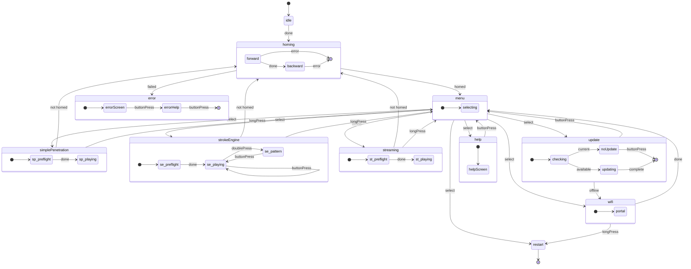

# Architecture de la machine à états

Le micrologiciel OSSM utilise une machine à états déclarative pour gérer le comportement de l'appareil. Cela garantit des transitions prévisibles entre les modes de fonctionnement et évite les états non valides qui pourraient provoquer un comportement inattendu.

## Diagramme d'état

Le diagramme suivant montre tous les états et transitions dans la machine à états OSSM :

<MermaidControls />



## Aperçu de la conception

La machine à états est implémentée à l'aide de [Boost.SML](https://boost-ext.github.io/sml/) (State Machine Language), une bibliothèque C++14 en en-tête uniquement qui fournit un langage spécifique au domaine pour définir les machines à états.

### Pourquoi Boost.SML ?

Boost.SML a été choisi pour OSSM car il offre :

- **Vérification au moment de la compilation** - Les transitions non valides sont détectées au moment de la compilation, pas au moment de l'exécution
- **Zéro surcharge d'exécution** - Performances équivalentes à une logique `switch/case` écrite à la main
- **Syntaxe déclarative** - La table de transition se lit comme une documentation
- **Sécurité des threads** – Prise en charge intégrée de l'accès simultané via des politiques
- **Faible encombrement** - En-tête unique, ~2 000 lignes de code, aucune dépendance

### Syntaxe de la table de transition

Chaque ligne du tableau de transition suit ce modèle :

```cpp
source_state + event [guard] / action = target_state
```

Par exemple :

```cpp
"menu.idle"_s + buttonPress[(isOption(Menu::SimplePenetration))] = "simplePenetration"_s
```

Cela se lit comme suit : lorsque l'état `menu.idle` est actif et qu'un événement `buttonPress` se produit, l'état passe à `simplePenetration` si la garde `isOption(Menu::SimplePenetration)` renvoie `true`.

<Info>
Pour un didacticiel complet sur la syntaxe des tables de transition, consultez le [Tutoriel Boost.SML](https://boost-ext.github.io/sml/tutorial.html).
</Info>

## Événements

Les événements déclenchent des transitions d'état. Ce sont des structures simples définies dans `Events.h` qui peuvent être dispatchées depuis n'importe où dans la base de code.

| Événement | Description | Source typique |
|-------|-------------|----------------|
| `ButtonPress` | Clic sur un seul bouton | Bouton de l’encodeur rotatif |
| `LongPress` | Bouton maintenu pendant une durée prolongée | Bouton de l'encodeur rotatif (maintenu) |
| `DoublePress` | Deux clics rapides sur un bouton | Bouton de l’encodeur rotatif |
| `Done` | Opération asynchrone terminée | Tâche de homing, vérification préliminaire |
| `Error` | L'opération a échoué | Échec du homing, course trop courte |
| `EmergencyStop` | Arrêt immédiat requis | Systèmes de sécurité |
| `Home` | Demander une séquence de homing | Commande externe |

### Dispatch des événements

Les événements sont dispatchés à l'aide de l'instance globale `stateMachine` :

```cpp
#include "ossm/state/state.h"

// From anywhere in the codebase
stateMachine->process_event(ButtonPress{});
stateMachine->process_event(Done{});
```

La machine à états est initialisée au démarrage dans [`state.cpp`](https://github.com/KinkyMakers/OSSM-hardware/blob/main/Software/src/ossm/state/state.cpp) et exposée comme pointeur global.

<Tip>
Les événements sont définis comme des structures vides. Le type lui-même a une signification : aucune charge utile de données n’est nécessaire.
</Tip>

## Guards

Les gardes sont des contrôles conditionnels qui déterminent si une transition doit avoir lieu. Ils renvoient `true` pour autoriser la transition ou `false` pour la bloquer.

| Guard | Description | Renvoie `true` lorsque ... |
|-------|-------------|------------------------|
| `isOnline` | Vérifier la connexion WiFi | L'appareil est connecté au WiFi |
| `isUpdateAvailable` | Rechercher les mises à jour du micrologiciel | Le serveur signale une version plus récente disponible |
| `isStrokeTooShort` | Valider le résultat du homing | La course mesurée est inférieure au seuil minimum |
| `isOption(Menu)` | Vérifier l'élément de menu sélectionné | La sélection de menu actuelle correspond à l'option spécifiée |
| `isPreflightSafe` | Valider la position du réglage de vitesse | Le potentiomètre de vitesse est dans la zone morte (démarrage sûr) |
| `isFirstHomed` | Vérification unique du premier homing | Il s'agit du premier homing réussi depuis le démarrage |
| `isNotHomed` | Vérifier l'état du homing | L'appareil n'a pas effectué le homing ou celui-ci a été invalidé |

### Mise en œuvre des Guards

Les Guards sont définis comme des lambdas `constexpr` dans l'espace de noms [`guards`](https://github.com/KinkyMakers/OSSM-hardware/blob/main/Software/src/ossm/state/guards.h). Ils appellent des fonctions d'implémentation déclarées en amont pour garder l'en-tête léger :

```cpp
// In guards.h - forward declaration
bool ossmIsPreflightSafe();

namespace guards {
    // Constexpr lambda wraps the implementation
    constexpr auto isPreflightSafe = []() {
        return ossmIsPreflightSafe();
    };

    // Parameterized guard using nested lambda
    constexpr auto isOption = [](Menu option) {
        return [option]() { return ossmGetMenuOption() == option; };
    };
}
```

La logique réelle réside dans `guards.cpp`, ce qui réduit les temps de compilation et permet de modifier l’implémentation sans recompiler la table de transition.

<Info>
Pour en savoir plus sur les modèles de Guard, consultez la [documentation Boost.SML sur les Guards](https://boost-ext.github.io/sml/user-guide.html#guards).
</Info>

## Actions

Les actions sont des fonctions exécutées lors des transitions d'état. Elles produisent des effets secondaires tels que la mise à jour de l'affichage, le démarrage des moteurs ou la réinitialisation des paramètres.

### Actions d'affichage

| Action | Description |
|--------|-------------|
| `drawHello` | Afficher l'écran de bienvenue/démarrage |
| `(drawMenu)` | Rendre le menu principal |
| `drawPlayControls` | Afficher les commandes de vitesse/course/profondeur |
| `drawPatternControls` | Afficher l'interface utilisateur de sélection de motif |
| `drawPreflight` | Afficher l'avertissement « réduire la vitesse pour démarrer » |
| `drawHelp` | Afficher les informations d'aide/support |
| `drawWiFi` | Afficher l'écran de configuration WiFi |
| `drawUpdate` | Afficher l'écran « Vérification des mises à jour » |
| `drawNoUpdate` | Afficher le message « le firmware est à jour » |
| `drawUpdating` | Afficher la progression de la mise à jour |
| `drawError` | Afficher l'état d'erreur avec un message |

### Actions de mouvement

| Action | Description |
|--------|-------------|
| `startHoming` | Démarrer la séquence de homing |
| `clearHoming` | Réinitialiser les variables d'état du homing |
| `startSimplePenetration` | Démarrer la tâche du mode Simple Penetration |
| `startStrokeEngine` | Démarrer la tâche du mode Stroke Engine |
| `startStreaming` | Démarrer la tâche du mode Streaming |
| `emergencyStop` | Forcer l'arrêt du moteur et désactiver les sorties |

### Actions de configuration

| Action | Description |
|--------|-------------|
| `resetSettingsStrokeEngine` | Initialiser les paramètres par défaut pour Stroke Engine (vitesse = 0, course = 50, profondeur = 10, sensation = 50) |
| `resetSettingsSimplePen` | Initialiser les valeurs par défaut pour Simple Penetration (vitesse=0, course=0, profondeur=50) |
| `incrementControl` | Parcourir les paramètres de contrôle (course → profondeur → sensation) |
| `setHomed` | Marquer l'appareil comme ayant effectué le homing avec succès |
| `setNotHomed` | Invalider le homing (un nouveau homing est requis avant de pouvoir lancer un mode de mouvement) |

### Actions du système

| Action | Description |
|--------|-------------|
| `restart` | Redémarrer l'ESP32 |
| `resetWiFi` | Effacer les informations d'identification WiFi enregistrées |
| `updateOSSM` | Télécharger et installer la mise à jour du micrologiciel |

### Mise en œuvre des actions

Les actions sont définies comme des lambdas `constexpr` dans l'espace de noms [`actions`](https://github.com/KinkyMakers/OSSM-hardware/blob/main/Software/src/ossm/state/actions.h). Comme les Guards, elles délèguent à des fonctions d'implémentation déclarées en amont :

```cpp
// In actions.h - forward declarations
void ossmDrawHello();
void ossmEmergencyStop();

namespace actions {
    constexpr auto drawHello = []() { ossmDrawHello(); };
    constexpr auto emergencyStop = []() { ossmEmergencyStop(); };
}
```

Les fonctions d'implémentation dans `actions.cpp` font appel aux modules de fonctionnalités appropriés :

```cpp
// In actions.cpp
void ossmEmergencyStop() {
    stepper->forceStop();
    stepper->disableOutputs();
}

void ossmDrawHello() {
    pages::drawHello();  // Delegates to pages namespace
}
```

Ce modèle maintient la machine à états découplée des implémentations spécifiques et permet de développer des modules de fonctionnalités indépendamment.

<Warning>
Les actions ne doivent pas bloquer le thread principal. Les opérations de longue durée doivent plutôt lancer des tâches FreeRTOS.
</Warning>

<Info>
Pour en savoir plus sur les modèles d'action, consultez la [documentation sur les actions Boost.SML](https://boost-ext.github.io/sml/user-guide.html#actions).
</Info>

## Sécurité des threads

La machine à états OSSM est configurée avec des politiques de sécurité des threads pour gérer les événements de plusieurs tâches FreeRTOS :

```cpp
sml::sm<OSSMStateMachine, sml::thread_safe<ESP32RecursiveMutex>, sml::logger<StateLogger>>
```

Cela utilise un mutex récursif pour protéger les transitions d'état et permettre le dispatch sécurisé des événements depuis les contextes suivants :

- La boucle principale
- Gestionnaires d'interruptions de boutons
- Gestionnaires de commandes BLE
- Tâches en arrière-plan

La machine à états est initialisée dans [`state.cpp`](https://github.com/KinkyMakers/OSSM-hardware/blob/main/Software/src/ossm/state/state.cpp) :

```cpp
// Global state machine instance
StateMachine* stateMachine = nullptr;

void initStateMachine() {
    stateMachine = new StateMachine{};
    stateMachine->process_event(Done{});  // Trigger initial transition
}
```

<Info>
Pour en savoir plus sur les politiques de sécurité des threads, consultez la [documentation sur les politiques Boost.SML](https://boost-ext.github.io/sml/user-guide.html#policies).
</Info>

## Journalisation d'état

Le micrologiciel comprend un `StateLogger` qui enregistre toutes les transitions d'état pour le débogage :

```cpp
sml::logger<StateLogger>
```

Cela génère des informations de transition via la journalisation ESP-IDF, ce qui facilite le suivi du comportement de la machine à états pendant le développement.

## Notes d'architecture

La machine à états suit une **architecture modulaire découplée** :

- **Définition de la machine à états** ([`machine.h`](https://github.com/KinkyMakers/OSSM-hardware/blob/main/Software/src/ossm/state/machine.h)) contient uniquement la table de transition
- **Les actions et les Guards** sont des lambdas `constexpr` qui délèguent aux fonctions d'implémentation
- **Les modules de fonctionnalités** (comme `pages::`, `simple_penetration::`, `stroke_engine::`) contiennent la logique réelle
- **Les structures d'état globales** gèrent l'état de l'application au lieu des membres de la classe

<Note>
La classe `OSSM` dans `ossm/OSSM.h` est conservée pour des raisons de rétrocompatibilité avec la gestion des commandes BLE. Les nouvelles fonctionnalités doivent utiliser des fonctions d'espace de noms sans état qui fonctionnent sur l'état global.
</Note>

Pour un aperçu complet de l'organisation du code source, voir [Structure des dossiers](/ossm/software/architecture/folder-structure).

## Lectures complémentaires

<CardGroup cols={2}>
<Card title="Structure des dossiers" icon="folder-tree" href="/ossm/software/architecture/folder-structure">
  Comprendre l'organisation du code source et la philosophie de conception.
</Card>

<Card title="Tutoriel Boost.SML" icon="graduation-cap" href="https://boost-ext.github.io/sml/tutorial.html">
  Guide étape par étape pour créer des machines à états avec Boost.SML.
</Card>

<Card title="Guide de l'utilisateur Boost.SML" icon="book" href="https://boost-ext.github.io/sml/user-guide.html">
  Référence complète pour toutes les fonctionnalités de Boost.SML.
</Card>

<Card title="Modes de fonctionnement" icon="play" href="/ossm/software/getting-started/operating-modes">
  Découvrez les modes Simple Penetration, Stroke Engine et Streaming.
</Card>
</CardGroup>
