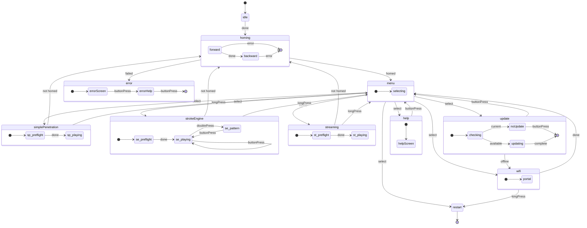

# Architectuur van staatsmachines

De OSSM-firmware gebruikt een declaratieve statusmachine om het gedrag van het apparaat te beheren. Dit zorgt voor voorspelbare overgangen tussen bedrijfsmodi en voorkomt ongeldige toestanden die onverwacht gedrag zouden kunnen veroorzaken.

## Staatsdiagram

Het volgende diagram toont alle toestanden en overgangen in de OSSM-statusmachine:

<MermaidControls />



## Ontwerpoverzicht

De statusmachine wordt geïmplementeerd met behulp van [Boost.SML](https://boost-ext.github.io/sml/) (State Machine Language), een C++14-bibliotheek met alleen headers die een domeinspecifieke taal biedt voor het definiëren van statusmachines.

### Waarom Boost.SML?

Boost.SML werd gekozen voor OSSM omdat het het volgende biedt:

- **Verificatie tijdens compilatie** - Ongeldige overgangen worden gedetecteerd tijdens het compileren, niet tijdens de runtime
- **Geen runtime-overhead** - Prestaties gelijkwaardig aan handgeschreven switch/case
- **Declaratieve syntaxis** - De transitietabel leest als documentatie
- **Thread safety** - Ingebouwde ondersteuning voor gelijktijdige toegang via beleid
- **Kleine footprint** - Eén header, ~2000 regels code, geen afhankelijkheden

### Syntaxis van overgangstabel

Elke rij in de overgangstabel volgt dit patroon:

```cpp
source_state + event [guard] / action = target_state
```

Bijvoorbeeld:

```cpp
"menu.idle"_s + buttonPress[(isOption(Menu::SimplePenetration))] = "simplePenetration"_s
```

Dit luidt als volgt: "Wanneer de status `menu.idle` zich bevindt en er een `buttonPress`-gebeurtenis plaatsvindt, gaat de status over naar `simplePenetration` als de guard `isOption(Menu::SimplePenetration)` waar retourneert."

<Info>
Voor een volledige tutorial over de syntaxis van transitietabellen, zie [Boost.SML-zelfstudie](https://boost-ext.github.io/sml/tutorial.html).
</Info>

## Evenementen

Gebeurtenissen veroorzaken toestandsovergangen. Het zijn eenvoudige structuren die zijn gedefinieerd in `Events.h` en die overal in de codebase kunnen worden verzonden.

| Evenement | Beschrijving | Typische bron |
|-------|-------------|----------------|
| `ButtonPress` | Enkele klik op de knop | Draaiende encoderknop |
| `LongPress` | Knop gedurende langere tijd vastgehouden | Encoderknop (vastgehouden) |
| `DoublePress` | Twee snelle klikken op de knop | Draaiende encoderknop |
| `Done` | Asynchrone bewerking voltooid | Thuistaak, preflightcontrole |
| `Error` | Operatie mislukt | Mislukte thuiskomst, beroerte te kort |
| `EmergencyStop` | Onmiddellijke stopzetting vereist | Veiligheidssystemen |
| `Home` | Vraag de thuisvolgorde aan | Externe opdracht |

### Gebeurtenissen verzenden

Gebeurtenissen worden verzonden met behulp van de globale `stateMachine`-instantie:

```cpp
#include "ossm/state/state.h"

// From anywhere in the codebase
stateMachine->process_event(ButtonPress{});
stateMachine->process_event(Done{});
```

De statusmachine wordt geïnitialiseerd bij het opstarten in [`state.cpp`](https://github.com/KinkyMakers/OSSM-hardware/blob/main/Software/src/ossm/state/state.cpp) en weergegeven als een globale aanwijzer.

<Tip>
Gebeurtenissen worden gedefinieerd als lege structuren. Het type zelf draagt ​​de betekenis: er is geen gegevenspayload nodig.
</Tip>

## Bewakers

Bewakers zijn voorwaardelijke controles die bepalen of er een transitie moet plaatsvinden. Ze retourneren `true` om de overgang mogelijk te maken of `false` om deze te blokkeren.

| Bewaker | Beschrijving | Retourneert `true` wanneer... |
|-------|-------------|------------------------|
| `isOnline` | Controleer WiFi-verbinding | Apparaat is verbonden met WiFi |
| `isUpdateAvailable` | Controleer op firmware-updates | Server meldt dat er een nieuwere versie beschikbaar is |
| `isStrokeTooShort` | Valideer het homing-resultaat | De gemeten slag ligt onder de minimumdrempel |
| `isOption(Menu)` | Controleer het geselecteerde menu-item | De huidige menuselectie komt overeen met de opgegeven optie |
| `isPreflightSafe` | Valideer de positie van de snelheidsknop | Toerentalpotentiometer bevindt zich in de dode zone (veilig starten) |
| `isFirstHomed` | Eenmalige eerste thuiscontrole | Dit is de eerste succesvolle thuiskomst sinds het opstarten |
| `isNotHomed` | Controleer de thuisstatus | Het apparaat is niet gehomed of de homing is ongeldig gemaakt |

### Implementatie van bewakers

Bewakers worden gedefinieerd als `constexpr` lambdas in de [`guards`](https://github.com/KinkyMakers/OSSM-hardware/blob/main/Software/src/ossm/state/guards.h)-naamruimte. Ze roepen forward-declared implementatiefuncties aan om de header lichtgewicht te houden:

```cpp
// In guards.h - forward declaration
bool ossmIsPreflightSafe();

namespace guards {
    // Constexpr lambda wraps the implementation
    constexpr auto isPreflightSafe = []() {
        return ossmIsPreflightSafe();
    };

    // Parameterized guard using nested lambda
    constexpr auto isOption = [](Menu option) {
        return [option]() { return ossmGetMenuOption() == option; };
    };
}
```

De feitelijke logica zit in `guards.cpp`, waardoor de compileertijden snel blijven en implementatiewijzigingen mogelijk zijn zonder de transitietabel opnieuw te compileren.

<Info>
Zie de [Boost.SML Guards-documentatie](https://boost-ext.github.io/sml/user-guide.html#guards) voor meer informatie over bewakingspatronen.
</Info>

## Acties

Acties zijn functies die worden uitgevoerd tijdens statusovergangen. Ze veroorzaken bijwerkingen zoals het updaten van het display, het starten van motoren of het resetten van instellingen.

### Acties weergeven

| Actie | Beschrijving |
|--------|-------------|
| `drawHello` | Welkomst-/opstartscherm weergeven |
| `(drawMenu)` | Geef het hoofdmenu weer |
| `drawPlayControls` | Toon snelheids-/slag-/dieptecontroles |
| `drawPatternControls` | Toon patroonselectie-UI |
| `drawPreflight` | Toon de waarschuwing "snelheid verlagen om te starten". |
| `drawHelp` | Help-/ondersteuningsinformatie weergeven |
| `drawWiFi` | Toon het WiFi-configuratiescherm |
| `drawUpdate` | Toon het scherm "controleren op updates". |
| `drawNoUpdate` | Toon het bericht "firmware is up-to-date". |
| `drawUpdating` | Updatevoortgang tonen |
| `drawError` | Foutstatus met bericht weergeven |

### Bewegingsacties

| Actie | Beschrijving |
|--------|-------------|
| `startHoming` | Begin met de homing-reeks |
| `clearHoming` | Reset de variabelen van de thuisstatus |
| `startSimplePenetration` | Start de taak in de modus Eenvoudige penetratie |
| `startStrokeEngine` | Start de taak in de Stroke Engine-modus |
| `startStreaming` | Start de streamingmodustaak |
| `emergencyStop` | Motor geforceerd stoppen en uitgangen uitschakelen |

### Instellingen Acties

| Actie | Beschrijving |
|--------|-------------|
| `resetSettingsStrokeEngine` | Initialiseer standaardwaarden voor Stroke Engine (snelheid=0, slag=50, diepte=10, sensatie=50) |
| `resetSettingsSimplePen` | Initialiseer standaardinstellingen voor eenvoudige penetratie (snelheid=0, streek=0, diepte=50) |
| `incrementControl` | Blader door de controleparameters (slag → diepte → sensatie) |
| `setHomed` | Markeer het apparaat als succesvol gehomed |
| `setNotHomed` | Herplaatsing ongeldig maken (vereist herplaatsing vóór het spelen) |

### Systeemacties

| Actie | Beschrijving |
|--------|-------------|
| `restart` | Start de ESP32 opnieuw op |
| `resetWiFi` | Wis opgeslagen WiFi-inloggegevens |
| `updateOSSM` | Download en installeer de firmware-update |

### Actie-implementatie

Acties worden gedefinieerd als `constexpr` lambdas in de [`actions`](https://github.com/KinkyMakers/OSSM-hardware/blob/main/Software/src/ossm/state/actions.h)-naamruimte. Net als bewakers delegeren ze naar voren verklaarde implementatiefuncties:

```cpp
// In actions.h - forward declarations
void ossmDrawHello();
void ossmEmergencyStop();

namespace actions {
    constexpr auto drawHello = []() { ossmDrawHello(); };
    constexpr auto emergencyStop = []() { ossmEmergencyStop(); };
}
```

De implementatiefuncties in `actions.cpp` roepen de juiste functiemodules op:

```cpp
// In actions.cpp
void ossmEmergencyStop() {
    stepper->forceStop();
    stepper->disableOutputs();
}

void ossmDrawHello() {
    pages::drawHello();  // Delegates to pages namespace
}
```

Dit patroon houdt de statusmachine losgekoppeld van specifieke implementaties en maakt het mogelijk dat featuremodules onafhankelijk worden ontwikkeld.

<Warning>
Acties mogen de rode draad niet blokkeren. Langdurige bewerkingen zouden in plaats daarvan FreeRTOS-taken moeten voortbrengen.
</Warning>

<Info>
Zie de [Documentatie over Boost.SML-acties](https://boost-ext.github.io/sml/user-guide.html#actions) voor meer informatie over actiepatronen.
</Info>

## Draadveiligheid

De OSSM-statusmachine is geconfigureerd met thread-safe beleid om gebeurtenissen van meerdere FreeRTOS-taken af ​​te handelen:

```cpp
sml::sm<OSSMStateMachine, sml::thread_safe<ESP32RecursiveMutex>, sml::logger<StateLogger>>
```

Hierbij wordt gebruik gemaakt van een recursieve mutex om statusovergangen te beschermen, waardoor een veilige gebeurtenisverzending mogelijk wordt gemaakt vanuit:

- De hoofdlus
- Knop-interrupt-handlers
- BLE-opdrachthandlers
- Achtergrondtaken

De statusmachine wordt geïnitialiseerd in [`state.cpp`](https://github.com/KinkyMakers/OSSM-hardware/blob/main/Software/src/ossm/state/state.cpp):

```cpp
// Global state machine instance
StateMachine* stateMachine = nullptr;

void initStateMachine() {
    stateMachine = new StateMachine{};
    stateMachine->process_event(Done{});  // Trigger initial transition
}
```

<Info>
Zie de [Documentatie over Boost.SML-beleid](https://boost-ext.github.io/sml/user-guide.html#policies) voor meer informatie over het beleid inzake draadveiligheid.
</Info>

## Staatsregistratie

De firmware bevat een `StateLogger` die alle statusovergangen registreert voor foutopsporing:

```cpp
sml::logger<StateLogger>
```

Deze voert transitie-informatie uit via ESP-IDF-logboekregistratie, waardoor het gemakkelijk wordt om het gedrag van de statusmachine tijdens de ontwikkeling te traceren.

## Architectuurnotities

De toestandsmachine volgt een **ontkoppelde modulaire architectuur**:

- **State machine-definitie** ([`machine.h`](https://github.com/KinkyMakers/OSSM-hardware/blob/main/Software/src/ossm/state/machine.h)) bevat alleen de overgangstabel
- **Acties en bewakers** zijn `constexpr`-lambda's die delegeren aan implementatiefuncties
- **Featuremodules** (zoals `pages::`, `simple_penetration::`, `stroke_engine::`) bevatten de daadwerkelijke logica
- **Algemene statusstructuren** beheren de applicatiestatus in plaats van klasseleden

<Note>
De klasse `OSSM` in `ossm/OSSM.h` blijft behouden voor achterwaartse compatibiliteit met de verwerking van BLE-opdrachten. Nieuwe functies moeten gebruik maken van staatloze naamruimtefuncties die werken op basis van de globale status.
</Note>

Zie [Mappenstructuur](/ossm/software/architecture/folder-structure) voor een compleet overzicht van de broncodeorganisatie.

## Verder lezen

<CardGroup cols={2}>
<Card title="Mappenstructuur" icon="folder-tree" href="/ossm/software/architecture/folder-structure">
  Begrijp de broncode-organisatie en ontwerpfilosofie.
</Card>

<Card title="Boost.SML-zelfstudie" icon="graduation-cap" href="https://boost-ext.github.io/sml/tutorial.html">
  Stapsgewijze handleiding voor het bouwen van statusmachines met Boost.SML.
</Card>

<Card title="Boost.SML-gebruikershandleiding" icon="book" href="https://boost-ext.github.io/sml/user-guide.html">
  Volledige referentie voor alle Boost.SML-functies.
</Card>

<Card title="Bedrijfsmodi" icon="play" href="/ossm/software/getting-started/operating-modes">
  Meer informatie over de modi Simple Penetration, Stroke Engine en Streaming.
</Card>
</CardGroup>
