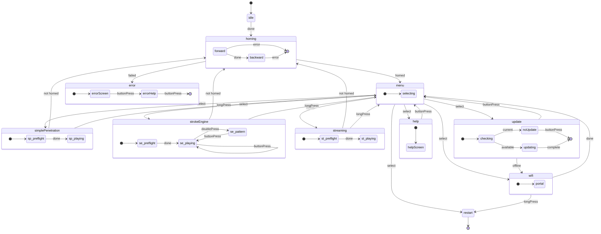

# Architectuur van de toestandsmachine

De OSSM-firmware gebruikt een declaratieve toestandsmachine om het gedrag van het apparaat te beheren. Dit zorgt voor voorspelbare overgangen tussen bedieningsmodi en voorkomt ongeldige toestanden die onverwacht gedrag kunnen veroorzaken.

## Toestandsdiagram

Het volgende diagram toont alle toestanden en overgangen in de OSSM-toestandsmachine:

<MermaidControls />



## Ontwerpoverzicht

De toestandsmachine wordt geïmplementeerd met [Boost.SML](https://boost-ext.github.io/sml/) (State Machine Language), een C++14-bibliotheek die alleen uit headers bestaat en een domeinspecifieke taal biedt voor het definiëren van toestandsmachines.

### Waarom Boost.SML?

Boost.SML werd gekozen voor OSSM omdat het het volgende biedt:

- **Verificatie tijdens compilatie** - Ongeldige overgangen worden gedetecteerd tijdens het compileren, niet tijdens de runtime
- **Geen runtime-overhead** - Prestaties gelijkwaardig aan handgeschreven switch/case
- **Declaratieve syntaxis** - De transitietabel leest als documentatie
- **Threadveiligheid** - Ingebouwde ondersteuning voor gelijktijdige toegang via beleidsregels
- **Kleine footprint** - Eén header, ~2000 regels code, geen afhankelijkheden

### Syntaxis van overgangstabel

Elke rij in de overgangstabel volgt dit patroon:

```cpp
source_state + event [guard] / action = target_state
```

Bijvoorbeeld:

```cpp
"menu.idle"_s + buttonPress[(isOption(Menu::SimplePenetration))] = "simplePenetration"_s
```

Dit betekent: wanneer de toestand `menu.idle` actief is en er een `buttonPress`-gebeurtenis optreedt, gaat de toestand over naar `simplePenetration` als de guard `isOption(Menu::SimplePenetration)` `true` retourneert.

<Info>
Voor een volledige tutorial over de syntaxis van transitietabellen, zie [Boost.SML-zelfstudie](https://boost-ext.github.io/sml/tutorial.html).
</Info>

## Gebeurtenissen

Gebeurtenissen veroorzaken toestandsovergangen. Het zijn eenvoudige structuren die zijn gedefinieerd in `Events.h` en die vanuit elk deel van de codebase kunnen worden verzonden.

| Evenement | Beschrijving | Typische bron |
|-------|-------------|----------------|
| `ButtonPress` | Enkele klik op de knop | Knop van de draai-encoder |
| `LongPress` | Knop gedurende langere tijd vastgehouden | Encoderknop (vastgehouden) |
| `DoublePress` | Twee snelle klikken op de knop | Knop van de draai-encoder |
| `Done` | Asynchrone bewerking voltooid | Homing-taak, preflightcontrole |
| `Error` | Bewerking mislukt | Mislukte homing, slag te kort |
| `EmergencyStop` | Onmiddellijke stopzetting vereist | Veiligheidssystemen |
| `Home` | Homingsequentie aanvragen | Externe opdracht |

### Gebeurtenissen dispatchen

Gebeurtenissen worden met behulp van de globale `stateMachine`-instantie gedispatcht:

```cpp
#include "ossm/state/state.h"

// From anywhere in the codebase
stateMachine->process_event(ButtonPress{});
stateMachine->process_event(Done{});
```

De toestandsmachine wordt bij het opstarten geïnitialiseerd in [`state.cpp`](https://github.com/KinkyMakers/OSSM-hardware/blob/main/Software/src/ossm/state/state.cpp) en als globale pointer beschikbaar gesteld.

<Tip>
Gebeurtenissen worden gedefinieerd als lege structuren. Het type zelf draagt de betekenis: er is geen gegevenspayload nodig.
</Tip>

## Guards

Guards zijn voorwaardelijke controles die bepalen of een overgang moet plaatsvinden. Ze retourneren `true` om de overgang toe te staan of `false` om deze te blokkeren.

| Guard | Beschrijving | Retourneert `true` wanneer ... |
|-------|-------------|------------------------|
| `isOnline` | WiFi-verbinding controleren | Het apparaat met WiFi is verbonden |
| `isUpdateAvailable` | Op firmware-updates controleren | De server meldt dat een nieuwere versie beschikbaar is |
| `isStrokeTooShort` | Het homing-resultaat valideren | De gemeten slag onder de minimumdrempel ligt |
| `isOption(Menu)` | Het geselecteerde menu-item controleren | De huidige menuselectie overeenkomt met de opgegeven optie |
| `isPreflightSafe` | De positie van de snelheidsknop valideren | De snelheidspotentiometer zich in de dode zone bevindt (veilig starten) |
| `isFirstHomed` | Eenmalige controle van de eerste homing | Dit de eerste geslaagde homing sinds het opstarten is |
| `isNotHomed` | De homingstatus controleren | Het apparaat niet is gehomed of de homing ongeldig is gemaakt |

### Implementatie van Guards

Guards worden gedefinieerd als `constexpr`-lambdas in de naamruimte [`guards`](https://github.com/KinkyMakers/OSSM-hardware/blob/main/Software/src/ossm/state/guards.h). Ze roepen vooruit gedeclareerde implementatiefuncties aan om de header licht te houden:

```cpp
// In guards.h - forward declaration
bool ossmIsPreflightSafe();

namespace guards {
    // Constexpr lambda wraps the implementation
    constexpr auto isPreflightSafe = []() {
        return ossmIsPreflightSafe();
    };

    // Parameterized guard using nested lambda
    constexpr auto isOption = [](Menu option) {
        return [option]() { return ossmGetMenuOption() == option; };
    };
}
```

De feitelijke logica zit in `guards.cpp`, waardoor de compileertijden kort blijven en implementatiewijzigingen mogelijk zijn zonder de transitietabel opnieuw te compileren.

<Info>
Zie de [Boost.SML Guards-documentatie](https://boost-ext.github.io/sml/user-guide.html#guards) voor meer informatie over guard-patronen.
</Info>

## Acties

Acties zijn functies die tijdens toestandsovergangen worden uitgevoerd. Ze veroorzaken bijwerkingen zoals het bijwerken van het display, het starten van motoren of het resetten van instellingen.

### Weergaveacties

| Actie | Beschrijving |
|--------|-------------|
| `drawHello` | Welkomst-/opstartscherm weergeven |
| `(drawMenu)` | Het hoofdmenu weergeven |
| `drawPlayControls` | Snelheids-/slag-/dieptebediening weergeven |
| `drawPatternControls` | Patroonselectie-UI weergeven |
| `drawPreflight` | De waarschuwing "snelheid verlagen om te starten" weergeven |
| `drawHelp` | Help-/ondersteuningsinformatie weergeven |
| `drawWiFi` | Het WiFi-configuratiescherm weergeven |
| `drawUpdate` | Het scherm "controleren op updates" weergeven |
| `drawNoUpdate` | Het bericht "firmware is up-to-date" weergeven |
| `drawUpdating` | Updatevoortgang weergeven |
| `drawError` | Fouttoestand met bericht weergeven |

### Bewegingsacties

| Actie | Beschrijving |
|--------|-------------|
| `startHoming` | De homingsequentie starten |
| `clearHoming` | Variabelen van de homingtoestand resetten |
| `startSimplePenetration` | De taak in de modus Simple Penetration starten |
| `startStrokeEngine` | De taak in de modus Stroke Engine starten |
| `startStreaming` | De taak in de modus Streaming starten |
| `emergencyStop` | De motor geforceerd stoppen en de uitgangen uitschakelen |

### Instellingsacties

| Actie | Beschrijving |
|--------|-------------|
| `resetSettingsStrokeEngine` | Standaardwaarden voor Stroke Engine initialiseren (snelheid=0, slag=50, diepte=10, sensatie=50) |
| `resetSettingsSimplePen` | Standaardwaarden voor Simple Penetration initialiseren (snelheid=0, slag=0, diepte=50) |
| `incrementControl` | De bedieningsparameters doorlopen (slag → diepte → sensatie) |
| `setHomed` | Het apparaat als succesvol gehomed markeren |
| `setNotHomed` | Homing ongeldig maken (opnieuw homen vereist voordat een bewegingsmodus kan worden gestart) |

### Systeemacties

| Actie | Beschrijving |
|--------|-------------|
| `restart` | De ESP32 opnieuw starten |
| `resetWiFi` | Opgeslagen WiFi-inloggegevens wissen |
| `updateOSSM` | De firmware-update downloaden en installeren |

### Actie-implementatie

Acties worden gedefinieerd als `constexpr`-lambdas in de naamruimte [`actions`](https://github.com/KinkyMakers/OSSM-hardware/blob/main/Software/src/ossm/state/actions.h). Net als Guards delegeren ze naar vooruit gedeclareerde implementatiefuncties:

```cpp
// In actions.h - forward declarations
void ossmDrawHello();
void ossmEmergencyStop();

namespace actions {
    constexpr auto drawHello = []() { ossmDrawHello(); };
    constexpr auto emergencyStop = []() { ossmEmergencyStop(); };
}
```

De implementatiefuncties in `actions.cpp` roepen de juiste functiemodules op:

```cpp
// In actions.cpp
void ossmEmergencyStop() {
    stepper->forceStop();
    stepper->disableOutputs();
}

void ossmDrawHello() {
    pages::drawHello();  // Delegates to pages namespace
}
```

Dit patroon houdt de toestandsmachine losgekoppeld van specifieke implementaties en maakt het mogelijk dat functiemodules onafhankelijk worden ontwikkeld.

<Warning>
Acties mogen de hoofdthread niet blokkeren. Langdurige bewerkingen moeten in plaats daarvan FreeRTOS-taken starten.
</Warning>

<Info>
Zie de [Documentatie over Boost.SML-acties](https://boost-ext.github.io/sml/user-guide.html#actions) voor meer informatie over actiepatronen.
</Info>

## Threadveiligheid

De OSSM-toestandsmachine is geconfigureerd met threadveilige beleidsregels om gebeurtenissen van meerdere FreeRTOS-taken af te handelen:

```cpp
sml::sm<OSSMStateMachine, sml::thread_safe<ESP32RecursiveMutex>, sml::logger<StateLogger>>
```

Hierbij wordt een recursieve mutex gebruikt om toestandsovergangen te beschermen, zodat gebeurtenissen veilig vanuit de volgende contexten kunnen worden gedispatcht:

- De hoofdlus
- Knop-interrupt-handlers
- BLE-opdrachthandlers
- Achtergrondtaken

De toestandsmachine wordt geïnitialiseerd in [`state.cpp`](https://github.com/KinkyMakers/OSSM-hardware/blob/main/Software/src/ossm/state/state.cpp):

```cpp
// Global state machine instance
StateMachine* stateMachine = nullptr;

void initStateMachine() {
    stateMachine = new StateMachine{};
    stateMachine->process_event(Done{});  // Trigger initial transition
}
```

<Info>
Zie de [documentatie over Boost.SML-beleidsregels](https://boost-ext.github.io/sml/user-guide.html#policies) voor meer informatie over threadveiligheidsbeleid.
</Info>

## Toestandslogging

De firmware bevat een `StateLogger` die alle toestandsovergangen registreert voor foutopsporing:

```cpp
sml::logger<StateLogger>
```

Dit geeft transitie-informatie door via ESP-IDF-logging, waardoor het gedrag van de toestandsmachine tijdens de ontwikkeling eenvoudig kan worden gevolgd.

## Architectuurnotities

De toestandsmachine volgt een **ontkoppelde modulaire architectuur**:

- **Definitie van de toestandsmachine** ([`machine.h`](https://github.com/KinkyMakers/OSSM-hardware/blob/main/Software/src/ossm/state/machine.h)) bevat alleen de overgangstabel
- **Acties en Guards** zijn `constexpr`-lambda's die delegeren aan implementatiefuncties
- **Functiemodules** (zoals `pages::`, `simple_penetration::`, `stroke_engine::`) bevatten de daadwerkelijke logica
- **Globale toestandsstructuren** beheren de applicatietoestand in plaats van klasseleden

<Note>
De klasse `OSSM` in `ossm/OSSM.h` blijft behouden voor achterwaartse compatibiliteit met de verwerking van BLE-opdrachten. Nieuwe functies moeten gebruik maken van staatloze naamruimtefuncties die werken op basis van de globale toestand.
</Note>

Zie [Mappenstructuur](/ossm/software/architecture/folder-structure) voor een compleet overzicht van de broncodeorganisatie.

## Verder lezen

<CardGroup cols={2}>
<Card title="Mappenstructuur" icon="folder-tree" href="/ossm/software/architecture/folder-structure">
  Begrijp de broncode-organisatie en ontwerpfilosofie.
</Card>

<Card title="Boost.SML-zelfstudie" icon="graduation-cap" href="https://boost-ext.github.io/sml/tutorial.html">
  Stapsgewijze handleiding voor het bouwen van toestandsmachines met Boost.SML.
</Card>

<Card title="Boost.SML-gebruikershandleiding" icon="book" href="https://boost-ext.github.io/sml/user-guide.html">
  Volledige referentie voor alle Boost.SML-functies.
</Card>

<Card title="Bedieningsmodi" icon="play" href="/ossm/software/getting-started/operating-modes">
  Meer informatie over de modi Simple Penetration, Stroke Engine en Streaming.
</Card>
</CardGroup>
