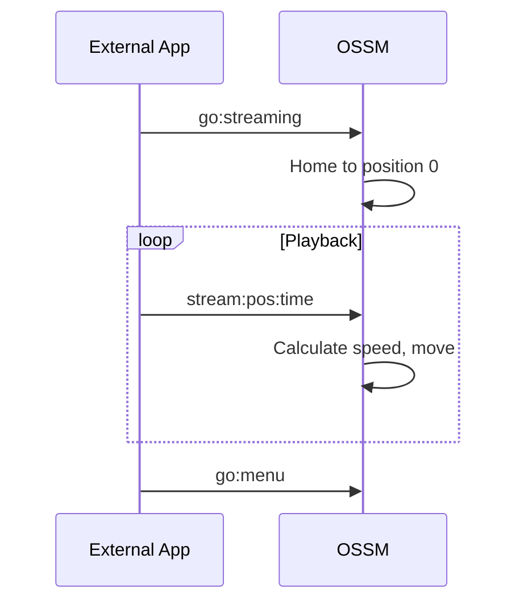

Die OSSM-Firmware bietet drei Hauptbetriebsmodi, die jeweils für unterschiedliche Anwendungsfälle konzipiert sind. In dieser Anleitung wird erläutert, wie Sie durch das Menüsystem navigieren und jeden Modus effektiv nutzen.

## Menünavigation

Nach Abschluss der Referenzfahrt zeigt das OSSM das Hauptmenü auf dem OLED-Bildschirm der Fernbedienung an.

| Aktion | Ergebnis |
|--------|--------|
| **Rotate encoder** | Durch die Menüoptionen scrollen |
| **Press encoder** | Die hervorgehobene Option auswählen |
| **Long-press encoder** | Zum Menü zurückkehren (aus jedem Betriebsmodus) |

<Info>
Das Menü läuft zyklisch – wenn Sie über den letzten Eintrag hinaus scrollen, gelangen Sie zurück zum ersten.
</Info>

## Hauptmenüoptionen

| Option | Beschreibung |
|--------|-------------|
| **Simple Penetration** | Grundlegende Bedienung mit Geschwindigkeits- und Hubsteuerung |
| **Stroke Engine** | Erweiterte musterbasierte Steuerung mit Tiefe, Stroke und Sensation |
| **Streaming (experimental)** | Externer Steuermodus für Funscript-Wiedergabe und Anwendungen von Drittanbietern |
| **Update** | Nach Firmware-Updates suchen und diese installieren (WiFi erforderlich) |
| **WiFi Setup** | Konfigurieren Sie die drahtlose Netzwerkverbindung |
| **Get Help** | Zeigen Sie den QR-Code an, der mit der Einrichtungsdokumentation verknüpft ist |
| **Restart** | Starten Sie den Controller neu und führen Sie eine neue Referenzfahrt durch |

## Simple Penetration-Modus

Simple Penetration bietet eine unkomplizierte Steuerung mit minimalen Parametern. Es ist ideal für Benutzer, die einen zuverlässigen Betrieb ohne Komplexität wünschen.

### Standardeinstellungen

| Parameter | Standardwert |
|-----------|---------------|
| Speed | 0% |
| Stroke | 0% |
| Depth | 50% |
| Sensation | 50% |

### Bedienelemente

<Tabs>
<Tab title="Speed">
Der **linke Knopf** (Potentiometer) steuert die Geschwindigkeit von 0 % bis 100 %.

- Im Uhrzeigersinn drehen, um die Geschwindigkeit zu erhöhen
- Gegen den Uhrzeigersinn drehen, um die Geschwindigkeit zu verringern
- Die Geschwindigkeit muss nahe Null liegen, um in den Modus zu gelangen (Sicherheitsfunktion).
</Tab>

<Tab title="Stroke">
Der **rechte Encoder** steuert die Hublänge von 0 % bis 100 %.

- Im Uhrzeigersinn drehen, um die Hublänge zu erhöhen
- Gegen den Uhrzeigersinn drehen, um die Hublänge zu verringern
- Der Hub bestimmt, wie weit sich der Aktuator bei jedem Zyklus bewegt
</Tab>
</Tabs>

### Sitzungsstatistiken

Simple Penetration verfolgt während Ihrer Sitzung drei Statistiken:

| Statistik | Beschreibung |
|-----------|-------------|
| **Stroke count** | Anzahl der durchgeführten vollständigen Hübe |
| **Distance** | Zurückgelegte Gesamtstrecke (angezeigt in Metern oder Fuß) |
| **Time** | Dauer seit Beginn der Sitzung |

Diese Statistiken werden unten auf dem Bildschirm angezeigt und zurückgesetzt, wenn Sie zum Menü zurückkehren.

<Tip>
Simple Penetration eignet sich am besten für einfache Anwendungsfälle, bei denen Sie eine konsistente, vorhersehbare Bewegung ohne Mustervariationen wünschen.
</Tip>

## Stroke Engine-Modus

Stroke Engine bietet eine erweiterte musterbasierte Steuerung mit vier einstellbaren Parametern. Es nutzt die [StrokeEngine-Bibliothek](/ossm/software/motion/stroke-engine/introduction), um vielfältige Bewegungsmuster zu erzeugen.

### Standardeinstellungen

| Parameter | Standardwert |
|-----------|---------------|
| Speed | 0% |
| Stroke | 50% |
| Depth | 10% |
| Sensation | 50% |

<Note>
Die Stroke Engine startet mit anderen Standardeinstellungen als Simple Penetration – insbesondere einer geringeren Tiefe (10 %) und einem höheren Hub (50 %), um ein sanfteres anfängliches Erlebnis mit musterbasierten Bewegungen zu ermöglichen.
</Note>

### Bedienelemente

<Tabs>
<Tab title="Speed">
Der **linke Knopf** (Potentiometer) steuert die Geschwindigkeit von 0 % bis 100 %.

Die Geschwindigkeit beeinflusst, wie schnell die Muster ausgeführt werden, gemessen in Zyklen pro Minute.
</Tab>

<Tab title="Parameters">
Der **rechte Encoder** steuert drei Parameter. Drücken Sie den Encoder, um zwischen ihnen zu wechseln:

| Parameter | Beschreibung |
|-----------|-------------|
| **Depth** | Wie weit dringt der Aktuator an seinem tiefsten Punkt in den Körper ein? |
| **Stroke** | Der Abstand, um den sich der Aktuator vom tiefsten Punkt zurückzieht |
| **Sensation** | Ein musterspezifischer Modifikator, der das Verhalten ändert (siehe [Pattern-Dokumentation](/ossm/software/motion/stroke-engine/pattern)) |

Der aktuell ausgewählte Parameter wird mit einem Balken in voller Breite angezeigt. Inaktive Parameter werden als kleinere Indikatoren angezeigt.
</Tab>

<Tab title="Pattern selection">
**Drücken Sie zweimal** den rechten Encoder, um die Musterauswahl zu öffnen.

Scrollen Sie mit dem Encoder durch die verfügbaren Muster und drücken Sie dann zur Auswahl. Das Muster ändert sich sofort.

Drücken Sie den Encoder oder drücken Sie ihn erneut zweimal, um zur Parametersteuerung zurückzukehren.
</Tab>
</Tabs>

### Verfügbare Muster

Stroke Engine bietet 7 Bewegungsmuster:

| Index | Muster | Verhalten |
|-------|---------|----------|
| 0 | Simple Stroke | Ausgewogene Beschleunigung, Ausrollen und Verzögerung |
| 1 | Teasing Pounding | Geschwindigkeit ändert sich abhängig von Sensation; gleicht schnellere Hübe aus |
| 2 | Robo Stroke | Sensation variiert die Beschleunigung von roboterhaft bis allmählich |
| 3 | Half'n'Half | Wechselt zwischen Hüben mit voller und halber Tiefe |
| 4 | Deeper | Die Hubtiefe nimmt mit jedem Zyklus zu; Sensation legt die Zykluszahl fest |
| 5 | Stop'n'Go | Pausen zwischen den Hüben; Sensation passt die Pausenlänge an |
| 6 | Insist | Ändert die Hublänge bei gleichbleibender Geschwindigkeit |

<Info>
Ausführliche Musterbeschreibungen und Sensationseffekte finden Sie in der [Pattern-Dokumentation](/ossm/software/motion/stroke-engine/pattern).
</Info>

## Streaming-Modus (experimentell)

<Warning>
Der Streaming-Modus ist experimentell und wird nicht für den allgemeinen Einsatz empfohlen. Das Protokoll und das Verhalten können sich in zukünftigen Firmware-Updates ändern. Verwenden Sie Streaming nur mit vertrauenswürdigen Anwendungen aus bekannten Quellen.
</Warning>

Der Streaming-Modus ermöglicht es externen Anwendungen, Echtzeit-Positionsbefehle über BLE an den OSSM zu senden. Im Gegensatz zu Simple Penetration und Stroke Engine, die Bewegungsmuster intern generieren, empfängt der Streaming-Modus genaue Positionsziele von einer externen Quelle und ermöglicht so eine synchronisierte Wiedergabe mit Videoinhalten, Funscripts oder benutzerdefinierten Steuerungsanwendungen.

### So funktioniert Streaming

1. Wählen Sie **Streaming** aus dem Hauptmenü (oder senden Sie `go:streaming` über BLE)
2. Das OSSM führt eine Referenzfahrt auf Position 0 (vollständig eingefahren) durch und wartet auf Befehle
3. Externe Anwendungen senden `stream:<position>:<time>`-Befehle
4. Das OSSM fährt innerhalb der vorgegebenen Zeit jede Zielposition an
5. Das Display zeigt den aktuellen Streaming-Status an

### Wann sollte der Streaming-Modus verwendet werden?

- **Funscript-Wiedergabe**: Synchronisieren Sie Bewegungen mit Videoinhalten mithilfe des [Funscript Player](/ossm/software/communication/ble#streaming-mode)
- **Integrationen von Drittanbietern**: Anwendungen, die Positionsdaten in Echtzeit generieren
- **Benutzerdefinierte Automatisierung**: Entwickler erstellen BLE-Steuerungsanwendungen

### Sicherheitsüberlegungen

<Warning>
Der Streaming-Modus akzeptiert Befehle von externen Quellen. Verwenden Sie nur Anwendungen, denen Sie vertrauen, und testen Sie sie immer mit geringer Intensität, bevor Sie sie vollständig nutzen. Halten Sie Ihre physischen Stopp-Bedienelemente zugänglich.
</Warning>

- Das OSSM validiert eingehende Befehle, verlässt sich jedoch für die sichere Bewegungsplanung auf die externe Anwendung
- Wenn die BLE-Verbindung verloren geht, verringert das OSSM die Geschwindigkeit über 2 Sekunden und stoppt
- Die lokalen Bedienelemente bleiben zugänglich – verwenden Sie bei Bedarf den Not-Aus-Schalter (langes Drücken des Encoders).

### Steuerung

Im Streaming-Modus:
- **Speed knob**: Wird nicht für Streaming verwendet (externe Befehle steuern die Bewegung)
- **Encoder rotation**: Wird nicht für Streaming verwendet
- **Long-press encoder**: Notstopp und Rückkehr zum Menü

### Technische Details

| Eigenschaft | Wert |
|----------|-------|
| Befehlsformat | `stream:<position>:<time>` |
| Positionsbereich | 0-100 (Prozentsatz des Hubs) |
| Zeiteinheit | Millisekunden |
| Mindest-Firmware | Version 3.0+ |

<CardGroup cols={2}>
<Card title="Funscript Player" icon="play" href="/ossm/software/communication/ble#streaming-mode">
  Spielen Sie mit Video synchronisierte Funscript-Dateien ab.
</Card>

<Card title="BLE Protocol" icon="bluetooth" href="/ossm/software/communication/ble">
  Vollständige Streaming-Befehlsreferenz und Protokolldetails.
</Card>
</CardGroup>

## Verlassen eines beliebigen Modus

**Drücken Sie in jedem Betriebsmodus den Encoder etwa 3 Sekunden lang**, um einen Notstopp auszulösen und zum Hauptmenü zurückzukehren.

<Warning>
Der Notstopp stoppt die Bewegung sofort und markiert das Gerät als „not homed“. Möglicherweise müssen Sie einen Neustart durchführen und eine neue Referenzfahrt durchführen, bevor Sie den Betrieb wieder aufnehmen können.
</Warning>

## Verwandte Seiten

<CardGroup cols={2}>
<Card title="Sicherheitsfunktionen" icon="shield" href="/ossm/software/getting-started/safety-features">
  Erfahren Sie mehr über Vorabprüfungen, Trennsicherung und Notstopp.
</Card>

<Card title="StrokeEngine Patterns" icon="wave-pulse" href="/ossm/software/motion/stroke-engine/pattern">
  Detaillierte Beschreibungen aller Bewegungsmuster und Sensation-Effekte.
</Card>

<Card title="Funscript Player" icon="play" href="/ossm/software/communication/ble#streaming-mode">
  Spielen Sie mit Video synchronisierte Funscript-Dateien im Streaming-Modus ab.
</Card>

<Card title="BLE Protocol" icon="bluetooth" href="/ossm/software/communication/ble">
  Technische Referenz für BLE-Befehle einschließlich Streaming.
</Card>
</CardGroup>
