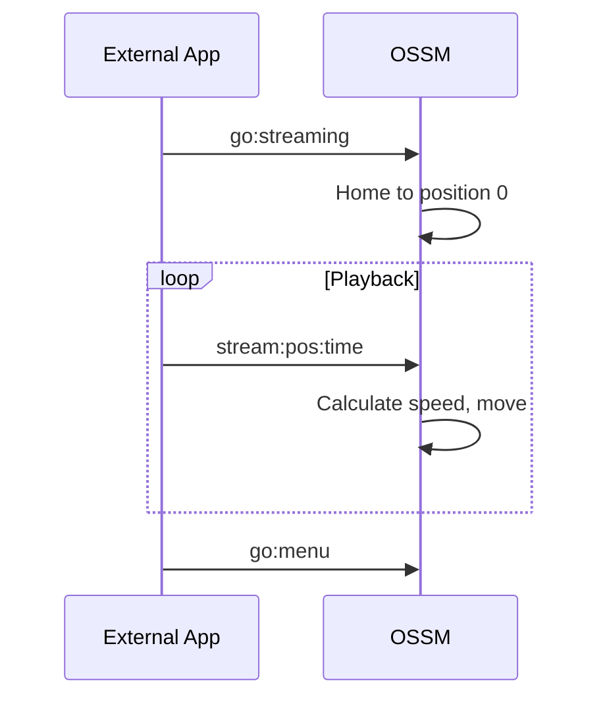

Le micrologiciel OSSM propose trois modes de fonctionnement principaux, chacun conçu pour différents cas d'utilisation. Ce guide explique comment naviguer dans le système de menus et utiliser chaque mode efficacement.

## Navigation dans les menus

Une fois le référencement terminé, l'OSSM affiche le menu principal sur l'écran OLED de la télécommande.

| Action | Résultat |
|--------|--------|
| **Rotate encoder** | Faire défiler les options du menu |
| **Press encoder** | Sélectionner l'option en surbrillance |
| **Long-press encoder** | Retourner au menu (depuis n'importe quel mode de fonctionnement) |

<Info>
Le menu boucle : faire défiler au-delà du dernier élément vous ramène au premier.
</Info>

## Options du menu principal

| Option | Description |
|--------|-------------|
| **Simple Penetration** | Fonctionnement de base avec commandes de vitesse et de course |
| **Stroke Engine** | Contrôle avancé basé sur des motifs avec profondeur, Stroke et Sensation |
| **Streaming (experimental)** | Mode de contrôle externe pour la lecture de funscripts et les applications tierces |
| **Update** | Rechercher et installer les mises à jour du micrologiciel (WiFi requis) |
| **WiFi Setup** | Configurer la connexion réseau sans fil |
| **Get Help** | Afficher le code QR renvoyant vers la documentation de configuration |
| **Restart** | Redémarrer le contrôleur et effectuer un nouveau référencement |

## Mode Simple Penetration

Simple Penetration offre un contrôle simple avec des paramètres minimaux. Il est idéal pour les utilisateurs qui souhaitent un fonctionnement fiable et sans complexité.

### Paramètres par défaut

| Paramètre | Valeur par défaut |
|-----------|---------------|
| Speed | 0% |
| Stroke | 0% |
| Depth | 50% |
| Sensation | 50% |

### Contrôles

<Tabs>
<Tab title="Speed">
Le **bouton gauche** (potentiomètre) contrôle la vitesse de 0 % à 100 %.

- Tournez dans le sens des aiguilles d'une montre pour augmenter la vitesse
- Tournez dans le sens inverse des aiguilles d'une montre pour diminuer la vitesse
- La vitesse doit être proche de zéro pour entrer dans le mode (fonction de sécurité)
</Tab>

<Tab title="Stroke">
L’**encodeur droit** contrôle la longueur de course de 0 % à 100 %.

- Tournez dans le sens des aiguilles d’une montre pour augmenter la longueur de course
- Tournez dans le sens antihoraire pour diminuer la longueur de course
- La course détermine la distance parcourue par l'actionneur à chaque cycle.
</Tab>
</Tabs>

### Statistiques de session

Simple Penetration suit trois statistiques au cours de votre session :

| Statistique | Description |
|-----------|-------------|
| **Stroke count** | Nombre de courses complètes effectuées |
| **Distance** | Distance totale parcourue (affichée en mètres ou en pieds) |
| **Time** | Durée depuis le début de la session |

Ces statistiques s'affichent en bas de l'écran et se réinitialisent lorsque vous revenez au menu.

<Tip>
Simple Penetration est idéal pour les cas d’utilisation simples dans lesquels vous souhaitez un mouvement cohérent et prévisible sans variations de motif.
</Tip>

## Mode Stroke Engine

Stroke Engine fournit un contrôle avancé basé sur des motifs avec quatre paramètres réglables. Il utilise la [bibliothèque StrokeEngine](/ossm/software/motion/stroke-engine/introduction) pour générer des motifs de mouvement variés.

### Paramètres par défaut

| Paramètre | Valeur par défaut |
|-----------|---------------|
| Speed | 0% |
| Stroke | 50% |
| Depth | 10% |
| Sensation | 50% |

<Note>
Stroke Engine démarre avec des paramètres par défaut différents de Simple Penetration, notamment une profondeur inférieure (10 %) et une course plus élevée (50 %), pour offrir une expérience initiale plus douce avec un mouvement basé sur des motifs.
</Note>

### Contrôles

<Tabs>
<Tab title="Speed">
Le **bouton gauche** (potentiomètre) contrôle la vitesse de 0 % à 100 %.

La vitesse détermine la rapidité d’exécution des motifs, mesurée en cycles par minute.
</Tab>

<Tab title="Parameters">
L’**encodeur droit** contrôle trois paramètres. Appuyez sur l’encodeur pour passer de l’un à l’autre :

| Paramètre | Description |
|-----------|-------------|
| **Depth** | Jusqu’où l’actionneur se déplace dans le corps à son point le plus profond |
| **Stroke** | La distance à laquelle l’actionneur se rétracte depuis le point le plus profond |
| **Sensation** | Un modificateur spécifique à un motif qui modifie le comportement (voir la [documentation des motifs](/ossm/software/motion/stroke-engine/pattern)) |

Le paramètre actuellement sélectionné s'affiche avec une barre pleine largeur ; les paramètres inactifs s'affichent sous forme d'indicateurs plus petits.
</Tab>

<Tab title="Pattern selection">
**Appuyez deux fois** sur l'encodeur droit pour ouvrir la sélection de motif.

Utilisez l'encodeur pour faire défiler les motifs disponibles, puis appuyez pour sélectionner. Le motif change immédiatement.

Appuyez sur l'encodeur ou appuyez à nouveau deux fois pour revenir aux contrôles des paramètres.
</Tab>
</Tabs>

### Motifs disponibles

Stroke Engine propose 7 motifs de mouvement :

| Indice | Motif | Comportement |
|-------|---------|----------|
| 0 | Simple Stroke | Accélération, roue libre et décélération équilibrées |
| 1 | Teasing Pounding | Les changements de vitesse dépendent de Sensation et équilibrent les courses plus rapides |
| 2 | Robo Stroke | Sensation fait varier l’accélération, d’un profil robotique à un profil progressif. |
| 3 | Half'n'Half | Alterne entre des courses de pleine et de demi-profondeur |
| 4 | Deeper | La profondeur de course augmente à chaque cycle ; Sensation définit le nombre de cycles |
| 5 | Stop'n'Go | Pauses entre les courses ; Sensation ajuste la durée de la pause |
| 6 | Insist | Modifie la longueur de course tout en maintenant la vitesse |

<Info>
Pour des descriptions détaillées des motifs et des effets de Sensation, consultez la [documentation des motifs](/ossm/software/motion/stroke-engine/pattern).
</Info>

## Mode Streaming (expérimental)

<Warning>
Le mode Streaming est expérimental et n’est pas recommandé pour une utilisation générale. Le protocole et le comportement peuvent changer dans les futures mises à jour du micrologiciel. Utilisez Streaming uniquement avec des applications fiables provenant de sources connues.
</Warning>

Le mode Streaming permet aux applications externes d'envoyer des commandes de position en temps réel à l'OSSM via BLE. Contrairement à Simple Penetration et Stroke Engine, qui génèrent des motifs de mouvement en interne, Streaming reçoit des cibles de position exactes d'une source externe, permettant une lecture synchronisée avec du contenu vidéo, des funscripts ou des applications de contrôle personnalisées.

### Comment fonctionne le streaming

1. Sélectionnez **Streaming** dans le menu principal (ou envoyez `go:streaming` via BLE)
2. L’OSSM effectue un référencement vers la position 0 (complètement rétracté) et attend les commandes
3. Les applications externes envoient des commandes `stream:<position>:<time>`
4. L'OSSM se déplace vers chaque position cible dans le délai spécifié
5. L'écran affiche l'état actuel du streaming

### Quand utiliser le mode Streaming

- **Lecture Funscript** : synchronisez le mouvement avec le contenu vidéo à l'aide du [Funscript Player](/ossm/software/communication/ble#streaming-mode)
- **Intégrations tierces** : applications qui génèrent des données de position en temps réel
- **Automatisation personnalisée** : développeurs créant des applications de contrôle BLE

### Considérations de sécurité

<Warning>
Le mode Streaming accepte les commandes provenant de sources externes. Utilisez uniquement des applications auxquelles vous faites confiance et testez toujours à faible intensité avant une utilisation à pleine intensité. Gardez vos commandes d’arrêt physiques accessibles.
</Warning>

- L'OSSM valide les commandes entrantes mais s'appuie sur l'application externe pour une planification de mouvement sécurisée.
- Si la connexion BLE est perdue, l’OSSM réduit progressivement sa vitesse pendant 2 secondes, puis s’arrête.
- Les commandes locales restent accessibles : utilisez l'arrêt d'urgence (encodeur à pression longue) si nécessaire

### Contrôles

En mode Streaming :
- **Speed knob** : non utilisé pour Streaming (les commandes externes contrôlent le mouvement)
- **Encoder rotation** : non utilisé pour Streaming
- **Long-press encoder** : Arrêt d'urgence et retour au menu

### Détails techniques

| Propriété | Valeur |
|----------|-------|
| Format de commande | `stream:<position>:<time>` |
| Plage de positions | 0-100 (pourcentage de course) |
| Unité de temps | Millisecondes |
| Micrologiciel minimal | Version 3.0+ |

<CardGroup cols={2}>
<Card title="Funscript Player" icon="play" href="/ossm/software/communication/ble#streaming-mode">
  Lisez des fichiers funscript synchronisés avec la vidéo.
</Card>

<Card title="BLE Protocol" icon="bluetooth" href="/ossm/software/communication/ble">
  Référence complète des commandes de streaming et détails du protocole.
</Card>
</CardGroup>

## Quitter n'importe quel mode

Depuis n'importe quel mode de fonctionnement, **appuyez longuement sur l'encodeur pendant environ 3 secondes** pour déclencher un arrêt d'urgence et revenir au menu principal.

<Warning>
L'arrêt d'urgence arrête immédiatement le mouvement et marque l'appareil comme « not homed ». Vous devrez peut-être redémarrer et effectuer un nouveau référencement avant de reprendre le fonctionnement.
</Warning>

## Pages connexes

<CardGroup cols={2}>
<Card title="Safety Features" icon="shield" href="/ossm/software/getting-started/safety-features">
  Découvrez les vérifications préalables, la sécurité de déconnexion et l’arrêt d’urgence.
</Card>

<Card title="StrokeEngine Patterns" icon="wave-pulse" href="/ossm/software/motion/stroke-engine/pattern">
  Descriptions détaillées de chaque motif de mouvement et des effets de Sensation.
</Card>

<Card title="Funscript Player" icon="play" href="/ossm/software/communication/ble#streaming-mode">
  Lisez des fichiers funscript synchronisés avec la vidéo en utilisant le mode Streaming.
</Card>

<Card title="BLE Protocol" icon="bluetooth" href="/ossm/software/communication/ble">
  Référence technique pour les commandes BLE, y compris le streaming.
</Card>
</CardGroup>
