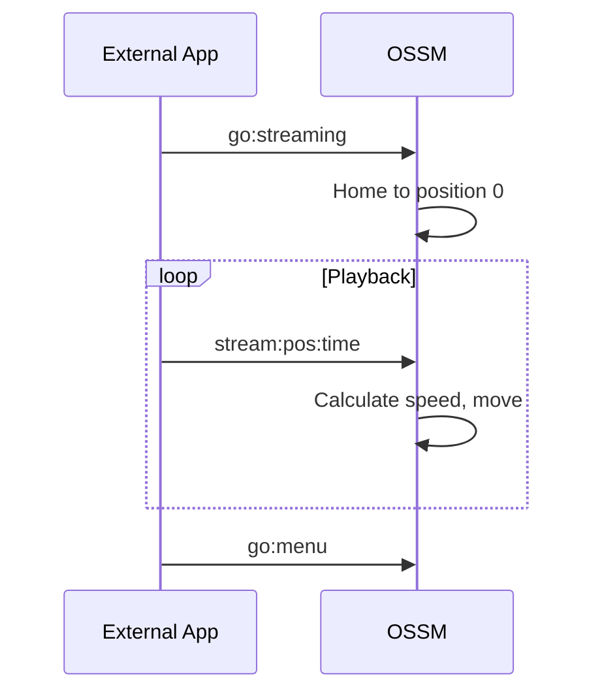

Le micrologiciel OSSM propose trois modes de fonctionnement principaux, chacun conçu pour différents cas d'utilisation. Ce guide explique comment naviguer dans le système de menus et utiliser chaque mode efficacement.

## Navigation dans les menus

Une fois la prise en charge terminée, l'OSSM affiche le menu principal sur l'écran OLED de la télécommande.

| Action | Résultat |
|--------|--------|
| ** Rotation de l'encodeur ** | Faire défiler les options du menu |
| **Appuyez sur l'encodeur** | Sélectionnez l'option en surbrillance |
| **Encodeur à pression longue** | Retour au menu (depuis n'importe quel mode de fonctionnement) |

<Info>
Le menu s'enroule et faire défiler le dernier élément vous ramène au premier.
</Info>

## Options du menu principal

| Option | Description |
|--------|-------------|
| **Pénétration simple** | Fonctionnement de base avec commandes de vitesse et de course |
| **Moteur de course** | Contrôle avancé basé sur des motifs avec profondeur, trait et sensation |
| **Streaming (expérimental)** | Mode de contrôle externe pour la lecture de funscripts et les applications tierces |
| **Mise à jour** | Recherchez et installez les mises à jour du micrologiciel (nécessite le Wi-Fi) |
| **Configuration Wi-Fi** | Configurer la connexion réseau sans fil |
| **Obtenir de l'aide** | Afficher le code QR reliant à la documentation de configuration |
| **Redémarrage** | Redémarrez le contrôleur et re-home |

## Mode de pénétration simple

Simple Penetration offre un contrôle simple avec des paramètres minimaux. Il est idéal pour les utilisateurs qui souhaitent un fonctionnement fiable et sans complexité.

### Paramètres par défaut

| Paramètre | Valeur par défaut |
|-----------|---------------|
| Vitesse | 0% |
| Accident vasculaire cérébral | 0% |
| Profondeur | 50% |
| Sensation | 50% |

### Contrôles

<Tabs>
<Tab title="Vitesse">
Le **bouton gauche** (potentiomètre) contrôle la vitesse de 0 % à 100 %.

- Tournez dans le sens des aiguilles d'une montre pour augmenter la vitesse
- Tournez dans le sens inverse des aiguilles d'une montre pour diminuer la vitesse
- La vitesse doit être proche de zéro pour entrer dans le mode (fonction de sécurité)
</Tab>

<Tab title="Accident vasculaire cérébral">
Le **encodeur droit** contrôle la longueur de course de 0 % à 100 %.

- Tournez dans le sens des aiguilles d’une montre pour augmenter la longueur de course
- Tournez dans le sens antihoraire pour diminuer la longueur de course
- La course détermine la distance parcourue par l'actionneur à chaque cycle.
</Tab>
</Tabs>

### Statistiques de session

Simple Penetration suit trois statistiques au cours de votre session :

| Statistique | Description |
|-----------|-------------|
| **Nombre de coups** | Nombre de coups complets effectués |
| **Distance** | Distance totale parcourue (affichée en mètres ou en pieds) |
| **Temps** | Durée depuis le début de la session |

Ces statistiques s'affichent en bas de l'écran et se réinitialisent lorsque vous revenez au menu.

<Tip>
La pénétration simple est idéale pour les cas d’utilisation simples dans lesquels vous souhaitez un mouvement cohérent et prévisible sans variations de motif.
</Tip>

## Mode moteur de course

Stroke Engine fournit un contrôle avancé basé sur des modèles avec quatre paramètres réglables. Il utilise la [bibliothèque StrokeEngine](/ossm/software/motion/stroke-engine/introduction) pour générer des modèles de mouvement variés.

### Paramètres par défaut

| Paramètre | Valeur par défaut |
|-----------|---------------|
| Vitesse | 0% |
| Accident vasculaire cérébral | 50% |
| Profondeur | 10% |
| Sensation | 50% |

<Note>
Stroke Engine démarre avec des paramètres par défaut différents de Simple Penetration, notamment une profondeur inférieure (10 %) et une course plus élevée (50 %), pour offrir une expérience initiale plus douce avec un mouvement basé sur des motifs.
</Note>

### Contrôles

<Tabs>
<Tab title="Vitesse">
Le **bouton gauche** (potentiomètre) contrôle la vitesse de 0 % à 100 %.

La vitesse affecte la vitesse d'exécution des modèles, mesurée en cycles par minute.
</Tab>

<Tab title="Paramètres">
Le **encodeur droit** contrôle trois paramètres. Appuyez sur l'encodeur pour passer de l'un à l'autre :

| Paramètre | Description |
|-----------|-------------|
| **Profondeur** | Jusqu'où l'actionneur se déplace dans le corps à son point le plus profond |
| **Accident vasculaire cérébral** | La distance à laquelle l'actionneur se rétracte depuis le point le plus profond |
| **Sensation** | Un modificateur spécifique à un modèle qui modifie le comportement (voir [Patterns](/ossm/software/motion/stroke-engine/pattern)) |

Le paramètre actuellement sélectionné s'affiche avec une barre pleine largeur ; les paramètres inactifs s'affichent sous forme d'indicateurs plus petits.
</Tab>

<Tab title="Sélection de motif">
**Appuyez deux fois** sur l'encodeur droit pour ouvrir la sélection de motif.

Utilisez l'encodeur pour faire défiler les modèles disponibles, puis appuyez pour sélectionner. Le modèle change immédiatement.

Appuyez sur l'encodeur ou appuyez à nouveau deux fois pour revenir aux contrôles des paramètres.
</Tab>
</Tabs>

### Modèles disponibles

Stroke Engine propose 7 modèles de mouvement :

| Indice | Modèle | Comportement |
|-------|---------|----------|
| 0 | Coup simple | Accélération, roue libre et décélération équilibrées |
| 1 | Taquiner martèlement | Changements de vitesse basés sur la sensation ; équilibre les mouvements plus rapides |
| 2 | Coup de robot | La sensation varie d'accélération de robotique à progressive |
| 3 | Moitié-moitié | Alterne entre les courses pleines et demi-profondeurs |
| 4 | Plus profond | La profondeur de course augmente à chaque cycle ; la sensation définit le nombre de cycles |
| 5 | Stop'n'Go | Pauses entre les coups ; la sensation ajuste la durée de la pause |
| 6 | Insister | Modifie la longueur de course tout en maintenant la vitesse |

<Info>
Pour des descriptions détaillées des modèles et des effets de sensation, consultez la [Documentation des modèles](/ossm/software/motion/stroke-engine/pattern).
</Info>

## Mode streaming (expérimental)

<Warning>
Le mode streaming est expérimental et n’est pas recommandé pour le jeu général. Le protocole et le comportement peuvent changer dans les futures mises à jour du micrologiciel. Utilisez le streaming uniquement avec des applications fiables provenant de sources connues.
</Warning>

Le mode streaming permet aux applications externes d'envoyer des commandes de position en temps réel à l'OSSM via BLE. Contrairement à Simple Penetration et Stroke Engine qui génèrent des modèles de mouvement en interne, le mode Streaming reçoit des cibles de position exactes d'une source externe, permettant une lecture synchronisée avec du contenu vidéo, des funscripts ou des applications de contrôle personnalisées.

### Comment fonctionne le streaming

1. Sélectionnez **Streaming** dans le menu principal (ou envoyez `go:streaming` via BLE)
2. L'OSSM revient en position 0 (complètement rétracté) et attend les commandes
3. Les applications externes envoient des commandes `stream:<position>:<time>`
4. L'OSSM se déplace vers chaque position cible dans le délai spécifié
5. L'écran affiche l'état actuel du streaming

### Quand utiliser le mode Streaming

- **Lecture Funscript** : synchronisez le mouvement avec le contenu vidéo à l'aide du [Funscript Player](/ossm/software/communication/ble#streaming-mode)
- **Intégrations tierces** : applications qui génèrent des données de position en temps réel
- **Automatisation personnalisée** : développeurs créant des applications de contrôle BLE

### Considérations de sécurité

<Warning>
Le mode streaming accepte les commandes provenant de sources externes. Utilisez uniquement des applications auxquelles vous faites confiance et testez toujours à faible intensité avant un engagement complet. Gardez vos commandes d’arrêt physiques accessibles.
</Warning>

- L'OSSM valide les commandes entrantes mais s'appuie sur l'application externe pour une planification de mouvement sécurisée.
- Si la connexion BLE est perdue, l'OSSM ralentit la vitesse sur 2 secondes et s'arrête.
- Les commandes locales restent accessibles : utilisez l'arrêt d'urgence (encodeur à pression longue) si nécessaire

### Contrôles

En mode Streaming :
- **Bouton de vitesse** : non utilisé pour le streaming (les commandes externes contrôlent le mouvement)
- **Rotation de l'encodeur** : non utilisé pour le streaming
- **Encodeur appui long** : Arrêt d'urgence et retour au menu

### Détails techniques

| Propriété | Valeur |
|----------|-------|
| Format de commande | `stream:<position>:<time>` |
| Plage de positions | 0-100 (pourcentage de course) |
| Unité de temps | Millisecondes |
| Micrologiciel minimal | Version 3.0+ |

<CardGroup cols={2}>
<Card title="Lecteur Funscript" icon="play" href="/ossm/software/communication/ble#streaming-mode">
  Lisez des fichiers funscript synchronisés avec la vidéo.
</Card>

<Card title="Protocole BLE" icon="bluetooth" href="/ossm/software/communication/ble">
  Référence complète des commandes de streaming et détails du protocole.
</Card>
</CardGroup>

## Quitter n'importe quel mode

Depuis n'importe quel mode de fonctionnement, **appuyez longuement sur l'encodeur pendant environ 3 secondes** pour déclencher un arrêt d'urgence et revenir au menu principal.

<Warning>
L'arrêt d'urgence arrête immédiatement le mouvement et marque l'appareil comme « non hébergé ». Vous devrez peut-être redémarrer et rentrer chez vous avant de recommencer à fonctionner.
</Warning>

## Pages connexes

<CardGroup cols={2}>
<Card title="Caractéristiques de sécurité" icon="shield" href="/ossm/software/getting-started/safety-features">
  Découvrez les vérifications avant vol, la sécurité de déconnexion et l’arrêt d’urgence.
</Card>

<Card title="Modèles de moteur de course" icon="wave-pulse" href="/ossm/software/motion/stroke-engine/pattern">
  Descriptions détaillées de chaque modèle de mouvement et effets de sensation.
</Card>

<Card title="Lecteur Funscript" icon="play" href="/ossm/software/communication/ble#streaming-mode">
  Lisez des fichiers funscript synchronisés avec la vidéo en utilisant le mode streaming.
</Card>

<Card title="Protocole BLE" icon="bluetooth" href="/ossm/software/communication/ble">
  Référence technique pour les commandes BLE, y compris le streaming.
</Card>
</CardGroup>
