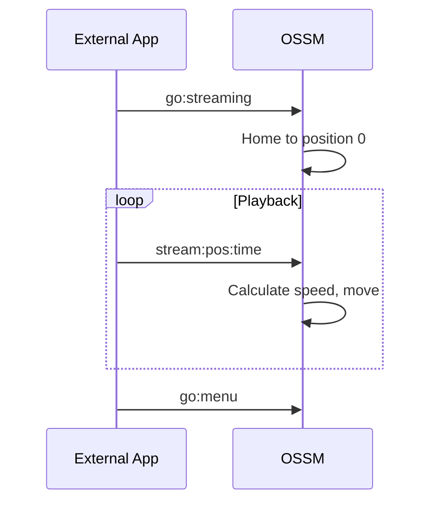

De OSSM-firmware biedt drie belangrijke bedieningsmodi, elk ontworpen voor verschillende gebruiksscenario's. In deze handleiding wordt uitgelegd hoe u door het menusysteem navigeert en elke modus effectief gebruikt.

## Menunavigatie

Nadat de homing is voltooid, geeft de OSSM het hoofdmenu weer op het OLED-scherm van de afstandsbediening.

| Actie | Resultaat |
|--------|--------|
| **Encoder draaien** | Blader door de menu-opties |
| **Druk op encoder** | Selecteer de gemarkeerde optie |
| **Encoder lang indrukken** | Terug naar menu (vanuit elke bedrijfsmodus) |

<Info>
Het menu loopt rond: als u voorbij het laatste item scrolt, keert u terug naar het eerste.
</Info>

## Hoofdmenu-opties

| Optie | Beschrijving |
|--------|-------------|
| **Eenvoudige penetratie** | Basisbediening met snelheids- en slagregeling |
| **Slagmotor** | Geavanceerde patroongebaseerde bediening met diepte, slag en sensatie |
| **Streamen (experimenteel)** | Externe bedieningsmodus voor het afspelen van funscripts en toepassingen van derden |
| **Update** | Firmware-updates controleren en installeren (vereist WiFi) |
| **WiFi-installatie** | Configureer de draadloze netwerkverbinding |
| **Hulp krijgen** | Geef de QR-code weer die linkt naar de installatiedocumentatie |
| **Herstart** | Start de controller opnieuw op en keer terug naar huis |

## Eenvoudige penetratiemodus

Simple Penetration biedt eenvoudige bediening met minimale parameters. Het is ideaal voor gebruikers die een betrouwbare werking zonder complexiteit willen.

### Standaardinstellingen

| Parameter | Standaardwaarde |
|-----------|---------------|
| Snelheid | 0% |
| Hartinfarct | 0% |
| Diepte | 50% |
| Gevoel | 50% |

### Controles

<Tabs>
<Tab title="Snelheid">
De **linkerknop** (potentiometer) regelt de snelheid van 0% tot 100%.

- Draai met de klok mee om de snelheid te verhogen
- Draai tegen de klok in om de snelheid te verlagen
- De snelheid moet bijna nul zijn om de modus te activeren (veiligheidsfunctie)
</Tab>

<Tab title="beroerte">
De **rechter encoder** regelt de slaglengte van 0% tot 100%.

- Draai met de klok mee om de slaglengte te vergroten
- Draai tegen de klok in om de slaglengte te verkleinen
- De slag bepaalt hoe ver de actuator tijdens elke cyclus reist
</Tab>
</Tabs>

### Sessiestatistieken

Simple Penetration houdt drie statistieken bij tijdens uw sessie:

| Statistiek | Beschrijving |
|-----------|-------------|
| **Aantallen slagen** | Aantal volledige uitgevoerde slagen |
| **Afstand** | Totaal afgelegde afstand (weergegeven in meters of voet) |
| **Tijd** | De duur sinds het begin van de sessie |

Deze statistieken worden onderaan het scherm weergegeven en worden gereset wanneer u terugkeert naar het menu.

<Tip>
Eenvoudige penetratie is het beste voor eenvoudige gebruikssituaties waarbij u consistente, voorspelbare bewegingen zonder patroonvariaties wilt.
</Tip>

## Slagmotormodus

Stroke Engine biedt geavanceerde patroongebaseerde bediening met vier instelbare parameters. Het maakt gebruik van de [StrokeEngine-bibliotheek](/ossm/software/motion/stroke-engine/introduction) om gevarieerde bewegingspatronen te genereren.

### Standaardinstellingen

| Parameter | Standaardwaarde |
|-----------|---------------|
| Snelheid | 0% |
| Hartinfarct | 50% |
| Diepte | 10% |
| Gevoel | 50% |

<Note>
Stroke Engine begint met andere standaardinstellingen dan Simple Penetration (met name een lagere diepte (10%) en een hogere slag (50%)) om een ​​zachtere eerste ervaring te bieden met op patronen gebaseerde bewegingen.
</Note>

### Controles

<Tabs>
<Tab title="Snelheid">
De **linkerknop** (potentiometer) regelt de snelheid van 0% tot 100%.

Snelheid beïnvloedt hoe snel de patronen worden uitgevoerd, gemeten in cycli per minuut.
</Tab>

<Tab title="Parameters">
De **rechter encoder** bestuurt drie parameters. Druk op de encoder om ertussen te schakelen:

| Parameter | Beschrijving |
|-----------|-------------|
| **Diepte** | Hoe ver in het lichaam de actuator op het diepste punt beweegt |
| **Hartinfarct** | De afstand die de actuator terugtrekt vanaf het diepste punt |
| **Gevoel** | Een patroonspecifieke modifier die gedrag verandert (zie [Patterns](/ossm/software/motion/stroke-engine/pattern)) |

De momenteel geselecteerde parameter wordt weergegeven met een balk over de volledige breedte; inactieve parameters worden weergegeven als kleinere indicatoren.
</Tab>

<Tab title="Patroon selectie">
**Druk dubbel** op de rechter encoder om de patroonselectie te openen.

Gebruik de encoder om door de beschikbare patronen te bladeren en druk vervolgens op om te selecteren. Het patroon verandert onmiddellijk.

Druk op de encoder of druk nogmaals tweemaal om terug te keren naar de parameterbedieningen.
</Tab>
</Tabs>

### Beschikbare patronen

Stroke Engine biedt 7 bewegingspatronen:

| Index | Patroon | Gedrag |
|-------|---------|----------|
| 0 | Simpele beroerte | Evenwichtige acceleratie, uitloop en vertraging |
| 1 | Plagen beukende | Snelheidsverschuivingen op basis van sensatie; balanceert snellere slagen |
| 2 | Robo-beroerte | De sensatie varieert van versnelling van robotachtig tot geleidelijk |
| 3 | Half en half | Wisselt af tussen slagen van volledige en halve diepte |
| 4 | Dieper | De slagdiepte neemt elke cyclus toe; sensatie stelt het aantal cycli in |
| 5 | Stop'n'Go | Pauzes tussen slagen; sensatie past de pauzelengte aan |
| 6 | Volharden | Wijzigt de slaglengte terwijl de snelheid behouden blijft |

<Info>
Voor gedetailleerde patroonbeschrijvingen en sensatie-effecten, zie de [Patroondocumentatie](/ossm/software/motion/stroke-engine/pattern).
</Info>

## Streamingmodus (experimenteel)

<Warning>
De streamingmodus is experimenteel en wordt niet aanbevolen voor algemeen spelen. Het protocol en het gedrag kunnen veranderen in toekomstige firmware-updates. Gebruik streaming alleen met vertrouwde applicaties van bekende bronnen.
</Warning>

Dankzij de streamingmodus kunnen externe applicaties via BLE real-time positieopdrachten naar de OSSM sturen. In tegenstelling tot de Simple Penetration and Stroke Engine, die intern bewegingspatronen genereert, ontvangt de Streaming-modus exacte positiedoelen van een externe bron, waardoor gesynchroniseerd afspelen met video-inhoud, funscripts of aangepaste besturingstoepassingen mogelijk is.

### Hoe streamen werkt

1. Selecteer **Streaming** in het hoofdmenu (of stuur `go:streaming` via BLE)
2. De OSSM keert terug naar positie 0 (volledig ingetrokken) en wacht op commando's
3. Externe toepassingen verzenden `stream:<position>:<time>`-opdrachten
4. De OSSM beweegt binnen de aangegeven tijd naar elke doelpositie
5. Het display toont de huidige streamingstatus

### Wanneer moet u de streamingmodus gebruiken?

- **Funscript afspelen**: synchroniseer beweging met video-inhoud met behulp van de [Funscript Player](/ossm/software/communication/ble#streaming-mode)
- **Integraties van derden**: Applicaties die realtime positiegegevens genereren
- **Aangepaste automatisering**: ontwikkelaars die BLE-besturingsapplicaties bouwen

### Veiligheidsoverwegingen

<Warning>
De streamingmodus accepteert opdrachten van externe bronnen. Gebruik alleen applicaties die u vertrouwt en test altijd op lage intensiteit voordat u deze volledig gebruikt. Houd uw fysieke stopbedieningen toegankelijk.
</Warning>

- De OSSM valideert binnenkomende opdrachten, maar vertrouwt op de externe applicatie voor veilige bewegingsplanning
- Als de BLE-verbinding verloren gaat, verlaagt de OSSM de snelheid gedurende 2 seconden en stopt dan
- Lokale bedieningselementen blijven toegankelijk: gebruik indien nodig de noodstop (encoder lang indrukken).

### Controles

In de streamingmodus:
- **Snelheidsknop**: Niet gebruikt voor streaming (externe commando's regelen beweging)
- **Encoderrotatie**: Niet gebruikt voor streaming
- **Encoder lang indrukken**: Noodstop en terugkeren naar het menu

### Technische details

| Eigendom | Waarde |
|----------|-------|
| Commando-indeling | `stream:<position>:<time>` |
| Positiebereik | 0-100 (percentage beroerte) |
| Tijdseenheid | Milliseconden |
| Minimale firmware | Versie 3.0+ |

<CardGroup cols={2}>
<Card title="Funscript-speler" icon="play" href="/ossm/software/communication/ble#streaming-mode">
  Speel funscript-bestanden af ​​die zijn gesynchroniseerd met video.
</Card>

<Card title="BLE-protocol" icon="bluetooth" href="/ossm/software/communication/ble">
  Volledige streamingopdrachtreferentie en protocoldetails.
</Card>
</CardGroup>

## Elke modus verlaten

Vanuit elke bedrijfsmodus kunt u **de encoder ongeveer 3 seconden lang ingedrukt houden** om een ​​noodstop te activeren en terug te keren naar het hoofdmenu.

<Warning>
Een noodstop stopt onmiddellijk de beweging en markeert het apparaat als 'niet thuis'. Mogelijk moet u opnieuw opstarten en opnieuw starten voordat u weer kunt werken.
</Warning>

## Gerelateerde pagina's

<CardGroup cols={2}>
<Card title="Veiligheidsvoorzieningen" icon="shield" href="/ossm/software/getting-started/safety-features">
  Lees meer over preflightcontroles, ontkoppelingsveiligheid en noodstop.
</Card>

<Card title="StrokeEngine-patronen" icon="wave-pulse" href="/ossm/software/motion/stroke-engine/pattern">
  Gedetailleerde beschrijvingen van elk bewegingspatroon en sensatie-effecten.
</Card>

<Card title="Funscript-speler" icon="play" href="/ossm/software/communication/ble#streaming-mode">
  Speel funscript-bestanden af ​​die zijn gesynchroniseerd met video via de streamingmodus.
</Card>

<Card title="BLE-protocol" icon="bluetooth" href="/ossm/software/communication/ble">
  Technische referentie voor BLE-opdrachten inclusief streaming.
</Card>
</CardGroup>
