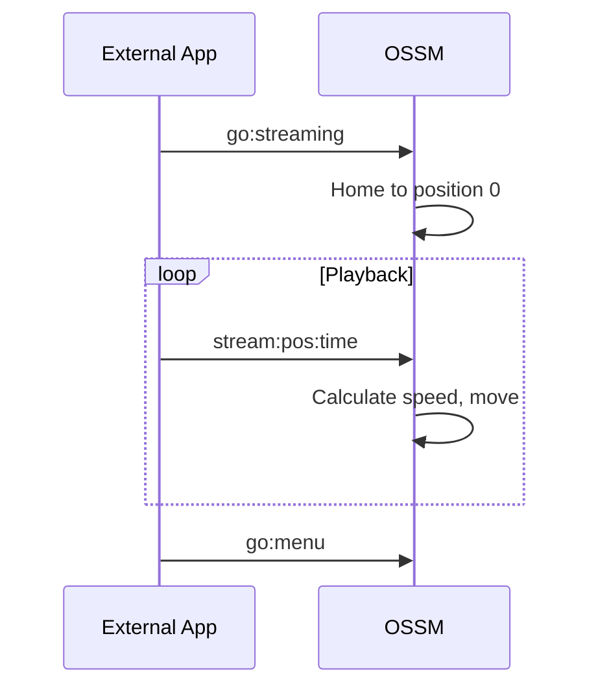

De OSSM-firmware biedt drie belangrijke bedieningsmodi, elk ontworpen voor verschillende gebruiksscenario's. In deze handleiding wordt uitgelegd hoe u door het menusysteem navigeert en elke modus effectief gebruikt.

## Menunavigatie

Nadat de homing is voltooid, geeft de OSSM het hoofdmenu weer op het OLED-scherm van de afstandsbediening.

| Actie | Resultaat |
|--------|--------|
| **Rotate encoder** | Door de menu-opties bladeren |
| **Press encoder** | De gemarkeerde optie selecteren |
| **Long-press encoder** | Terugkeren naar het menu (vanuit elke bedrijfsmodus) |

<Info>
Het menu loopt rond: als u voorbij het laatste item scrolt, keert u terug naar het eerste.
</Info>

## Hoofdmenu-opties

| Optie | Beschrijving |
|--------|-------------|
| **Simple Penetration** | Basisbediening met snelheids- en slagregeling |
| **Stroke Engine** | Geavanceerde patroongebaseerde bediening met diepte, Stroke en Sensation |
| **Streaming (experimental)** | Externe bedieningsmodus voor het afspelen van funscripts en toepassingen van derden |
| **Update** | Firmware-updates controleren en installeren (vereist WiFi) |
| **WiFi Setup** | Configureer de draadloze netwerkverbinding |
| **Get Help** | Geef de QR-code weer die naar de installatiedocumentatie verwijst |
| **Restart** | Start de controller opnieuw op en voer opnieuw homing uit |

## Simple Penetration-modus

Simple Penetration biedt eenvoudige bediening met minimale parameters. Het is ideaal voor gebruikers die een betrouwbare werking zonder complexiteit willen.

### Standaardinstellingen

| Parameter | Standaardwaarde |
|-----------|---------------|
| Speed | 0% |
| Stroke | 0% |
| Depth | 50% |
| Sensation | 50% |

### Bediening

<Tabs>
<Tab title="Speed">
De **linkerknop** (potentiometer) regelt de snelheid van 0% tot 100%.

- Draai met de klok mee om de snelheid te verhogen
- Draai tegen de klok in om de snelheid te verlagen
- De snelheid moet bijna nul zijn om de modus te activeren (veiligheidsfunctie)
</Tab>

<Tab title="Stroke">
De **rechter encoder** regelt de slaglengte van 0% tot 100%.

- Draai met de klok mee om de slaglengte te vergroten
- Draai tegen de klok in om de slaglengte te verkleinen
- De slag bepaalt hoe ver de actuator tijdens elke cyclus reist
</Tab>
</Tabs>

### Sessiestatistieken

Simple Penetration houdt drie statistieken bij tijdens uw sessie:

| Statistiek | Beschrijving |
|-----------|-------------|
| **Stroke count** | Aantal volledig uitgevoerde slagen |
| **Distance** | Totaal afgelegde afstand (weergegeven in meters of voet) |
| **Time** | De duur sinds het begin van de sessie |

Deze statistieken worden onderaan het scherm weergegeven en worden gereset wanneer u terugkeert naar het menu.

<Tip>
Simple Penetration is het beste voor eenvoudige gebruikssituaties waarbij u consistente, voorspelbare bewegingen zonder patroonvariaties wilt.
</Tip>

## Stroke Engine-modus

Stroke Engine biedt geavanceerde patroongebaseerde bediening met vier instelbare parameters. Het maakt gebruik van de [StrokeEngine-bibliotheek](/ossm/software/motion/stroke-engine/introduction) om gevarieerde bewegingspatronen te genereren.

### Standaardinstellingen

| Parameter | Standaardwaarde |
|-----------|---------------|
| Speed | 0% |
| Stroke | 50% |
| Depth | 10% |
| Sensation | 50% |

<Note>
Stroke Engine begint met andere standaardinstellingen dan Simple Penetration (met name een lagere diepte (10%) en een hogere slag (50%)) om een zachtere eerste ervaring met patroongebaseerde bewegingen te bieden.
</Note>

### Bediening

<Tabs>
<Tab title="Speed">
De **linkerknop** (potentiometer) regelt de snelheid van 0% tot 100%.

Snelheid beïnvloedt hoe snel de patronen worden uitgevoerd, gemeten in cycli per minuut.
</Tab>

<Tab title="Parameters">
De **rechter encoder** bestuurt drie parameters. Druk op de encoder om ertussen te schakelen:

| Parameter | Beschrijving |
|-----------|-------------|
| **Depth** | Hoe ver de actuator op het diepste punt het lichaam in beweegt |
| **Stroke** | De afstand die de actuator vanaf het diepste punt terugtrekt |
| **Sensation** | Een patroonspecifieke modifier die het gedrag verandert (zie [Patroondocumentatie](/ossm/software/motion/stroke-engine/pattern)) |

De momenteel geselecteerde parameter wordt weergegeven met een balk over de volledige breedte; inactieve parameters worden weergegeven als kleinere indicatoren.
</Tab>

<Tab title="Pattern selection">
**Druk tweemaal** op de rechter encoder om de patroonselectie te openen.

Gebruik de encoder om door de beschikbare patronen te bladeren en druk er vervolgens op om te selecteren. Het patroon verandert onmiddellijk.

Druk op de encoder of druk nogmaals tweemaal om terug te keren naar de parameterbedieningen.
</Tab>
</Tabs>

### Beschikbare patronen

Stroke Engine biedt 7 bewegingspatronen:

| Index | Patroon | Gedrag |
|-------|---------|----------|
| 0 | Simple Stroke | Evenwichtige acceleratie, uitloop en vertraging |
| 1 | Teasing Pounding | Snelheid verandert op basis van Sensation; balanceert snellere slagen |
| 2 | Robo Stroke | Sensation varieert de acceleratie van robotachtig tot geleidelijk |
| 3 | Half'n'Half | Wisselt af tussen slagen met volledige en halve diepte |
| 4 | Deeper | De slagdiepte neemt elke cyclus toe; Sensation bepaalt het aantal cycli |
| 5 | Stop'n'Go | Pauzes tussen slagen; Sensation past de pauzelengte aan |
| 6 | Insist | Past de slaglengte aan terwijl de snelheid behouden blijft |

<Info>
Voor gedetailleerde patroonbeschrijvingen en Sensation-effecten raadpleegt u de [Patroondocumentatie](/ossm/software/motion/stroke-engine/pattern).
</Info>

## Streaming-modus (experimenteel)

<Warning>
De streamingmodus is experimenteel en wordt niet aanbevolen voor algemeen gebruik. Het protocol en het gedrag kunnen veranderen in toekomstige firmware-updates. Gebruik streaming alleen met vertrouwde applicaties van bekende bronnen.
</Warning>

Dankzij de Streaming-modus kunnen externe applicaties via BLE realtime positieopdrachten naar de OSSM sturen. In tegenstelling tot Simple Penetration en Stroke Engine, die intern bewegingspatronen genereren, ontvangt Streaming exacte positiedoelen van een externe bron, waardoor gesynchroniseerd afspelen met video-inhoud, funscripts of aangepaste besturingstoepassingen mogelijk is.

### Hoe streamen werkt

1. Selecteer **Streaming** in het hoofdmenu (of stuur `go:streaming` via BLE)
2. De OSSM voert homing uit naar positie 0 (volledig ingetrokken) en wacht op commando's
3. Externe toepassingen verzenden `stream:<position>:<time>`-opdrachten
4. De OSSM beweegt binnen de aangegeven tijd naar elke doelpositie
5. Het display toont de huidige streamingstatus

### Wanneer moet u de streamingmodus gebruiken?

- **Funscript afspelen**: synchroniseer beweging met video-inhoud met behulp van de [Funscript Player](/ossm/software/communication/ble#streaming-mode)
- **Integraties van derden**: Applicaties die realtime positiegegevens genereren
- **Aangepaste automatisering**: ontwikkelaars die BLE-besturingsapplicaties bouwen

### Veiligheidsoverwegingen

<Warning>
De streamingmodus accepteert opdrachten van externe bronnen. Gebruik alleen applicaties die u vertrouwt en test altijd op lage intensiteit voordat u deze volledig gebruikt. Houd uw fysieke stopbedieningen toegankelijk.
</Warning>

- De OSSM valideert binnenkomende opdrachten, maar vertrouwt op de externe applicatie voor veilige bewegingsplanning
- Als de BLE-verbinding verloren gaat, verlaagt de OSSM de snelheid gedurende 2 seconden en stopt dan
- Lokale bedieningselementen blijven toegankelijk: gebruik indien nodig de noodstop (encoder lang indrukken).

### Bedieningselementen

In de streamingmodus:
- **Speed knob**: Niet gebruikt voor Streaming (externe opdrachten regelen de beweging)
- **Encoder rotation**: Niet gebruikt voor Streaming
- **Long-press encoder**: Noodstop en terugkeren naar het menu

### Technische details

| Eigenschap | Waarde |
|----------|-------|
| Commando-indeling | `stream:<position>:<time>` |
| Positiebereik | 0-100 (percentage van de slag) |
| Tijdseenheid | Milliseconden |
| Minimale firmware | Versie 3.0+ |

<CardGroup cols={2}>
<Card title="Funscript Player" icon="play" href="/ossm/software/communication/ble#streaming-mode">
  Speel funscript-bestanden af die zijn gesynchroniseerd met video.
</Card>

<Card title="BLE Protocol" icon="bluetooth" href="/ossm/software/communication/ble">
  Volledige streamingopdrachtreferentie en protocoldetails.
</Card>
</CardGroup>

## Elke modus verlaten

Vanuit elke bedrijfsmodus kunt u **de encoder ongeveer 3 seconden lang ingedrukt houden** om een noodstop te activeren en terug te keren naar het hoofdmenu.

<Warning>
Een noodstop stopt onmiddellijk de beweging en markeert het apparaat als "not homed". Mogelijk moet u opnieuw opstarten en opnieuw homing uitvoeren voordat u weer kunt werken.
</Warning>

## Gerelateerde pagina's

<CardGroup cols={2}>
<Card title="Veiligheidsvoorzieningen" icon="shield" href="/ossm/software/getting-started/safety-features">
  Lees meer over preflightcontroles, ontkoppelingsveiligheid en noodstop.
</Card>

<Card title="StrokeEngine Patterns" icon="wave-pulse" href="/ossm/software/motion/stroke-engine/pattern">
  Gedetailleerde beschrijvingen van elk bewegingspatroon en Sensation-effecten.
</Card>

<Card title="Funscript Player" icon="play" href="/ossm/software/communication/ble#streaming-mode">
  Speel funscript-bestanden af die met video zijn gesynchroniseerd via de Streaming-modus.
</Card>

<Card title="BLE Protocol" icon="bluetooth" href="/ossm/software/communication/ble">
  Technische referentie voor BLE-opdrachten inclusief streaming.
</Card>
</CardGroup>
