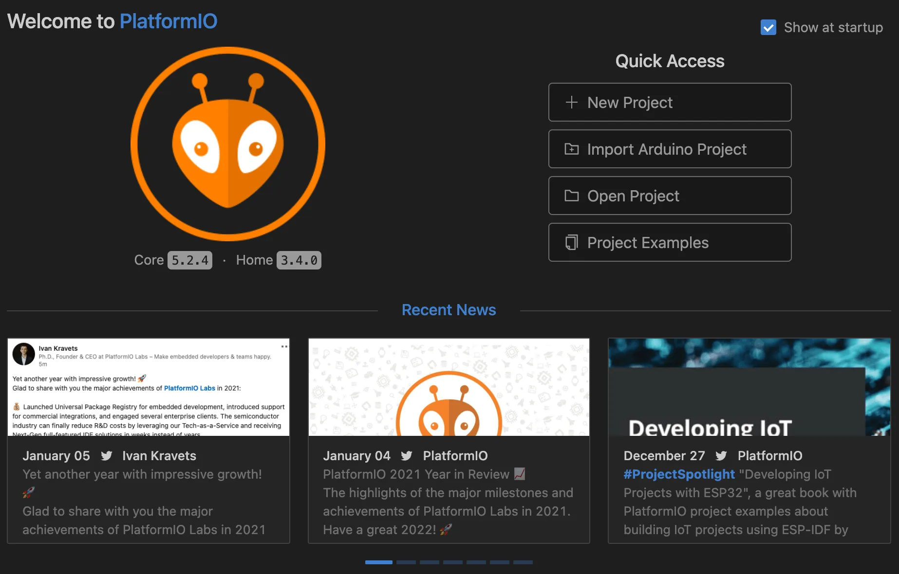
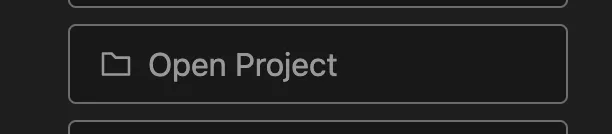
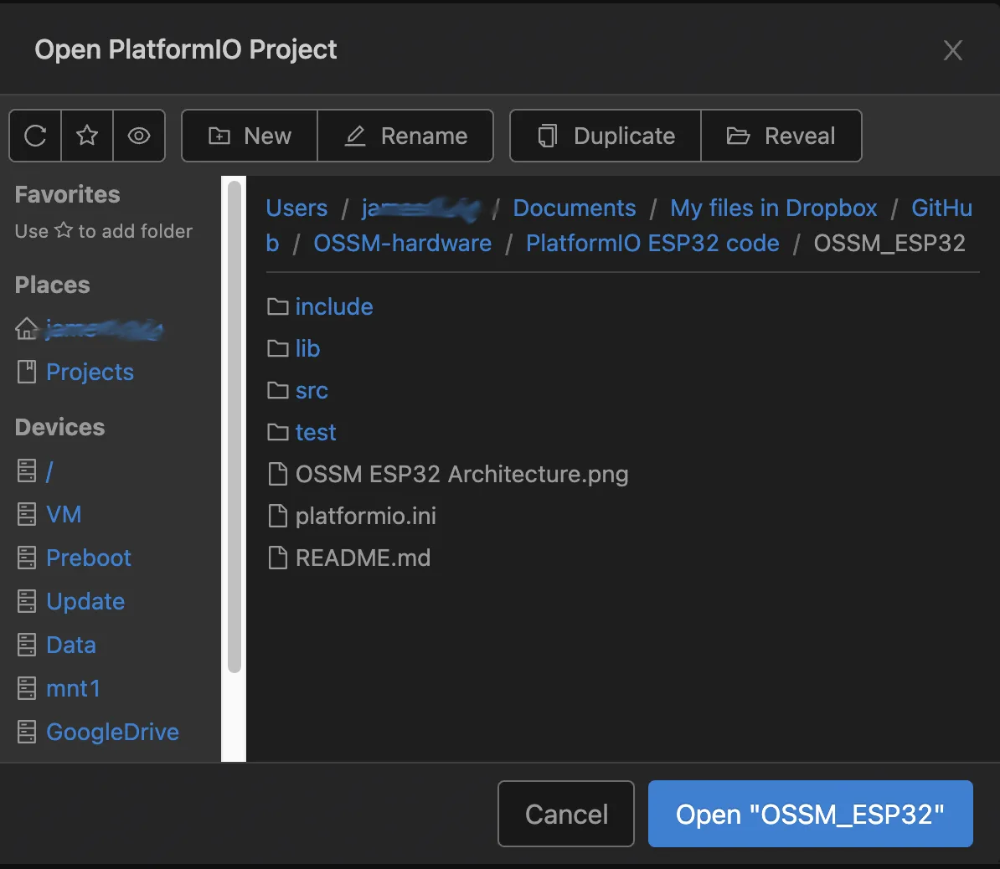
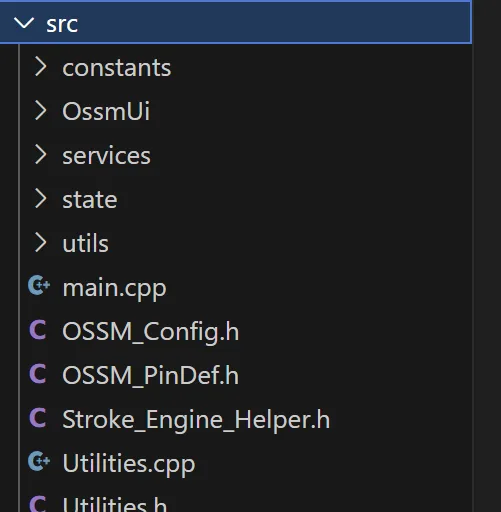
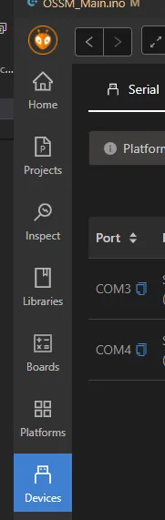

OSSM wird mit PlatformIO in VS Code entwickelt. Wenn Sie von der Arduino IDE kommen, kann der Übergang zunächst ungewohnt aussehen – Sie erhalten jedoch schnellere Builds, ein besseres Abhängigkeitsmanagement und ein konsistentes Setup für alle Mitwirkenden.

<Tip>
PlatformIO verwaltet Bibliotheken, Toolchains und Build-Umgebungen für Sie. Frühere OSSM-Versionen konnten an Arduino angepasst werden, aber das Projekt ist über diesen Ansatz hinausgewachsen. PlatformIO zu lernen nimmt weniger Zeit in Anspruch, als OSSM für jede Veröffentlichung erneut für Arduino anzupassen.
</Tip>

## Warum PlatformIO?

- Mehr Zeit für Funktionen – weniger Zeit, mit Abhängigkeiten zu kämpfen
- Einfachere Zusammenarbeit – eine einheitliche Entwicklungsumgebung für alle Mitwirkenden
- Automatische Abhängigkeitsauflösung – Bibliotheken werden für reproduzierbare Builds abgerufen und versionssicher festgeschrieben
- Code-Unterstützung – automatische Vervollständigung, Linting und Inline-Fehlererkennung

## Voraussetzungen

- VS Code installiert
- USB-Datenkabel für Ihr Board (Nur-Ladekabel funktionieren beim Hochladen nicht)
- Board-Treiber installiert, sofern Ihr Betriebssystem dies erfordert (z. B. CP210x oder CH340)

<Note>
Das Referenz-OSSM-Board verwendet ein eingebettetes <strong>Espressif ESP32 Dev Module</strong>.
</Note>

## Installation

<Steps>
<Step title="Installieren Sie VS Code und PlatformIO">
Installieren Sie VS Code und fügen Sie dann die Erweiterung "PlatformIO IDE" aus dem VS Code Marketplace hinzu. Starten Sie VS Code nach der Installation neu, um PlatformIO zu aktivieren.

<Check>
Sie sollten das PlatformIO-Symbol mit Alienkopf in der Activity Bar auf der linken Seite sehen.
</Check>
</Step>

<Step title="Öffnen Sie PlatformIO Home">
Klicken Sie auf das PlatformIO-Symbol, um PlatformIO Home zu öffnen.

<Frame>

</Frame>

<Frame>

</Frame>
</Step>

<Step title="Öffnen Sie das OSSM-Projekt">
Wählen Sie in PlatformIO Home „Open Project“ und wählen Sie den OSSM-Ordner aus, der `platformio.ini` (Kleinbuchstaben) enthält.

<Frame>

</Frame>

<Frame>

</Frame>

<Check>
Der Explorer sollte `platformio.ini`, einen `src/`-Ordner und einen `lib/`-Ordner anzeigen.
</Check>
</Step>

<Step title="Wählen Sie die richtige Umgebung aus (falls zutreffend)">
Wenn das Projekt mehrere Umgebungen in `platformio.ini` definiert (z. B. verschiedene Boards oder Build-Optionen), verwenden Sie die Umgebungsauswahl in der VS Code Status Bar (normalerweise mit der aktiven Umgebung beschriftet), um diejenige auszuwählen, die zu Ihrem Board passt.

<Note>
Wenn nur eine Umgebung vorhanden ist, wählt PlatformIO diese automatisch aus.
</Note>
</Step>

<Step title="Öffnen Sie den Firmware-Einstiegspunkt">
Öffnen Sie `src/main.cpp`, um den Firmware-Quelltext zu überprüfen.

<Frame>

</Frame>
</Step>

<Step title="Erstellen Sie die Firmware und laden Sie sie hoch">
Verwenden Sie das Symbol ✓ (Build) zum Kompilieren und das Symbol → (Upload), um das Board zu flashen. Diese Steuerelemente befinden sich in der Status Bar unten in VS Code.

<Frame>

</Frame>

- Führen Sie zuerst einen Build aus, um Fehler lokal zu erkennen, oder laden Sie die Firmware direkt hoch, um sie in einem Schritt zu kompilieren und zu flashen.
- Stellen Sie sicher, dass Ihr Board angeschlossen ist und der richtige serielle Port ausgewählt ist.

<Check>
Ein erfolgreicher Build endet mit `SUCCESS` im Terminal. Bei einem erfolgreichen Upload wird `Hash of data verified` oder eine ähnliche Bestätigung vom ESP32-Uploader angezeigt.
</Check>
</Step>
</Steps>

## Häufige Aufgaben

- Seriellen Port auswählen: PlatformIO → Quick Access → "Select Serial Port".
- Überwachen Sie die serielle Ausgabe: Klicken Sie auf das Steckersymbol (Monitor) in der Status Bar oder führen Sie `PlatformIO: Monitor` über die Command Palette aus.
- Build bereinigen: Führen Sie `PlatformIO: Clean` aus, um kompilierte Artefakte vor dem Neuaufbau zu entfernen.

## Fehlerbehebung

<AccordionGroup>
<Accordion title="Der Upload schlägt fehl oder das Board wurde nicht erkannt">
Die häufigsten Ursachen sind ein falsch konfigurierter serieller Port oder eine falsche Board-Konfiguration.

### Überprüfen Sie Ihren seriellen Port

Unter Windows erscheint das Board als `COMx`. Unter macOS/Linux erscheint es unter `/dev/tty.*` oder `/dev/cu.*`.

Legen Sie den Port in PlatformIO fest:

<Frame>

</Frame>

<Tip>
Wenn Sie keinen Port sehen, versuchen Sie es mit einem anderen USB-Kabel, einem anderen USB-Anschluss oder installieren Sie den entsprechenden USB-zu-UART-Treiber für Ihr Board.
</Tip>

<Note>
Für das OSSM-Referenzboard ist das Board-Ziel **Espressif ESP32 Dev Module**. Stellen Sie sicher, dass Ihre `platformio.ini`-Umgebung die richtige `board`-Einstellung für ESP32 verwendet.
</Note>
</Accordion>

<Accordion title="Der Build schlägt aufgrund von Bibliotheks- oder Plattformaktualisierungen fehl">
Ein Update einer Plattform oder Bibliothek kann inkompatible Änderungen mit sich bringen. Legen Sie die Versionen in `platformio.ini` fest, um eine bekannte funktionierende Konfiguration wiederherzustellen.

```ini platformio.ini
; Example: pin the Espressif32 platform
platform = espressif32@3.5.0
```

<Warning>
Überprüfen Sie immer die Versionshinweise des Projekts auf die empfohlenen Plattform- und Bibliotheksversionen.
</Warning>
</Accordion>

<Accordion title="Der serielle Monitor zeigt Kauderwelsch">
Dies weist normalerweise auf eine nicht passende Baudrate hin.

- Überprüfen Sie `monitor_speed` in `platformio.ini` (z. B. `115200`).
- Stellen Sie sicher, dass die Firmware und der serielle Monitor dieselbe Baudrate verwenden
</Accordion>

<Accordion title="Beim Hochladen bei „connecting…“ hängen geblieben">
- Halten Sie die BOOT/EN-Tasten des Boards gedrückt oder tippen Sie darauf, je nach Bedarf Ihres ESP32-Moduls
- Drücken Sie nach Abschluss des Uploads auf „Reset“, wenn das Board nicht automatisch neu startet
- Trennen Sie andere Apps, die möglicherweise denselben seriellen Port verwenden
</Accordion>
</AccordionGroup>

<Info>
Wenn Sie auf Probleme stoßen, die hier nicht behandelt werden, erfassen Sie das vollständige PlatformIO-Build-/Upload-Protokoll vom VS Code Terminal und geben Sie es an, wenn Sie um Hilfe bitten. Das Protokoll enthält die ausgewählte Umgebung, Plattformversionen und genaue Fehlermeldungen.
</Info>
