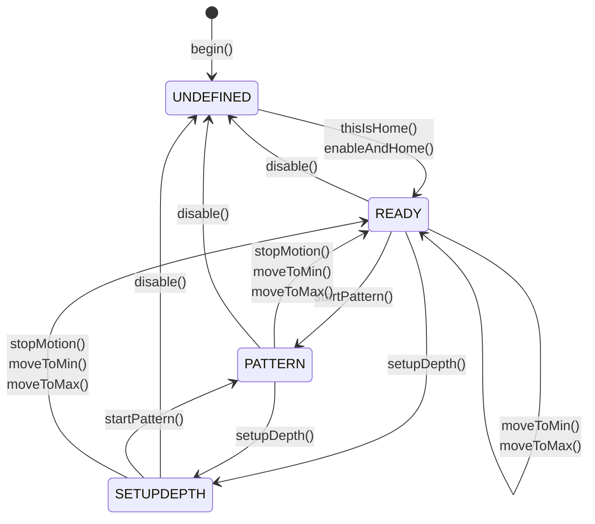

StrokeEngine ist eine Bibliothek zum Erstellen verschiedener Hubbewegungen mit Schritt- oder Servomotoren auf einem ESP32. Sie können sie mit jeder Heimwerkermaschine verwenden, die über einen linearen Positionsantrieb verfügt, der von einem Schritt- oder Servomotor angetrieben wird.

<CardGroup cols={2}>
  <Card title="FuckIO Example" icon="code" href="https://github.com/theelims/FuckIO">
    Referenzimplementierung mit StrokeEngine
  </Card>
  <Card title="OSSM Project" icon="gear" href="https://github.com/KinkyMakers/OSSM-hardware">
    Beliebte Open-Source-Implementierung von Kinky Makers
  </Card>
</CardGroup>

## Kernkonzepte

StrokeEngine nutzt die Vorteile von Maschinen mit Servo- und Schrittantrieb gegenüber Konstruktionen mit festem Nockenantrieb voll aus. Unter der Haube nutzt es die [FastAccelStepper](https://github.com/gin66/FastAccelStepper)-Bibliothek, um über Standard-STEP/DIR-Signale mit Motoren zu kommunizieren.

<Tip>
Wenn Sie diese Konzepte verstehen, können Sie StrokeEngine schneller nutzen.
</Tip>

### Koordinatensystem

Die Maschine verwendet ein internes Koordinatensystem, das reale metrische Einheiten in Encoder-/Schrittschritte umwandelt. Diese Abstraktion funktioniert mit allen Maschinengrößen, unabhängig vom gewählten Motor.

<Frame caption="StrokeEngine-Koordinatensystem, das den physischen Weg, Sperrgrenzen und Hubparameter anzeigt">
  
</Frame>

**Wichtige Koordinatenkonzepte:**

| Begriff | Beschreibung |
|------|-------------|
| **physicalTravel** | Der tatsächliche physische Weg von einem harten Endanschlag zum anderen |
| **keepoutBoundary** | Auf jeder Seite wird der Sicherheitsabstand abgezogen, um Kollisionen zu verhindern |
| **_travel** | Arbeitsabstand: `physicalTravel - (2 * keepoutBoundary)` |
| **Home** | Position bei `-keepoutBoundary` (typischerweise hinten) |
| **MIN = 0** | Nullposition, `keepoutBoundary` vom Home entfernt |
| **Depth** | Der weiteste Punkt, an den die Maschine ausfährt (zur Laufzeit einstellbar) |
| **Stroke** | Der Arbeitsabstand einer Hubbewegung (zur Laufzeit einstellbar) |

<Note>
Stellen Sie sich **Stroke** als die Amplitude und **Depth** als einen dazu addierten linearen Offset vor. Die positive Bewegungsrichtung ist nach vorne (zum Körper hin).
</Note>

### Muster

StrokeEngine verwendet einen Mustergenerator, um eine Vielzahl von Empfindungen zu erzeugen. Mithilfe trapezförmiger Bewegungsprofile passen Muster Parameter wie speed, stroke und depth Bewegung für Bewegung dynamisch an.

Jedes Muster akzeptiert vier Parameter:
- **depth** – Maximale Ausfahrposition
- **stroke** – Bewegungsamplitude
- **speed** – Zyklen pro Minute
- **sensation** – Beliebiger Modifikator für Musterverhalten (-100 bis 100)

<Info>
Ausführliche Beschreibungen der verfügbaren Muster und Anweisungen zum Erstellen eigener Muster finden Sie in der [Musterdokumentation](/ossm/software/motion/stroke-engine/pattern).
</Info>

### Fehlerbehandlung ohne Unterbrechung

StrokeEngine verarbeitet ungültige Parameter ordnungsgemäß, ohne den Betrieb zu unterbrechen:

- Alle Setter-Funktionen verwenden `constrain()`, um Eingaben auf die physischen Fähigkeiten der Maschine zu beschränken
- Werte außerhalb der Grenzen werden automatisch beschnitten
- Musterbefehle, die die Maschinengrenzen überschreiten, führen zu verkürzten Hüben oder angepassten Rampen
- Die Bewegung wird über die gesamte Distanz abgeschlossen, kann jedoch etwas länger dauern als erwartet

### Parameteraktualisierungen während des Hubs

Sie können die Parameter für Depth, Stroke, speed und pattern während des Hubs aktualisieren, um ein reaktionsschnelles, flüssiges Benutzererlebnis zu gewährleisten. Integrierte Sicherheitsvorrichtungen sorgen dafür, dass die Maschine jederzeit innerhalb der Grenzen bleibt.

### Zustandsmaschine

Eine interne Finite-State-Maschine verwaltet die Maschinenzustände:



| Zustand | Beschreibung |
|-------|-------------|
| **UNDEFINED** | Ausgangszustand vor dem Homing. Der Motor ist deaktiviert und die Position ist unbekannt. |
| **READY** | Homing abgeschlossen. Die Maschine akzeptiert Bewegungsbefehle. |
| **PATTERN** | Der Mustergenerator führt zyklische Bewegungen aus. |
| **SETUPDEPTH** | Der Motor folgt der Tiefenposition für eine interaktive Anpassung. |

## Verwendung

StrokeEngine bietet eine einfache, aber leistungsstarke API. Geben Sie alle Eingabeparameter in realen metrischen Einheiten an.

### Initialisieren Sie die Bibliothek

<Steps>
  <Step title="Definieren Sie Pin-Konfigurationen">
    Richten Sie die Pins für Ihren Motortreiber und den optionalen Referenzschalter ein:

```cpp main.cpp
#include <code>

// Pin Definitions
#define SERVO_PULSE       4
#define SERVO_DIR         16
#define SERVO_ENABLE      17
#define SERVO_ENDSTOP     25        // Optional: Only needed with a homing switch
```
  </Step>

  <Step title="Motoreigenschaften konfigurieren">
    Berechnen Sie Schritte pro Millimeter basierend auf Ihrer Hardware:

```cpp main.cpp
// Calculation Aid:
#define STEP_PER_REV      2000      // Steps per revolution (check driver DIP switches)
#define PULLEY_TEETH      20        // Teeth on the drive pulley
#define BELT_PITCH        2         // Timing belt pitch in mm
#define MAX_RPM           3000.0    // Maximum motor RPM
#define STEP_PER_MM       STEP_PER_REV / (PULLEY_TEETH * BELT_PITCH)
#define MAX_SPEED         (MAX_RPM / 60.0) * PULLEY_TEETH * BELT_PITCH

static motorProperties servoMotor {
  .maxSpeed = MAX_SPEED,              // Maximum speed in mm/s
  .maxAcceleration = 10000,           // Maximum acceleration in mm/s²
  .stepsPerMillimeter = STEP_PER_MM,  // Steps per millimeter
  .invertDirection = true,            // Flip direction if motor moves wrong way
  .enableActiveLow = true,            // Enable signal polarity
  .stepPin = SERVO_PULSE,             // STEP signal pin
  .directionPin = SERVO_DIR,          // DIR signal pin
  .enablePin = SERVO_ENABLE           // Enable signal pin
};
```
  </Step>

  <Step title="Maschinengeometrie definieren">
    Geben Sie die physischen Abmessungen Ihrer Maschine an:

```cpp main.cpp
static machineGeometry strokingMachine = {
  .physicalTravel = 160.0,            // Total travel between hard endstops (mm)
  .keepoutBoundary = 5.0              // Safety margin on each side (mm)
};
```
  </Step>

  <Step title="Homing konfigurieren">
    Richten Sie die Eigenschaften des Endschalters ein:

```cpp main.cpp
static endstopProperties endstop = {
  .homeToBack = true,                 // Endstop at rear of machine
  .activeLow = true,                  // Switch wired active low
  .endstopPin = SERVO_ENDSTOP,        // Endstop pin number
  .pinMode = INPUT                    // Use INPUT with external pull-up
};

StrokeEngine Stroker;
```
  </Step>

  <Step title="In setup() initialisieren">
    Rufen Sie die Initialisierungsfunktionen auf und warten Sie, bis das Homing abgeschlossen ist:

```cpp main.cpp
void setup() {
  // Initialize StrokeEngine
  Stroker.begin(&strokingMachine, &servoMotor);
  Stroker.enableAndHome(&endstop);

  // Your other initialization code here

  // Wait for homing to complete
  while (Stroker.getState() != READY) {
    delay(100);
  }
}
```

<Check>
Wenn `getState()` `READY` zurückgibt, ist das Homing abgeschlossen und die Maschine bereit für Bewegungsbefehle.
</Check>
  </Step>
</Steps>

### Manuelles Homing (kein Endschalter)

<Warning>
Manuelles Homing ist gefährlich. Wenn sich die Maschine nicht am physischen Endanschlag befindet, führt der Aufruf von `thisIsHome()` zu einem falschen Koordinatensystem und dadurch zu einer mechanischen Kollision, die Ihre Maschine beschädigen könnte.
</Warning>

Wenn Ihre Maschine keinen Homing-Schalter hat, können Sie manuelles Homing verwenden:

1. Bewegen Sie die Maschine physisch bis zum hinteren Endanschlag
2. Rufen Sie `Stroker.thisIsHome()` auf

```cpp
Stroker.thisIsHome();
```

Dadurch wird der Treiber aktiviert, die aktuelle Position als `-keepoutBoundary` festgelegt und langsam auf Position 0 gefahren.

### Verfügbare Muster abrufen

Verwenden Sie `getNumberOfPattern()` und `getPatternName()`, um verfügbare Muster aufzulisten:

```cpp patterns.cpp
String getPatternJSON() {
    String JSON = "[{\"";
    for (size_t i = 0; i < Stroker.getNumberOfPattern(); i++) {
        JSON += String(Stroker.getPatternName(i));
        JSON += "\": ";
        JSON += String(i, DEC);
        if (i < Stroker.getNumberOfPattern() - 1) {
            JSON += "},{\"";
        } else {
            JSON += "}]";
        }
    }
    Serial.println(JSON);
    return JSON;
}
```

## Bewegungssteuerung

### Bewegung starten und stoppen

| Funktion | Beschreibung |
|----------|-------------|
| `Stroker.startPattern()` | Startet die musterbasierte Hubbewegung |
| `Stroker.stopMotion()` | Sofort mit maximaler Verzögerung anhalten |

### Positionsbefehle

Bewegen Sie die Maschine zu Einrichtungszwecken an ein beliebiges Ende:

```cpp
Stroker.moveToMin();        // Move to rear (home) position
Stroker.moveToMax();        // Move to front (maximum) position
Stroker.moveToMax(10.0);    // Move at 10 mm/s (default speed)
```

<Note>
Diese Funktionen können aus den Zuständen `PATTERN` oder `READY` aufgerufen werden und jede aktuelle Bewegung stoppen. Sie geben `false` zurück, wenn sie in einem ungültigen Zustand aufgerufen werden.
</Note>

### Interaktives Tiefen-Setup

Rufen Sie den Tiefen-Setup-Modus auf, in dem der Motor der Tiefenposition in Echtzeit folgt:

```cpp
Stroker.setupDepth();           // Default 10 mm/s
Stroker.setupDepth(10.0);       // Specify speed
```

Aktualisieren Sie die Tiefenposition mit `Stroker.setDepth(float)` und lesen Sie den aktuellen Wert mit `Stroker.getDepth()`.

<Tip>
**Fancy Mode:** Rufen Sie `Stroker.setupDepth(10.0, true)` auf, um depth und stroke interaktiv anzupassen. Der Sensationsschieberegler wird dem Intervall `[depth-stroke, depth]` zugeordnet:
- `sensation = 100` – Passt die Tiefenposition an
- `sensation = -100` – Passt die Hubposition an
- `sensation = 0` – Positioniert am Hubmittelpunkt
</Tip>

### Parameterfunktionen

Aktualisieren Sie die Parameter jederzeit. Die Werte werden automatisch auf die Maschinengrenzen beschränkt:

```cpp
// Setter functions
Stroker.setSpeed(float speed, bool applyNow);      // 0.5–6000 cycles/min
Stroker.setDepth(float depth, bool applyNow);      // 0 to _travel (mm)
Stroker.setStroke(float stroke, bool applyNow);    // 0 to _travel (mm)
Stroker.setSensation(float sensation, bool applyNow); // -100 to 100
Stroker.setPattern(int index, bool applyNow);      // 0 to getNumberOfPattern()-1
```

<Info>
Setzen Sie `applyNow` auf `true`, um Änderungen sofort in der Mitte des Hubs anzuwenden. Andernfalls werden die Änderungen wirksam, nachdem der aktuelle Hub abgeschlossen ist.
</Info>

Lesen Sie die tatsächlich von StrokeEngine verwendeten eingeschränkten Werte zurück:

```cpp
// Getter functions
float speed = Stroker.getSpeed();         // Cycles per minute
float depth = Stroker.getDepth();         // Depth in mm
float stroke = Stroker.getStroke();       // Stroke length in mm
float sensation = Stroker.getSensation(); // -100 to 100
int pattern = Stroker.getPattern();       // Pattern index
```

## Erweiterte Funktionen

### Telemetrie-Rückruf

Registrieren Sie einen Rückruf, um Telemetriedaten für jede Trapezbewegung zu erhalten:

```cpp
void callbackTelemetry(float position, float speed, bool clipping) {
  // Handle telemetry data
}

Stroker.registerTelemetryCallback(callbackTelemetry);
```

<Note>
Die vollständige API-Referenz, einschließlich überladener Funktionen und zusätzlicher Funktionen, finden Sie im Quell-Repository unter [StrokeEngine.h](https://github.com/theelims/StrokeEngine/blob/main/src/StrokeEngine.h).
</Note>
