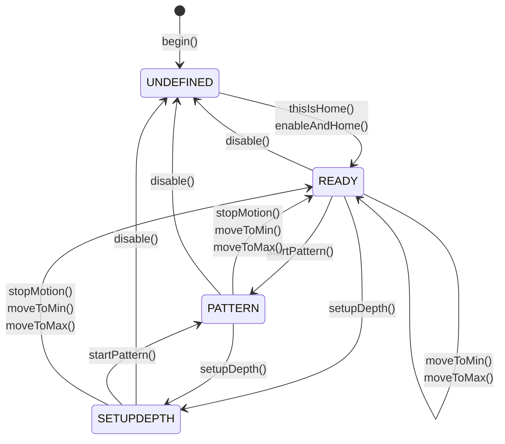

StrokeEngine est une bibliothèque permettant de créer une variété de mouvements de course avec des moteurs pas à pas ou des servomoteurs sur un ESP32. Vous pouvez l'utiliser avec n'importe quelle machine de bricolage dotée d'un entraînement de position linéaire alimenté par un moteur pas à pas ou un servomoteur.

<CardGroup cols={2}>
  <Card title="FuckIO Example" icon="code" href="https://github.com/theelims/FuckIO">
    Implémentation de référence à l'aide de StrokeEngine
  </Card>
  <Card title="OSSM Project" icon="gear" href="https://github.com/KinkyMakers/OSSM-hardware">
    Implémentation open source populaire par Kinky Makers
  </Card>
</CardGroup>

## Concepts de base

StrokeEngine tire pleinement parti des machines à servomoteur et pas à pas par rapport aux conceptions à came fixe. Sous le capot, il utilise la bibliothèque [FastAccelStepper](https://github.com/gin66/FastAccelStepper) pour s'interfacer avec les moteurs utilisant des signaux STEP/DIR standard.

<Tip>
Comprendre ces concepts vous aide à être opérationnel plus rapidement avec StrokeEngine.
</Tip>

### Système de coordonnées

La machine utilise un système de coordonnées interne qui convertit les unités métriques du monde réel en étapes d'encodeur/pas à pas. Cette abstraction fonctionne avec toutes les tailles de machines, quel que soit le moteur que vous choisissez.

<Frame caption="Système de coordonnées StrokeEngine affichant le déplacement physique, les limites d'interdiction et les paramètres de course">
  
</Frame>

**Concepts de coordonnées clés :**

| Terme | Description |
|------|-------------|
| **physicalTravel** | Le déplacement physique réel entre deux butées mécaniques |
| **keepoutBoundary** | Distance de sécurité soustraite de chaque côté pour éviter les collisions |
| **_travel** | Distance de travail : `physicalTravel - (2 * keepoutBoundary)` |
| **Home** | Position à `-keepoutBoundary` (généralement à l'arrière) |
| **MIN = 0** | Position zéro, à la distance `keepoutBoundary` du Home |
| **Depth** | Le point le plus éloigné où la machine s'étend (réglable au moment de l'exécution) |
| **Stroke** | La distance de travail d'un mouvement de course (réglable au moment de l'exécution) |

<Note>
Considérez **Stroke** comme l'amplitude et **Depth** comme un décalage linéaire qui y est ajouté. La direction positive du mouvement est vers l’avant (vers le corps).
</Note>

### Motifs

StrokeEngine utilise un générateur de motifs pour offrir une grande variété de sensations. Les motifs ajustent dynamiquement des paramètres tels que speed, stroke et depth, mouvement par mouvement, à l'aide de profils de mouvement trapézoïdaux.

Chaque motif accepte quatre paramètres :
- **depth** — Point d'extension maximal
- **stroke** — Amplitude du mouvement
- **speed** — Cycles par minute
- **sensation** — Modificateur librement réglable pour le comportement du motif (-100 à 100)

<Info>
Consultez la [documentation des motifs](/ossm/software/motion/stroke-engine/pattern) pour des descriptions détaillées des motifs disponibles et des instructions pour créer les vôtres.
</Info>

### Gestion des erreurs sans interruption

StrokeEngine gère les paramètres non valides avec élégance sans interrompre le fonctionnement :

- Toutes les fonctions de réglage utilisent `constrain()` pour limiter les entrées aux capacités physiques de la machine
- Les valeurs en dehors des limites sont automatiquement rognées
- Les commandes de motif qui dépassent les limites de la machine entraînent des courses raccourcies ou des rampes ajustées
- Le mouvement s'effectue sur toute la distance, mais peut prendre un peu plus de temps que prévu

### Mise à jour des paramètres à mi-course

Vous pouvez mettre à jour les paramètres depth, stroke, speed et motif à mi-course pour une expérience utilisateur réactive et fluide. Des protections intégrées garantissent que la machine reste dans les limites à tout moment.

### Machine à états

Une machine à états finis interne gère les états de la machine :



| État | Description |
|-------|-------------|
| **UNDEFINED** | État initial avant le homing. Le moteur est désactivé et la position est inconnue. |
| **READY** | Homing terminé. La machine accepte les commandes de mouvement. |
| **PATTERN** | Le générateur de motifs exécute des mouvements cycliques. |
| **SETUPDEPTH** | Le moteur suit la position de depth pour un réglage interactif. |

## Utilisation

StrokeEngine fournit une API simple mais puissante. Spécifiez tous les paramètres d’entrée en unités métriques réelles.

### Initialiser la bibliothèque

<Steps>
  <Step title="Définir les configurations des broches">
    Configurez les broches de votre pilote de moteur et du commutateur de homing en option :

```cpp main.cpp
#include <code>

// Pin Definitions
#define SERVO_PULSE       4
#define SERVO_DIR         16
#define SERVO_ENABLE      17
#define SERVO_ENDSTOP     25        // Optional: Only needed with a homing switch
```
  </Step>

  <Step title="Configurer les propriétés du moteur">
    Calculez les pas par millimètre en fonction de votre matériel :

```cpp main.cpp
// Calculation Aid:
#define STEP_PER_REV      2000      // Steps per revolution (check driver DIP switches)
#define PULLEY_TEETH      20        // Teeth on the drive pulley
#define BELT_PITCH        2         // Timing belt pitch in mm
#define MAX_RPM           3000.0    // Maximum motor RPM
#define STEP_PER_MM       STEP_PER_REV / (PULLEY_TEETH * BELT_PITCH)
#define MAX_SPEED         (MAX_RPM / 60.0) * PULLEY_TEETH * BELT_PITCH

static motorProperties servoMotor {
  .maxSpeed = MAX_SPEED,              // Maximum speed in mm/s
  .maxAcceleration = 10000,           // Maximum acceleration in mm/s²
  .stepsPerMillimeter = STEP_PER_MM,  // Steps per millimeter
  .invertDirection = true,            // Flip direction if motor moves wrong way
  .enableActiveLow = true,            // Enable signal polarity
  .stepPin = SERVO_PULSE,             // STEP signal pin
  .directionPin = SERVO_DIR,          // DIR signal pin
  .enablePin = SERVO_ENABLE           // Enable signal pin
};
```
  </Step>

  <Step title="Définir la géométrie de la machine">
    Précisez les dimensions physiques de votre machine :

```cpp main.cpp
static machineGeometry strokingMachine = {
  .physicalTravel = 160.0,            // Total travel between hard endstops (mm)
  .keepoutBoundary = 5.0              // Safety margin on each side (mm)
};
```
  </Step>

  <Step title="Configurer le homing">
    Configurez les propriétés du commutateur de butée :

```cpp main.cpp
static endstopProperties endstop = {
  .homeToBack = true,                 // Endstop at rear of machine
  .activeLow = true,                  // Switch wired active low
  .endstopPin = SERVO_ENDSTOP,        // Endstop pin number
  .pinMode = INPUT                    // Use INPUT with external pull-up
};

StrokeEngine Stroker;
```
  </Step>

  <Step title="Initialiser dans setup()">
    Appelez les fonctions d'initialisation et attendez la fin du homing :

```cpp main.cpp
void setup() {
  // Initialize StrokeEngine
  Stroker.begin(&strokingMachine, &servoMotor);
  Stroker.enableAndHome(&endstop);

  // Your other initialization code here

  // Wait for homing to complete
  while (Stroker.getState() != READY) {
    delay(100);
  }
}
```

<Check>
Lorsque `getState()` renvoie `READY`, le homing de la machine est terminé et elle est prête à recevoir des commandes de mouvement.
</Check>
  </Step>
</Steps>

### Homing manuel (pas de commutateur de butée)

<Warning>
Le homing manuel est dangereux. Lorsque la machine n'est pas à la butée physique, l'appel de `thisIsHome()` provoque un système de coordonnées incorrect et une collision mécanique qui pourrait endommager votre machine.
</Warning>

Si votre machine ne dispose pas d'un commutateur de homing, vous pouvez utiliser le homing manuel :

1. Déplacez physiquement la machine jusqu'à la butée arrière
2. Appelez `Stroker.thisIsHome()`

```cpp
Stroker.thisIsHome();
```

Cela active le pilote, définit la position actuelle comme `-keepoutBoundary` et se déplace lentement vers la position 0.

### Récupérer les motifs disponibles

Utilisez `getNumberOfPattern()` et `getPatternName()` pour énumérer les motifs disponibles :

```cpp patterns.cpp
String getPatternJSON() {
    String JSON = "[{\"";
    for (size_t i = 0; i < Stroker.getNumberOfPattern(); i++) {
        JSON += String(Stroker.getPatternName(i));
        JSON += "\": ";
        JSON += String(i, DEC);
        if (i < Stroker.getNumberOfPattern() - 1) {
            JSON += "},{\"";
        } else {
            JSON += "}]";
        }
    }
    Serial.println(JSON);
    return JSON;
}
```

## Contrôle de mouvement

### Démarrer et arrêter le mouvement

| Fonction | Description |
|----------|-------------|
| `Stroker.startPattern()` | Démarrer le mouvement basé sur un motif |
| `Stroker.stopMotion()` | Arrêter immédiatement avec une décélération maximale |

### Commandes de positionnement

Déplacez la machine vers l'une des extrémités à des fins de configuration :

```cpp
Stroker.moveToMin();        // Move to rear (home) position
Stroker.moveToMax();        // Move to front (maximum) position
Stroker.moveToMax(10.0);    // Move at 10 mm/s (default speed)
```

<Note>
Ces fonctions peuvent être appelées à partir des états `PATTERN` ou `READY` et arrêter tout mouvement en cours. Elles renvoient `false` si elles sont appelées dans un état non valide.
</Note>

### Configuration interactive de la profondeur

Accédez au mode de configuration de la profondeur dans lequel le moteur suit la position de la profondeur en temps réel :

```cpp
Stroker.setupDepth();           // Default 10 mm/s
Stroker.setupDepth(10.0);       // Specify speed
```

Mettez à jour la position de profondeur avec `Stroker.setDepth(float)` et lisez la valeur actuelle avec `Stroker.getDepth()`.

<Tip>
**Fancy Mode :** Appelez `Stroker.setupDepth(10.0, true)` pour régler depth et stroke de manière interactive. Le curseur de sensation correspond à l'intervalle `[depth-stroke, depth]` :
- `sensation = 100` — Ajuste la position en profondeur
- `sensation = -100` — Ajuste la position de course
- `sensation = 0` — Positionne au milieu de la course
</Tip>

### Fonctions de paramètres

Mettez à jour les paramètres à tout moment. Les valeurs sont automatiquement contraintes aux limites de la machine :

```cpp
// Setter functions
Stroker.setSpeed(float speed, bool applyNow);      // 0.5–6000 cycles/min
Stroker.setDepth(float depth, bool applyNow);      // 0 to _travel (mm)
Stroker.setStroke(float stroke, bool applyNow);    // 0 to _travel (mm)
Stroker.setSensation(float sensation, bool applyNow); // -100 to 100
Stroker.setPattern(int index, bool applyNow);      // 0 to getNumberOfPattern()-1
```

<Info>
Définissez `applyNow` sur `true` pour appliquer les modifications immédiatement à mi-course. Sinon, les modifications prendront effet une fois la course en cours terminée.
</Info>

Récupérez les valeurs contraintes réellement utilisées par StrokeEngine :

```cpp
// Getter functions
float speed = Stroker.getSpeed();         // Cycles per minute
float depth = Stroker.getDepth();         // Depth in mm
float stroke = Stroker.getStroke();       // Stroke length in mm
float sensation = Stroker.getSensation(); // -100 to 100
int pattern = Stroker.getPattern();       // Pattern index
```

## Fonctionnalités avancées

### Callback de télémétrie

Enregistrez un callback pour recevoir des données de télémétrie pour chaque mouvement trapézoïdal :

```cpp
void callbackTelemetry(float position, float speed, bool clipping) {
  // Handle telemetry data
}

Stroker.registerTelemetryCallback(callbackTelemetry);
```

<Note>
Consultez [StrokeEngine.h](https://github.com/theelims/StrokeEngine/blob/main/src/StrokeEngine.h) dans le référentiel source pour la référence complète de l'API, y compris les fonctions surchargées et les fonctionnalités supplémentaires.
</Note>
