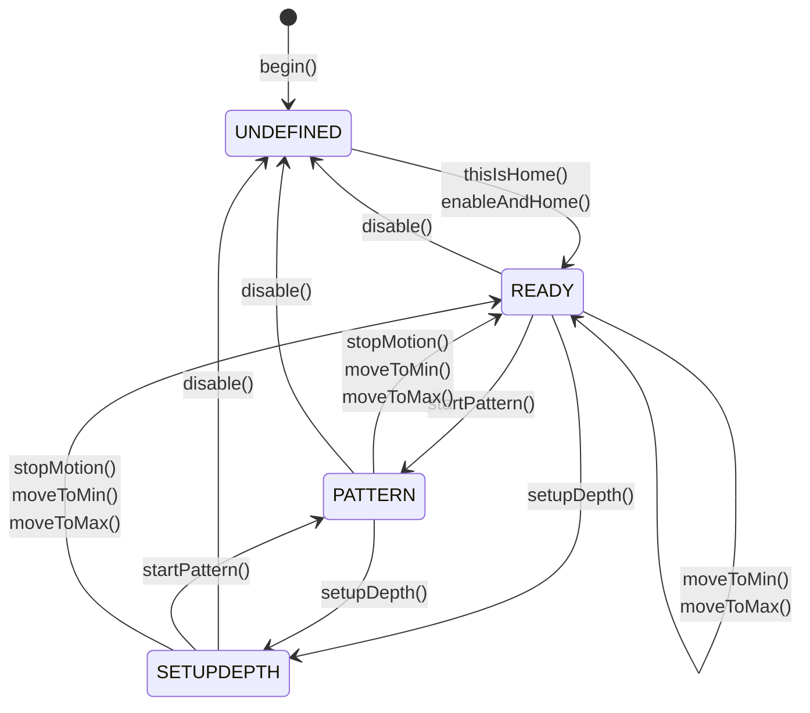

StrokeEngine is een bibliotheek voor het creëren van een verscheidenheid aan slagbewegingen met stappen- of servomotoren op een ESP32. U kunt deze gebruiken met elke doe-het-zelfmachine met een lineaire positieaandrijving, aangedreven door een stappen- of servomotor.

<CardGroup cols={2}>
  <Card title="FuckIO Example" icon="code" href="https://github.com/theelims/FuckIO">
    Referentie-implementatie met behulp van StrokeEngine
  </Card>
  <Card title="OSSM Project" icon="gear" href="https://github.com/KinkyMakers/OSSM-hardware">
    Populaire open-source implementatie door Kinky Makers
  </Card>
</CardGroup>

## Kernconcepten

StrokeEngine maakt optimaal gebruik van servo- en stappenmotoraangedreven machines ten opzichte van ontwerpen met vaste nokken. Onder de motorkap gebruikt het de bibliotheek [FastAccelStepper](https://github.com/gin66/FastAccelStepper) om te communiceren met motoren met behulp van standaard STEP/DIR-signalen.

<Tip>
Als u deze concepten begrijpt, kunt u sneller aan de slag met StrokeEngine.
</Tip>

### Coördinatiesysteem

De machine maakt gebruik van een intern coördinatensysteem dat metrische eenheden uit de echte wereld omzet in encoder-/stepperstappen. Deze abstractie werkt met alle machinegroottes, ongeacht de motor die u kiest.

<Frame caption="StrokeEngine-coördinatensysteem dat de fysieke verplaatsing, uitsluitingsgrenzen en slagparameters weergeeft">
  
</Frame>

**Belangrijke coördinaatconcepten:**

| Begrip | Beschrijving |
|------|-------------|
| **physicalTravel** | De werkelijke fysieke verplaatsing van de ene harde eindstop naar de andere |
| **keepoutBoundary** | Veiligheidsafstand die aan beide kanten wordt afgetrokken om botsingen te voorkomen |
| **_travel** | Werkafstand: `physicalTravel - (2 * keepoutBoundary)` |
| **Home** | Positie bij `-keepoutBoundary` (meestal aan de achterkant) |
| **MIN = 0** | Nulpositie, op een afstand van `keepoutBoundary` van Home |
| **Depth** | Het verste punt dat de machine uitschuift (instelbaar tijdens runtime) |
| **Stroke** | De werkafstand van een slagbeweging (tijdens runtime instelbaar) |

<Note>
Beschouw **Stroke** als de amplitude en **Depth** als een lineaire offset die eraan wordt toegevoegd. De positieve bewegingsrichting is naar voren (naar het lichaam).
</Note>

### Patronen

StrokeEngine maakt gebruik van een patroongenerator om een grote verscheidenheid aan sensaties te bieden. Patronen passen dynamisch parameters zoals speed, stroke en depth per beweging aan met behulp van trapeziumvormige bewegingsprofielen.

Elk patroon accepteert vier parameters:
- **depth** — Maximale uitgeschoven positie
- **stroke** — Bewegingsamplitude
- **speed** — Cycli per minuut
- **sensation** — Vrij instelbare modifier voor patroongedrag (-100 tot 100)

<Info>
Zie de [documentatie over patronen](/ossm/software/motion/stroke-engine/pattern) voor gedetailleerde beschrijvingen van beschikbare patronen en instructies voor het maken van uw eigen patronen.
</Info>

### Foutafhandeling zonder onderbreking

StrokeEngine verwerkt ongeldige parameters op een elegante manier zonder de werking te onderbreken:

- Alle instelfuncties gebruiken `constrain()` om de invoer te beperken tot de fysieke mogelijkheden van de machine
- Waarden buiten de grenzen worden automatisch bijgesneden
- Patroonopdrachten die de machinelimieten overschrijden, resulteren in kortere slagen of aangepaste bewegingsrampen
- De beweging wordt over de volledige afstand voltooid, maar kan iets langer duren dan verwacht

### Parameterupdates halverwege de slag

U kunt de parameters depth, stroke, speed en pattern halverwege de slag bijwerken voor een responsieve, vloeiende gebruikerservaring. Ingebouwde beveiligingen zorgen ervoor dat de machine altijd binnen de grenzen blijft.

### Toestandsmachine

Een interne eindige toestandsmachine beheert de machinetoestanden:



| Staat | Beschrijving |
|-------|-------------|
| **UNDEFINED** | Initiële toestand vóór homing. De motor is uitgeschakeld en de positie is onbekend. |
| **READY** | Homing voltooid. De machine accepteert bewegingsopdrachten. |
| **PATTERN** | De patroongenerator voert cyclische bewegingen uit. |
| **SETUPDEPTH** | De motor volgt de dieptepositie voor interactieve aanpassing. |

## Gebruik

StrokeEngine biedt een eenvoudige maar krachtige API. Geef alle invoerparameters op in echte metrische eenheden.

### Initialiseer de bibliotheek

<Steps>
  <Step title="Pinconfiguraties definiëren">
    Stel de pinnen in voor uw motorbestuurder en optionele homing-schakelaar:

```cpp main.cpp
#include <code>

// Pin Definitions
#define SERVO_PULSE       4
#define SERVO_DIR         16
#define SERVO_ENABLE      17
#define SERVO_ENDSTOP     25        // Optional: Only needed with a homing switch
```
  </Step>

  <Step title="Motoreigenschappen configureren">
    Bereken stappen per millimeter op basis van uw hardware:

```cpp main.cpp
// Calculation Aid:
#define STEP_PER_REV      2000      // Steps per revolution (check driver DIP switches)
#define PULLEY_TEETH      20        // Teeth on the drive pulley
#define BELT_PITCH        2         // Timing belt pitch in mm
#define MAX_RPM           3000.0    // Maximum motor RPM
#define STEP_PER_MM       STEP_PER_REV / (PULLEY_TEETH * BELT_PITCH)
#define MAX_SPEED         (MAX_RPM / 60.0) * PULLEY_TEETH * BELT_PITCH

static motorProperties servoMotor {
  .maxSpeed = MAX_SPEED,              // Maximum speed in mm/s
  .maxAcceleration = 10000,           // Maximum acceleration in mm/s²
  .stepsPerMillimeter = STEP_PER_MM,  // Steps per millimeter
  .invertDirection = true,            // Flip direction if motor moves wrong way
  .enableActiveLow = true,            // Enable signal polarity
  .stepPin = SERVO_PULSE,             // STEP signal pin
  .directionPin = SERVO_DIR,          // DIR signal pin
  .enablePin = SERVO_ENABLE           // Enable signal pin
};
```
  </Step>

  <Step title="Machinegeometrie definiëren">
    Geef de fysieke afmetingen van uw machine op:

```cpp main.cpp
static machineGeometry strokingMachine = {
  .physicalTravel = 160.0,            // Total travel between hard endstops (mm)
  .keepoutBoundary = 5.0              // Safety margin on each side (mm)
};
```
  </Step>

  <Step title="Configureer homing">
    Stel de eigenschappen van de eindstopschakelaar in:

```cpp main.cpp
static endstopProperties endstop = {
  .homeToBack = true,                 // Endstop at rear of machine
  .activeLow = true,                  // Switch wired active low
  .endstopPin = SERVO_ENDSTOP,        // Endstop pin number
  .pinMode = INPUT                    // Use INPUT with external pull-up
};

StrokeEngine Stroker;
```
  </Step>

  <Step title="Initialiseren in setup()">
    Roep de initialisatiefuncties op en wacht tot de homing is voltooid:

```cpp main.cpp
void setup() {
  // Initialize StrokeEngine
  Stroker.begin(&strokingMachine, &servoMotor);
  Stroker.enableAndHome(&endstop);

  // Your other initialization code here

  // Wait for homing to complete
  while (Stroker.getState() != READY) {
    delay(100);
  }
}
```

<Check>
Wanneer `getState()` `READY` retourneert, is de machine in de uitgangspositie gezet en klaar voor bewegingsopdrachten.
</Check>
  </Step>
</Steps>

### Handmatige homing (geen eindstopschakelaar)

<Warning>
Handmatige homing is gevaarlijk. Als de machine zich niet bij de fysieke eindstop bevindt, leidt het aanroepen van `thisIsHome()` tot een onjuist coördinatensysteem en daardoor tot een mechanische botsing die uw machine kan beschadigen.
</Warning>

Als uw machine geen homing-schakelaar heeft, kunt u handmatige homing gebruiken:

1. Verplaats de machine fysiek naar de achterste eindstop
2. Roep `Stroker.thisIsHome()` aan

```cpp
Stroker.thisIsHome();
```

Dit schakelt de motordriver in, stelt de huidige positie in als `-keepoutBoundary` en beweegt langzaam naar positie 0.

### Beschikbare patronen ophalen

Gebruik `getNumberOfPattern()` en `getPatternName()` om beschikbare patronen op te sommen:

```cpp patterns.cpp
String getPatternJSON() {
    String JSON = "[{\"";
    for (size_t i = 0; i < Stroker.getNumberOfPattern(); i++) {
        JSON += String(Stroker.getPatternName(i));
        JSON += "\": ";
        JSON += String(i, DEC);
        if (i < Stroker.getNumberOfPattern() - 1) {
            JSON += "},{\"";
        } else {
            JSON += "}]";
        }
    }
    Serial.println(JSON);
    return JSON;
}
```

## Bewegingscontrole

### Start en stop beweging

| Functie | Beschrijving |
|----------|-------------|
| `Stroker.startPattern()` | Start de patroongebaseerde slagbeweging |
| `Stroker.stopMotion()` | Stop onmiddellijk met maximale vertraging |

### Positiecommando's

Verplaats de machine naar een van beide uiteinden voor installatiedoeleinden:

```cpp
Stroker.moveToMin();        // Move to rear (home) position
Stroker.moveToMax();        // Move to front (maximum) position
Stroker.moveToMax(10.0);    // Move at 10 mm/s (default speed)
```

<Note>
Deze functies kunnen worden opgeroepen vanuit de toestand `PATTERN` of `READY` en stoppen elke huidige beweging. Ze retourneren `false` als ze in een ongeldige toestand worden aangeroepen.
</Note>

### Interactieve diepte-instelling

Ga naar de diepte-instelmodus waarin de motor de dieptepositie in realtime volgt:

```cpp
Stroker.setupDepth();           // Default 10 mm/s
Stroker.setupDepth(10.0);       // Specify speed
```

Werk de dieptepositie bij met `Stroker.setDepth(float)` en lees de huidige waarde af met `Stroker.getDepth()`.

<Tip>
**Fancy Mode:** Roep `Stroker.setupDepth(10.0, true)` op om zowel depth als stroke interactief aan te passen. De sensatieschuifregelaar wordt toegewezen aan het interval `[depth-stroke, depth]`:
- `sensation = 100` — Past de dieptepositie aan
- `sensation = -100` — Past de slagpositie aan
- `sensation = 0` — Positioneert op het middelpunt van de slag
</Tip>

### Parameterfuncties

Werk parameters op elk gewenst moment bij. Waarden worden automatisch beperkt tot de machinelimieten:

```cpp
// Setter functions
Stroker.setSpeed(float speed, bool applyNow);      // 0.5–6000 cycles/min
Stroker.setDepth(float depth, bool applyNow);      // 0 to _travel (mm)
Stroker.setStroke(float stroke, bool applyNow);    // 0 to _travel (mm)
Stroker.setSensation(float sensation, bool applyNow); // -100 to 100
Stroker.setPattern(int index, bool applyNow);      // 0 to getNumberOfPattern()-1
```

<Info>
Stel `applyNow` in op `true` om wijzigingen onmiddellijk halverwege de slag toe te passen. Anders worden de wijzigingen van kracht nadat de huidige slag is voltooid.
</Info>

Lees de beperkte waarden terug die feitelijk door StrokeEngine worden gebruikt:

```cpp
// Getter functions
float speed = Stroker.getSpeed();         // Cycles per minute
float depth = Stroker.getDepth();         // Depth in mm
float stroke = Stroker.getStroke();       // Stroke length in mm
float sensation = Stroker.getSensation(); // -100 to 100
int pattern = Stroker.getPattern();       // Pattern index
```

## Geavanceerde functies

### Telemetriecallback

Registreer een callback om telemetriegegevens te ontvangen voor elke trapeziumvormige beweging:

```cpp
void callbackTelemetry(float position, float speed, bool clipping) {
  // Handle telemetry data
}

Stroker.registerTelemetryCallback(callbackTelemetry);
```

<Note>
Raadpleeg [StrokeEngine.h](https://github.com/theelims/StrokeEngine/blob/main/src/StrokeEngine.h) in de bronrepository voor de volledige API-referentie, inclusief overladen functies en extra functies.
</Note>
