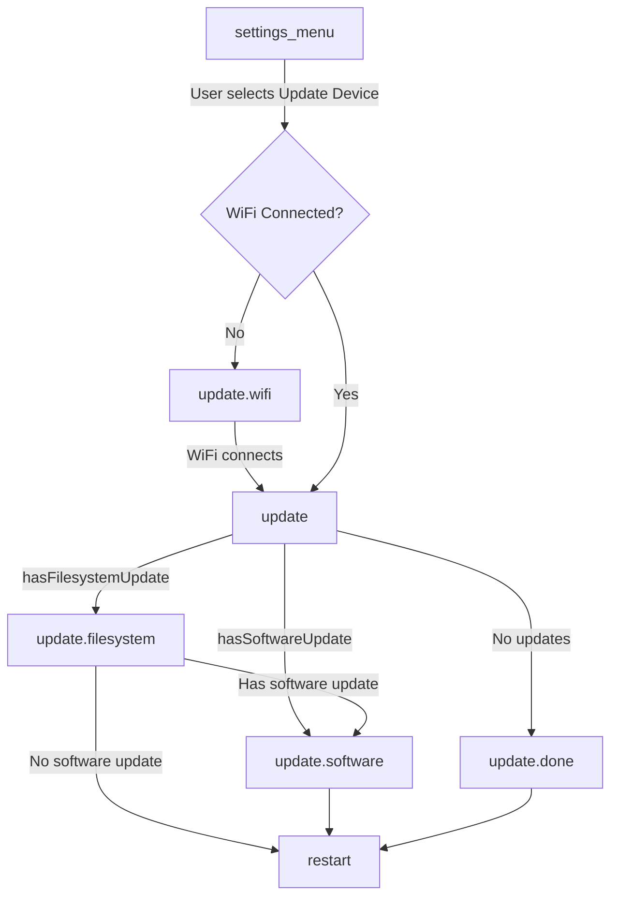

Dieses Dokument beschreibt das Over-the-Air-(OTA-)Update-System des Research And Desire Wireless Remote (RADR), einschließlich der Update-Kette, des Ablaufs der Zustandsmaschine und der zu aktualisierenden Komponenten.

## Überblick

RADR verwendet ein zweiteiliges OTA-Update-System:

| Komponente | Beschreibung | Binärdatei |
|-----------|-------------|--------|
| **Firmware** | ESP32-Anwendungsbinärdatei | `firmware.bin` |
| **Dateisystem** | LittleFS-Partition mit Geräteregistrierung und Protokollspezifikationen | `littlefs.bin` |

Das Dateisystem-Update ist besonders wichtig für die Geräteunterstützung – es enthält die Buttplug.io-Registrierung, die Bluetooth-Dienst-UUIDs den Gerätekonfigurationen zuordnet. Dies ermöglicht das Hinzufügen von Unterstützung für neue Geräte, ohne dass Firmware-Änderungen erforderlich sind.

## OTA-Update-Architektur

```mermaid
flowchart TB
    subgraph OTA[OTA Update System]
        direction LR
        subgraph FW[Firmware Update]
            FWBin[firmware.bin]
            FWBin --> AppCode[Application Code]
        end
        subgraph FS[Filesystem Update]
            FSBin[littlefs.bin]
            FSBin --> Registry[/registry.json]
            FSBin --> Protocols[/protocols/*.json]
            Protocols --> ButtplugSpecs[Buttplug.io Device Specs]
        end
    end
    Server[Supabase Storage] --> OTA
```

### Update-Server

Updates werden von Supabase Storage bereitgestellt. Die Server-URL ist in `platformio.ini` definiert:

```ini
UPDATE_SERVER_URL="https://acjajruwevyyatztbkdf.supabase.co/storage/v1/object/public/radr-firmware"
```

Binärdatei-URLs folgen diesem Muster:
- Firmware: `{UPDATE_SERVER_URL}/master/firmware.bin`
- Dateisystem: `{UPDATE_SERVER_URL}/master/littlefs.bin`

## Ablauf der Zustandsmaschine

Aktualisierungen werden von der RADR-Zustandsmaschine verwaltet. Der Update-Ablauf wird über das Menü **Settings** ausgelöst.



### Zustandsübergänge

| Von | Nach | Bedingung |
|------|-----|-----------|
| `settings_menu` | `update` | Der Benutzer wählt "Update Device" + WiFi verbunden |
| `settings_menu` | `update.wifi` | Der Benutzer wählt "Update Device" + WiFi nicht verbunden |
| `update.wifi` | `update` | WiFi-Verbindung hergestellt |
| `update` | `update.filesystem` | Der `hasFilesystemUpdate`-Guard gibt true zurück |
| `update` | `update.software` | Der `hasSoftwareUpdate`-Guard gibt true zurück (kein Dateisystem-Update) |
| `update` | `update.done` | Keine Updates verfügbar |
| `update.filesystem` | `update.software` | Dateisystem-Update abgeschlossen + Software-Update verfügbar |
| `update.filesystem` | `restart` | Dateisystem-Update abgeschlossen, kein Software-Update |
| `update.software` | `restart` | Software-Update abgeschlossen (immer Neustart) |
| `update.done` | `restart` | Der Benutzer bestätigt |

## Was wird aktualisiert?

### Firmware-Update

Das Firmware-Update ersetzt die ESP32-Anwendungsbinärdatei. Dazu gehören:

- Kernanwendungslogik
- UI- und Anzeigecode
- Bluetooth-Stack und Gerätekommunikation
- Zustandsmaschine und Navigation
- Eingabeverarbeitung (Encoder, Tasten, Bumper)

**Implementierung:** `updateSoftwareTask()` in `src/tasks/update.cpp`

```cpp
void updateSoftwareTask(void *pvParameters) {
    // Uses ESP32 HTTPUpdate library
    httpUpdate.setRebootOnUpdate(true);  // Auto-reboot on success

    String url = String(UPDATE_SERVER_URL) + "/master/firmware.bin";
    httpUpdate.update(client, url);
}
```

Das Firmware-Update führt bei Erfolg automatisch einen Neustart des Geräts durch.

### Dateisystem-Update

Das Dateisystem-Update ersetzt die LittleFS-Partition, die Folgendes enthält:

| Datei | Zweck |
|------|---------|
| `/registry.json` | Ordnet BLE-Dienst-UUIDs Protokollspezifikationsdateien zu |
| `/protocols/*.json` | Buttplug.io v4-Gerätekonfigurationsdateien |

**Implementierung:** `updateFilesystemTask()` in `src/tasks/update.cpp`

```cpp
void updateFilesystemTask(void *pvParameters) {
    LittleFS.end();  // Unmount before update

    httpUpdate.setRebootOnUpdate(false);  // Don't reboot yet

    String url = String(UPDATE_SERVER_URL) + "/master/littlefs.bin";
    httpUpdate.updateSpiffs(client, url);

    LittleFS.begin();  // Remount after update
}
```

<Info>
Das Dateisystem-Update löst keinen automatischen Neustart aus. Dadurch können sowohl das Dateisystem als auch die Firmware vor dem Neustart nacheinander aktualisiert werden.
</Info>

### Registry-Update-Kette

Wenn das Dateisystem aktualisiert wird, wird die Geräteregistrierung von Buttplug.io aktualisiert:


Die Registrierung wird beim Gerätestart durch `initRegistry()` in `src/devices/registry.cpp` geladen:

1. Fest codierte Geräte werden zuerst registriert (z. B. OSSM)
2. `/registry.json` wird von LittleFS gelesen
3. Jede Dienst-UUID ist einem `ButtplugIODeviceFactory` zugeordnet
4. Protokollspezifikationen werden bei Bedarf geladen, wenn Geräte erkannt werden

## Verfügbarkeit von Updates

Die Verfügbarkeit von Updates wird durch Guard-Funktionen in `src/state/guards.hpp` bestimmt:

```cpp
bool hasFilesystemUpdate(const State &state, const Event &event) {
    return isFilesystemUpdateAvailable;
}

bool hasSoftwareUpdate(const State &state, const Event &event) {
    return isSoftwareUpdateAvailable;
}
```

Diese Flags werden folgendermaßen gesetzt:

| Flag | Gesetzt, wenn |
|------|----------|
| `isSoftwareUpdateAvailable` | `FORCE_UPDATE`-Kompilierungsflag oder der Server zeigt ein Update an |
| `isFilesystemUpdateAvailable` | `FORCE_UPDATE`-Kompilierungsflag oder der Server zeigt ein Update an |

<Warning>
Die aktuelle Implementierung verfügt über ein TODO für die automatische Update-Überprüfung. Derzeit werden Aktualisierungen manuell ausgelöst und die Verfügbarkeit muss über Kompilierungsflags oder externe Mechanismen festgelegt werden.
</Warning>

## Wichtige Quelldateien

| Datei | Zweck |
|------|---------|
| `src/tasks/update.cpp` | Implementierungen der Update-Tasks (`updateSoftwareTask`, `updateFilesystemTask`) |
| `src/tasks/update.h` | Deklarationen der Update-Tasks und Verfügbarkeitsflags |
| `src/state/machine.h` | Zustandsmaschinendefinition mit Aktualisierungszuständen |
| `src/state/guards.hpp` | Guard-Funktionen für die Verfügbarkeit von Updates |
| `src/devices/registry.cpp` | Registrierungsinitialisierung aus LittleFS |
| `data/registry.json` | Zuordnungen von Dienst-UUIDs zu Protokollspezifikationen |
| `data/protocols/*.json` | Buttplug.io-v4-Gerätespezifikationen |

## Entwicklungshinweise

### Aktualisierungen erzwingen

Verwenden Sie für Entwicklung und Tests das Kompilierungsflag `FORCE_UPDATE`:

```ini
build_flags =
    -D FORCE_UPDATE
```

Dadurch werden sowohl `isSoftwareUpdateAvailable` als auch `isFilesystemUpdateAvailable` auf `true` gesetzt.

### Lokale Dateisystem-Updates

Wenn Sie lokal entwickeln, verwenden Sie die Funktion „Upload Filesystem“ von PlatformIO:

```bash
pio run --target uploadfs
```

Dadurch wird der Inhalt des Verzeichnisses `data/` auf die LittleFS-Partition hochgeladen.

<Warning>
"Upload Filesystem" löscht die vorhandene LittleFS-Partition vor dem Schreiben. Alle Laufzeitänderungen gehen verloren.
</Warning>

## Verwandte Dokumentation

<CardGroup cols={2}>
<Card title="Geräteregistrierung" icon="database" href="/radr/software/device-registry/introduction">
Wie RADR Geräteinstanzen aus BLE-Dienst-UUIDs erkennt und erstellt.
</Card>

<Card title="Web-Flasher" icon="bolt" href="/radr/software/ota-updates/introduction">
Manuelles Firmware-Flashen über den Browser.
</Card>
</CardGroup>
