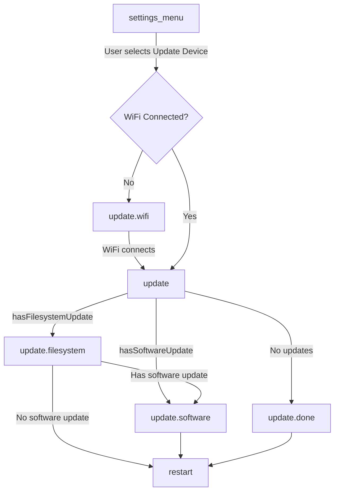

Ce document décrit le système de mise à jour par liaison radio (OTA) utilisé par la télécommande sans fil Research And Desire Wireless Remote (RADR), y compris la chaîne de mise à jour, le flux de la machine à états et les composants mis à jour.

## Aperçu

RADR utilise un système de mise à jour OTA en deux parties :

| Composant | Description | Binaire |
|-----------|-------------|--------|
| **Micrologiciel** | Binaire de l'application ESP32 | `firmware.bin` |
| **Système de fichiers** | Partition LittleFS contenant le registre des périphériques et les spécifications du protocole | `littlefs.bin` |

La mise à jour du système de fichiers est particulièrement importante pour la prise en charge des appareils : elle contient le registre Buttplug.io qui associe les UUID de service Bluetooth aux configurations des appareils. Cela permet d'ajouter la prise en charge de nouveaux appareils sans modifier le micrologiciel.

## Architecture des mises à jour OTA

```mermaid
flowchart TB
    subgraph OTA[OTA Update System]
        direction LR
        subgraph FW[Firmware Update]
            FWBin[firmware.bin]
            FWBin --> AppCode[Application Code]
        end
        subgraph FS[Filesystem Update]
            FSBin[littlefs.bin]
            FSBin --> Registry[/registry.json]
            FSBin --> Protocols[/protocols/*.json]
            Protocols --> ButtplugSpecs[Buttplug.io Device Specs]
        end
    end
    Server[Supabase Storage] --> OTA
```

### Serveur de mise à jour

Les mises à jour sont fournies par Supabase Storage. L'URL du serveur est définie dans `platformio.ini` :

```ini
UPDATE_SERVER_URL="https://acjajruwevyyatztbkdf.supabase.co/storage/v1/object/public/radr-firmware"
```

Les URL des binaires suivent le modèle :
- Micrologiciel : `{UPDATE_SERVER_URL}/master/firmware.bin`
- Système de fichiers : `{UPDATE_SERVER_URL}/master/littlefs.bin`

## Flux de la machine à états

Les mises à jour sont gérées par la machine à états RADR. Le flux de mise à jour est déclenché depuis le menu **Settings**.



### Transitions d'État

| Depuis | À | Condition |
|------|-----|-----------|
| `settings_menu` | `update` | L'utilisateur sélectionne "Update Device" + WiFi connecté |
| `settings_menu` | `update.wifi` | L'utilisateur sélectionne "Update Device" + WiFi non connecté |
| `update.wifi` | `update` | Connexion WiFi établie |
| `update` | `update.filesystem` | La garde `hasFilesystemUpdate` renvoie true |
| `update` | `update.software` | La garde `hasSoftwareUpdate` renvoie true (pas de mise à jour du système de fichiers) |
| `update` | `update.done` | Aucune mise à jour disponible |
| `update.filesystem` | `update.software` | Mise à jour du système de fichiers terminée + mise à jour du logiciel disponible |
| `update.filesystem` | `restart` | Mise à jour du système de fichiers terminée, aucune mise à jour logicielle |
| `update.software` | `restart` | Mise à jour du logiciel terminée (l'appareil redémarre toujours) |
| `update.done` | `restart` | L'utilisateur confirme |

## Ce qui est mis à jour

### Mise à jour du micrologiciel

La mise à jour du micrologiciel remplace le binaire de l'application ESP32. Cela comprend :

- Logique d'application de base
- Interface utilisateur et code d'affichage
- Pile Bluetooth et communication avec les appareils
- Machine à états et navigation
- Gestion des entrées (encodeurs, boutons, bumpers)

**Mise en œuvre :** `updateSoftwareTask()` dans `src/tasks/update.cpp`

```cpp
void updateSoftwareTask(void *pvParameters) {
    // Uses ESP32 HTTPUpdate library
    httpUpdate.setRebootOnUpdate(true);  // Auto-reboot on success

    String url = String(UPDATE_SERVER_URL) + "/master/firmware.bin";
    httpUpdate.update(client, url);
}
```

La mise à jour du micrologiciel redémarre automatiquement l'appareil en cas de succès.

### Mise à jour du système de fichiers

La mise à jour du système de fichiers remplace la partition LittleFS, qui contient :

| Fichier | But |
|------|---------|
| `/registry.json` | Associe les UUID de service BLE aux fichiers de spécifications de protocole |
| `/protocols/*.json` | Fichiers de configuration des appareils Buttplug.io v4 |

**Mise en œuvre :** `updateFilesystemTask()` dans `src/tasks/update.cpp`

```cpp
void updateFilesystemTask(void *pvParameters) {
    LittleFS.end();  // Unmount before update

    httpUpdate.setRebootOnUpdate(false);  // Don't reboot yet

    String url = String(UPDATE_SERVER_URL) + "/master/littlefs.bin";
    httpUpdate.updateSpiffs(client, url);

    LittleFS.begin();  // Remount after update
}
```

<Info>
La mise à jour du système de fichiers ne déclenche pas de redémarrage automatique. Cela permet à la fois au système de fichiers et au micrologiciel d'être mis à jour en séquence avant le redémarrage.
</Info>

### Chaîne de mise à jour du registre

Lorsque le système de fichiers est mis à jour, le registre des appareils Buttplug.io est actualisé :


Le registre est chargé au démarrage par `initRegistry()` dans `src/devices/registry.cpp` :

1. Les appareils codés en dur sont enregistrés en premier (par exemple, OSSM)
2. `/registry.json` est lu depuis LittleFS
3. Chaque UUID de service est associé à un `ButtplugIODeviceFactory`
4. Les spécifications du protocole sont chargées à la demande lorsque les appareils sont découverts

## Disponibilité des mises à jour

La disponibilité des mises à jour est déterminée par les fonctions de garde dans `src/state/guards.hpp` :

```cpp
bool hasFilesystemUpdate(const State &state, const Event &event) {
    return isFilesystemUpdateAvailable;
}

bool hasSoftwareUpdate(const State &state, const Event &event) {
    return isSoftwareUpdateAvailable;
}
```

Ces drapeaux sont contrôlés par :

| Drapeau | Défini lorsque |
|------|----------|
| `isSoftwareUpdateAvailable` | Indicateur de compilation `FORCE_UPDATE` ou le serveur indique une mise à jour |
| `isFilesystemUpdateAvailable` | Indicateur de compilation `FORCE_UPDATE` ou le serveur indique une mise à jour |

<Warning>
L'implémentation actuelle comporte un TODO pour la vérification automatique des mises à jour. Actuellement, les mises à jour sont déclenchées manuellement et la disponibilité doit être définie via des indicateurs de compilation ou des mécanismes externes.
</Warning>

## Fichiers sources clés

| Fichier | But |
|------|---------|
| `src/tasks/update.cpp` | Implémentations des tâches de mise à jour (`updateSoftwareTask`, `updateFilesystemTask`) |
| `src/tasks/update.h` | Déclarations des tâches et indicateurs de disponibilité |
| `src/state/machine.h` | Définition de la machine à états avec les états de mise à jour |
| `src/state/guards.hpp` | Fonctions de garde pour la disponibilité des mises à jour |
| `src/devices/registry.cpp` | Initialisation du registre à partir de LittleFS |
| `data/registry.json` | Associations entre UUID de service et spécifications de protocole |
| `data/protocols/*.json` | Spécifications des appareils Buttplug.io v4 |

## Notes de développement

### Forcer les mises à jour

Pour le développement et les tests, utilisez l'indicateur de compilation `FORCE_UPDATE` :

```ini
build_flags =
    -D FORCE_UPDATE
```

Cela définit `isSoftwareUpdateAvailable` et `isFilesystemUpdateAvailable` sur `true`.

### Mises à jour locales du système de fichiers

Lors du développement local, utilisez la fonctionnalité « Upload Filesystem » de PlatformIO :

```bash
pio run --target uploadfs
```

Cela téléverse le contenu du répertoire `data/` sur la partition LittleFS.

<Warning>
"Upload Filesystem" efface la partition LittleFS existante avant l'écriture. Toutes les modifications effectuées pendant l'exécution seront perdues.
</Warning>

## Documentation connexe

<CardGroup cols={2}>
<Card title="Registre des appareils" icon="database" href="/radr/software/device-registry/introduction">
Comment RADR découvre et crée des instances de périphérique à partir des UUID de service BLE.
</Card>

<Card title="Web Flasher" icon="bolt" href="/radr/software/ota-updates/introduction">
Flashage manuel du micrologiciel via le navigateur.
</Card>
</CardGroup>
