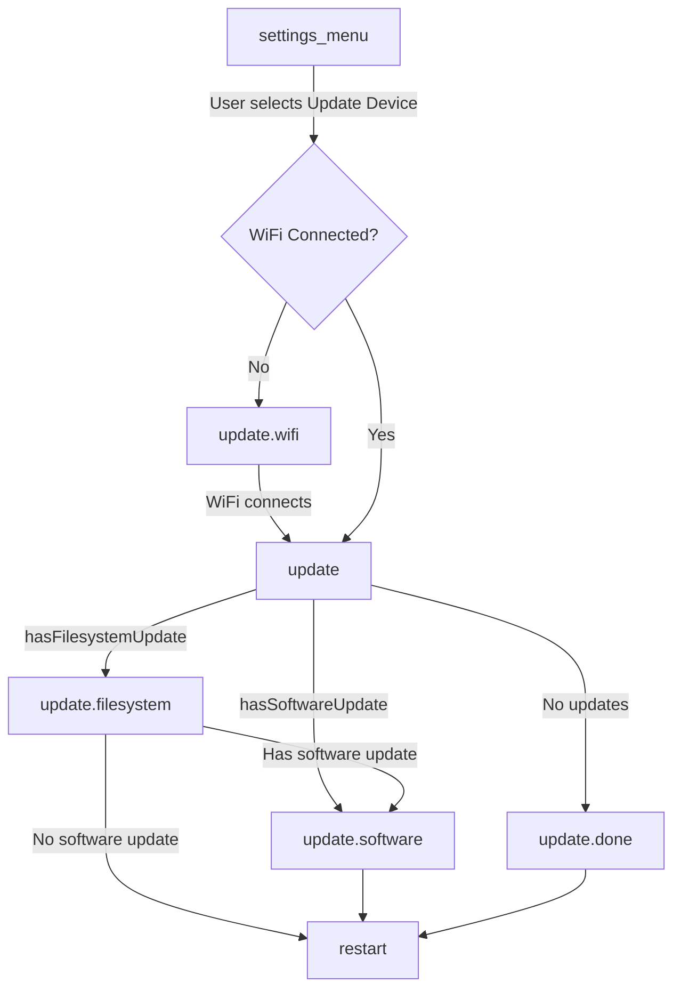
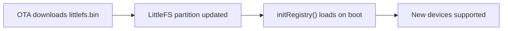

Dit document beschrijft het over-the-air-(OTA-)updatesysteem van de Research And Desire Wireless Remote (RADR), inclusief de updateketen, het verloop van de toestandsmachine en de onderdelen die worden bijgewerkt.

## Overzicht

RADR maakt gebruik van een tweedelig OTA-updatesysteem:

| Onderdeel | Beschrijving | Binair bestand |
|-----------|-------------|--------|
| **Firmware** | Binair ESP32-applicatiebestand | `firmware.bin` |
| **Bestandssysteem** | LittleFS-partitie met apparaatregister en protocolspecificaties | `littlefs.bin` |

De bestandssysteemupdate is vooral belangrijk voor apparaatondersteuning: deze bevat het Buttplug.io-register dat Bluetooth-service-UUID's koppelt aan apparaatconfiguraties. Hierdoor kan ondersteuning voor nieuwe apparaten worden toegevoegd zonder firmwarewijzigingen.

## OTA-updatearchitectuur

```mermaid
flowchart TB
    subgraph OTA[OTA Update System]
        direction LR
        subgraph FW[Firmware Update]
            FWBin[firmware.bin]
            FWBin --> AppCode[Application Code]
        end
        subgraph FS[Filesystem Update]
            FSBin[littlefs.bin]
            FSBin --> Registry[/registry.json]
            FSBin --> Protocols[/protocols/*.json]
            Protocols --> ButtplugSpecs[Buttplug.io Device Specs]
        end
    end
    Server[Supabase Storage] --> OTA
```

### Updateserver

Updates worden geleverd vanuit Supabase Storage. De server-URL wordt gedefinieerd in `platformio.ini`:

```ini
UPDATE_SERVER_URL="https://acjajruwevyyatztbkdf.supabase.co/storage/v1/object/public/radr-firmware"
```

Binaire URL's volgen dit patroon:
- Firmware: `{UPDATE_SERVER_URL}/master/firmware.bin`
- Bestandssysteem: `{UPDATE_SERVER_URL}/master/littlefs.bin`

## Verloop van de toestandsmachine

Updates worden beheerd door de RADR-toestandsmachine. Het updateverloop wordt geactiveerd vanuit het **Settings**-menu.



### Statusovergangen

| Van | Naar | Voorwaarde |
|------|-----|-----------|
| `settings_menu` | `update` | Gebruiker selecteert "Update Device" + WiFi verbonden |
| `settings_menu` | `update.wifi` | Gebruiker selecteert "Update Device" + WiFi niet verbonden |
| `update.wifi` | `update` | WiFi-verbinding tot stand gebracht |
| `update` | `update.filesystem` | `hasFilesystemUpdate`-guard retourneert true |
| `update` | `update.software` | `hasSoftwareUpdate`-guard retourneert true (geen bestandssysteemupdate) |
| `update` | `update.done` | Geen updates beschikbaar |
| `update.filesystem` | `update.software` | Bestandssysteemupdate voltooid + software-update beschikbaar |
| `update.filesystem` | `restart` | Bestandssysteemupdate voltooid, geen software-update |
| `update.software` | `restart` | Software-update voltooid (het apparaat wordt altijd opnieuw opgestart) |
| `update.done` | `restart` | Gebruiker bevestigt |

## Wat wordt bijgewerkt?

### Firmware-update

De firmware-update vervangt het binaire ESP32-applicatiebestand. Dit omvat:

- Kernapplicatielogica
- UI en weergavecode
- Bluetooth-stack en apparaatcommunicatie
- Toestandsmachine en navigatie
- Invoerverwerking (encoders, knoppen, bumpers)

**Implementatie:** `updateSoftwareTask()` in `src/tasks/update.cpp`

```cpp
void updateSoftwareTask(void *pvParameters) {
    // Uses ESP32 HTTPUpdate library
    httpUpdate.setRebootOnUpdate(true);  // Auto-reboot on success

    String url = String(UPDATE_SERVER_URL) + "/master/firmware.bin";
    httpUpdate.update(client, url);
}
```

De firmware-update start het apparaat automatisch opnieuw op als het succesvol is.

### Bestandssysteemupdate

De bestandssysteemupdate vervangt de LittleFS-partitie, die het volgende bevat:

| Bestand | Doel |
|------|---------|
| `/registry.json` | Koppelt BLE-service-UUID's aan protocolspecificatiebestanden |
| `/protocols/*.json` | Buttplug.io v4-apparaatconfiguratiebestanden |

**Implementatie:** `updateFilesystemTask()` in `src/tasks/update.cpp`

```cpp
void updateFilesystemTask(void *pvParameters) {
    LittleFS.end();  // Unmount before update

    httpUpdate.setRebootOnUpdate(false);  // Don't reboot yet

    String url = String(UPDATE_SERVER_URL) + "/master/littlefs.bin";
    httpUpdate.updateSpiffs(client, url);

    LittleFS.begin();  // Remount after update
}
```

<Info>
De update van het bestandssysteem veroorzaakt geen automatische herstart. Hierdoor kunnen zowel het bestandssysteem als de firmware achtereenvolgens worden bijgewerkt voordat opnieuw wordt opgestart.
</Info>

### Updateketen van het register

Wanneer het bestandssysteem wordt bijgewerkt, wordt het Buttplug.io-apparaatregister vernieuwd:



Het register wordt tijdens het opstarten geladen door `initRegistry()` in `src/devices/registry.cpp`:

1. Hardgecodeerde apparaten worden eerst geregistreerd (bijvoorbeeld OSSM)
2. `/registry.json` wordt gelezen vanuit LittleFS
3. Elke service-UUID wordt toegewezen aan een `ButtplugIODeviceFactory`
4. Protocolspecificaties worden op aanvraag geladen wanneer apparaten worden ontdekt

## Beschikbaarheid van updates

De beschikbaarheid van updates wordt bepaald door guardfuncties in `src/state/guards.hpp`:

```cpp
bool hasFilesystemUpdate(const State &state, const Event &event) {
    return isFilesystemUpdateAvailable;
}

bool hasSoftwareUpdate(const State &state, const Event &event) {
    return isSoftwareUpdateAvailable;
}
```

Deze vlaggen worden ingesteld door:

| Vlag | Wordt ingesteld wanneer |
|------|----------|
| `isSoftwareUpdateAvailable` | de `FORCE_UPDATE`-compileervlag actief is of de server een update meldt |
| `isFilesystemUpdateAvailable` | de `FORCE_UPDATE`-compileervlag actief is of de server een update meldt |

<Warning>
De huidige implementatie heeft een TODO voor automatische updatecontrole. Momenteel worden updates handmatig geactiveerd en moet de beschikbaarheid worden ingesteld via compileervlaggen of externe mechanismen.
</Warning>

## Belangrijke bronbestanden

| Bestand | Doel |
|------|---------|
| `src/tasks/update.cpp` | Implementaties van updatetaken (`updateSoftwareTask`, `updateFilesystemTask`) |
| `src/tasks/update.h` | Declaraties van updatetaken en beschikbaarheidsvlaggen |
| `src/state/machine.h` | Definitie van de toestandsmachine met updatetoestanden |
| `src/state/guards.hpp` | Guardfuncties voor de beschikbaarheid van updates |
| `src/devices/registry.cpp` | Registerinitialisatie vanuit LittleFS |
| `data/registry.json` | Koppelingen van service-UUID's naar protocolspecificatiebestanden |
| `data/protocols/*.json` | Buttplug.io v4-apparaatspecificaties |

## Ontwikkelingsnotities

### Updates forceren

Gebruik voor ontwikkeling en testen de compileervlag `FORCE_UPDATE`:

```ini
build_flags =
    -D FORCE_UPDATE
```

Hierdoor worden zowel `isSoftwareUpdateAvailable` als `isFilesystemUpdateAvailable` ingesteld op `true`.

### Lokale bestandssysteemupdates

Wanneer u lokaal ontwikkelt, gebruikt u de functie "Upload Filesystem" van PlatformIO:

```bash
pio run --target uploadfs
```

Hiermee wordt de inhoud van de map `data/` geüpload naar de LittleFS-partitie.

<Warning>
"Upload Filesystem" wist de bestaande LittleFS-partitie vóór het schrijven. Eventuele runtime-wijzigingen gaan verloren.
</Warning>

## Gerelateerde documentatie

<CardGroup cols={2}>
<Card title="Apparaatregister" icon="database" href="/radr/software/device-registry/introduction">
Hoe RADR apparaatinstanties ontdekt en maakt op basis van BLE-service-UUID's.
</Card>

<Card title="Web Flasher" icon="bolt" href="/radr/software/ota-updates/introduction">
Handmatig firmware flashen via de browser.
</Card>
</CardGroup>
