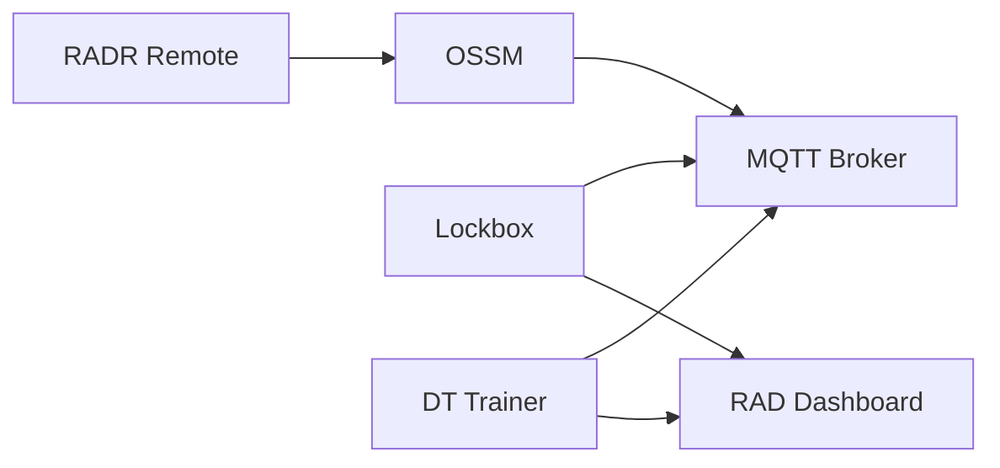

# RAD product ecosystem

Research and Desire open-hardware products share protocols and optional cloud services.

## Products

| Product | Role | License |
|---------|------|---------|
| **OSSM** | Open-source linear actuator platform | CERN-OHL-S |
| **RADR** | Wireless remote / ButtplugIO bridge for OSSM | CERN-OHL-S |
| **Lockbox** | Chastity lock firmware + hardware | MPL 2.0 fw / OHL-S hw |
| **DT Trainer** | Training device firmware + hardware | MPL 2.0 fw / OHL-S hw |

## Interoperability

- **RADR ↔ OSSM:** RADR controls OSSM via BLE and shared control protocols — see RADR and OSSM developer sections
- **rad-json:** Shared message schema across products — see [rad-json](rad-json.md)
- **MQTT:** Cloud/mobile control path — see [MQTT topology](mqtt-topology.md)

## Repositories

- [rad-json](https://github.com/researchanddesire/rad-json) — shared JSON schemas
- [simple-docs](https://github.com/researchanddesire/simple-docs) — user documentation
- **dev-docs** (this repo) — developer documentation assembly
